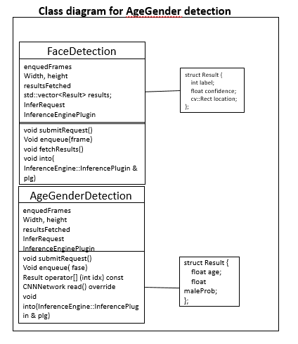
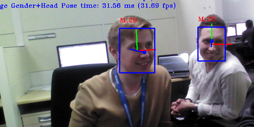

# Age and Gender Detection using OpenVINO™
### Lab Overview
We have done Face Detection in our previous module. Now, we identify Age and Gender for the identified faces.    
We  build upon our Face Detection code and add Age, Gender identification code in this module.



### We replace Age and Gender Detection TODOs with the following:
-	Include CPU as plugin device for parallel inferencing.
-	Load pre-trained data model for Age and Gender detection.
-	Once Face Detection result is available, submit inference request for Age and Gender Detection
-	Mark the identified faces inside rectangle and put text on it for Age and Gender.
-	Observe Age and Gender Detection in addition to face.


### Include CPU as Plugin Device
We need to include CPU as plugin device for inferencing Age and Gender
- Replace #TODO: Age and Gender detection 2
- Paste the following lines
```
plugin = PluginDispatcher({ "../../../lib/intel64", "" }).getPluginByDevice("CPU");
pluginsForDevices["CPU"] = plugin;
  ```

### Load Pre-trained Optimized Model for Age and Gender Inferencing
We need CPU as plugin device for inferencing Age and Gender and load pre-retained model for Age and Gender Detection on CPU
- Replace #TODO: Age and Gender Detection 3
- Paste the following lines
```
FLAGS_Age_Gender_Model = "/opt/intel/computer_vision_sdk_2018.1.265/deployment_tools/intel_models/age-gender-recognition-retail-0013/FP32/age-gender-recognition-retail-0013.xml";
AgeGenderDetection AgeGender;
Load(AgeGender).into(pluginsForDevices["CPU"]);
 ```

### Submit Inference Request
- Replace #TODO: Age and Gender Detection 4
- Paste the following lines
```
//Submit Inference Request for age and gender detection and wait for result
	AgeGender.submitRequest();
	AgeGender.wait();
 ```

### Use Identified Face for Age and Gender Detection
Clip the identified Faces and send inference request for identifying Age and Gender
- Replace #TODO: Age and Gender Detection 5
- Paste the following lines
```
//Clipped the identified face and send Inference Request for age and gender detection
	for (auto face : FaceDetection.results) {
		auto clippedRect = face.location & cv::Rect(0, 0, 640, 480);
		auto face1 = frame(clippedRect);
		AgeGender.enqueue(face1);
	}
	// Got the Face, Age and Gender detection result, now customize and print them on window
	std::ostringstream out;
	index = 0;
	curFaceCount = 0;
    malecount=0;
	femalecount=0;
 ```

### Customize the Result for Display
Now we got result for Face, Age and Gender detection. We can customize the output and display this on the screen
- Replace #TODO: Age and Gender Detection 6
- Paste the following lines
```
            out.str("");
			curFaceCount++;

			//Draw rectangle bounding identified face and print Age and Gender
			out << (AgeGender[index].maleProb > 0.5 ? "M" : "F");
			if(AgeGender[index].maleProb > 0.5)
				malecount++;
			else
				femalecount++;
			out << "," << static_cast<int>(AgeGender[index].age);

			cv::putText(frame,
				out.str(),
				cv::Point2f(result.location.x, result.location.y - 15),
				cv::FONT_HERSHEY_COMPLEX_SMALL,
				0.8,
				cv::Scalar(0, 0, 255));

			index++;

 ```

### The Final Solution
Keep the TODOs as it is. We will re-use this program during Cloud Integration.
```
#include <gflags/gflags.h>
#include <functional>
#include <iostream>
#include <fstream>
#include <random>
#include <memory>
#include <chrono>
#include <string>
#include <utility>
#include <algorithm>
#include <iterator>
#include <samples/common.hpp>
#include <samples/slog.hpp>
#include <ext_list.hpp>
#include <sstream>
#include <map>
#include <vector>
#include "mkldnn/mkldnn_extension_ptr.hpp"
#include <inference_engine.hpp>
#include "interactive_face_detection.hpp"
#include <opencv2/opencv.hpp>

using namespace InferenceEngine;


// -------------------------Generic routines for detection networks-------------------------------------------------

struct FaceDetectionClass {
	std::string input;
	std::string output;
	int maxProposalCount;
	int objectSize;
	int enquedFrames = 0;
	float width = 0;
	float height = 0;
	bool resultsFetched = false;
	std::vector<std::string> labels;


	ExecutableNetwork net;
	InferenceEngine::InferencePlugin * plugin;
	InferRequest::Ptr request;
	std::string & commandLineFlag = FLAGS_Face_Model;
	std::string topoName = "Face Detection";
	const int maxBatch = 1;

	struct Result {
		int label;
		float confidence;
		cv::Rect location;
	};

	std::vector<Result> results;

	void submitRequest()  {
		if (!enquedFrames) return;
		enquedFrames = 0;
		resultsFetched = false;
		results.clear();

		request->StartAsync();
	}

	 void wait() {
		if (!request) return;
		request->Wait(IInferRequest::WaitMode::RESULT_READY);
	}

	void matU8ToBlob(const cv::Mat& orig_image, Blob::Ptr& blob, float scaleFactor = 1.0, int batchIndex = 0) {
	SizeVector blobSize = blob.get()->dims();
	const size_t width = blobSize[0];
	const size_t height = blobSize[1];
	const size_t channels = blobSize[2];

	uint8_t * blob_data = blob->buffer().as<uint8_t *>();

	cv::Mat resized_image(orig_image);
	if (width != orig_image.size().width || height != orig_image.size().height) {
		cv::resize(orig_image, resized_image, cv::Size(width, height));
	}

	int batchOffset = batchIndex * width * height * channels;

	for (size_t c = 0; c < channels; c++) {
		for (size_t h = 0; h < height; h++) {
			for (size_t w = 0; w < width; w++) {
				blob_data[batchOffset + c * width * height + h * width + w] =
					resized_image.at<cv::Vec3b>(h, w)[c] * scaleFactor;
			}
		}
	}
}


	void enqueue(const cv::Mat &frame) {
		//if (!enabled()) return;

		if (!request) {
			request = net.CreateInferRequestPtr();
		}

		width = frame.cols;
		height = frame.rows;

		auto  inputBlob = request->GetBlob(input);

		matU8ToBlob(frame, inputBlob);

		enquedFrames = 1;
	}

	InferenceEngine::CNNNetwork read()  {
		InferenceEngine::CNNNetReader netReader;
		/** Read network model **/
		netReader.ReadNetwork(FLAGS_Face_Model);
		/** Set batch size to 1 **/
		netReader.getNetwork().setBatchSize(maxBatch);
		/** Extract model name and load it's weights **/
		std::string binFileName = fileNameNoExt(FLAGS_Face_Model) + ".bin";
		netReader.ReadWeights(binFileName);
		/** Read labels (if any)**/
		std::string labelFileName = fileNameNoExt(FLAGS_Face_Model) + ".labels";

		std::ifstream inputFile(labelFileName);
		std::copy(std::istream_iterator<std::string>(inputFile),
			std::istream_iterator<std::string>(),
			std::back_inserter(labels));

		/** SSD-based network should have one input and one output **/
		// ---------------------------Check inputs ------------------------------------------------------
		InferenceEngine::InputsDataMap inputInfo(netReader.getNetwork().getInputsInfo());
		auto& inputInfoFirst = inputInfo.begin()->second;
		inputInfoFirst->setPrecision(Precision::U8);
		inputInfoFirst->getInputData()->setLayout(Layout::NCHW);

		// ---------------------------Check outputs ------------------------------------------------------
		InferenceEngine::OutputsDataMap outputInfo(netReader.getNetwork().getOutputsInfo());

		auto& _output = outputInfo.begin()->second;
		output = outputInfo.begin()->first;

		const auto outputLayer = netReader.getNetwork().getLayerByName(output.c_str());

		const int num_classes = outputLayer->GetParamAsInt("num_classes");

		const InferenceEngine::SizeVector outputDims = _output->dims;
		maxProposalCount = outputDims[1];
		objectSize = outputDims[0];

		_output->setPrecision(Precision::FP32);
		_output->setLayout(Layout::NCHW);


		input = inputInfo.begin()->first;
		return netReader.getNetwork();
	}

	void into(InferenceEngine::InferencePlugin & plg)  {

			net = plg.LoadNetwork(this->read(), {});
			plugin = &plg;

	}

	void fetchResults() {
		results.clear();
		if (resultsFetched) return;
		resultsFetched = true;
		const float *detections = request->GetBlob(output)->buffer().as<float *>();

		for (int i = 0; i < maxProposalCount; i++) {
			float image_id = detections[i * objectSize + 0];
			Result r;
			r.label = static_cast<int>(detections[i * objectSize + 1]);
			r.confidence = detections[i * objectSize + 2];
			if (r.confidence <= FLAGS_t) {
				continue;
			}

			r.location.x = detections[i * objectSize + 3] * width;
			r.location.y = detections[i * objectSize + 4] * height;
			r.location.width = detections[i * objectSize + 5] * width - r.location.x;
			r.location.height = detections[i * objectSize + 6] * height - r.location.y;

			if (image_id < 0) {
				break;
			}

			results.push_back(r);
		}
	}
};

struct AgeGenderDetection {
	std::string input;
	std::string outputAge;
	std::string outputGender;
	int enquedFaces = 0;


	ExecutableNetwork net;
	InferenceEngine::InferencePlugin * plugin;
	InferRequest::Ptr request;
	std::string & commandLineFlag = FLAGS_Age_Gender_Model;
	std::string topoName = "Age Gender";
	const int maxBatch = FLAGS_n_ag;


	void submitRequest()  {
		if (!enquedFaces) return;
		request->StartAsync();
		enquedFaces = 0;
	}

	void wait() {
		if (!request) return;
		request->Wait(IInferRequest::WaitMode::RESULT_READY);
	}

	void matU8ToBlob(const cv::Mat& orig_image, Blob::Ptr& blob, float scaleFactor = 1.0, int batchIndex = 0) {
	SizeVector blobSize = blob.get()->dims();
	const size_t width = blobSize[0];
	const size_t height = blobSize[1];
	const size_t channels = blobSize[2];

	float* blob_data = blob->buffer().as<float*>();

	cv::Mat resized_image(orig_image);
	if (width != orig_image.size().width || height != orig_image.size().height) {
		cv::resize(orig_image, resized_image, cv::Size(width, height));
	}

	int batchOffset = batchIndex * width * height * channels;

	for (size_t c = 0; c < channels; c++) {
		for (size_t h = 0; h < height; h++) {
			for (size_t w = 0; w < width; w++) {
				blob_data[batchOffset + c * width * height + h * width + w] =
					resized_image.at<cv::Vec3b>(h, w)[c] * scaleFactor;
			}
		}
	}
}


	void enqueue(const cv::Mat &face) {

		if (!request) {
			request = net.CreateInferRequestPtr();
		}

		auto  inputBlob = request->GetBlob(input);
		matU8ToBlob(face, inputBlob, 1.0f, enquedFaces);
		enquedFaces++;
	}

	struct Result { float age; float maleProb; };
	Result operator[] (int idx) const {
		auto  genderBlob = request->GetBlob(outputGender);
		auto  ageBlob = request->GetBlob(outputAge);

		return{ ageBlob->buffer().as<float*>()[idx] * 100,
			genderBlob->buffer().as<float*>()[idx * 2 + 1] };
	}

	void into(InferenceEngine::InferencePlugin & plg)  {

			net = plg.LoadNetwork(this->read(), {});
			plugin = &plg;

	}

	CNNNetwork read()  {

		InferenceEngine::CNNNetReader netReader;
		/** Read network model **/
		netReader.ReadNetwork(FLAGS_Age_Gender_Model);

		//	/** Set batch size to 16
		netReader.getNetwork().setBatchSize(16);

		/** Extract model name and load it's weights **/
		std::string binFileName = fileNameNoExt(FLAGS_Age_Gender_Model) + ".bin";
		netReader.ReadWeights(binFileName);

		/** Age Gender network should have one input two outputs **/
		InferenceEngine::InputsDataMap inputInfo(netReader.getNetwork().getInputsInfo());

		auto& inputInfoFirst = inputInfo.begin()->second;
		inputInfoFirst->setPrecision(Precision::FP32);
		inputInfoFirst->getInputData()->setLayout(Layout::NCHW);
		input = inputInfo.begin()->first;

		// ---------------------------Check outputs ------------------------------------------------------
		InferenceEngine::OutputsDataMap outputInfo(netReader.getNetwork().getOutputsInfo());

		auto it = outputInfo.begin();
		auto ageOutput = (it++)->second;
		auto genderOutput = (it++)->second;

		outputAge = ageOutput->name;
		outputGender = genderOutput->name;
		return netReader.getNetwork();
	}
};


int main(int argc, char *argv[]) {
	int faceCountThreshold = 100;
	int curFaceCount = 0;
	int prevFaceCount = 0;
	int index = 0;
	int malecount=0;
	int femalecount=0;
	//TODO: Cloud integration 1

	//If there is a single camera connected, just pass 0.
	cv::VideoCapture cap;
	cap.open(0);

	cv::Mat frame;
	cap.read(frame);

	//Select plugins for inference engine
	std::map<std::string, InferencePlugin> pluginsForDevices;

	//Select GPU as plugin device to load Face Detection pre trained optimized model
	InferencePlugin plugin = PluginDispatcher({ "../../../lib/intel64", "" }).getPluginByDevice("GPU");
	pluginsForDevices["GPU"] = plugin;

	//Select GPU as plugin device to load Age and Gender Detection pre trained optimized model
	plugin = PluginDispatcher({ "../../../lib/intel64", "" }).getPluginByDevice("CPU");
	pluginsForDevices["CPU"] = plugin;


	//Load pre trained optimized data model for face detection
	FLAGS_Face_Model = "/opt/intel/computer_vision_sdk_2018.1.265/deployment_tools/intel_models/face-detection-adas-0001/FP16/face-detection-adas-0001.xml";


	FaceDetectionClass FaceDetection;
	FaceDetection.into(pluginsForDevices["GPU"]);


	//Load pre trained optimized data model for Age and Gender detection
	FLAGS_Age_Gender_Model = "/opt/intel/computer_vision_sdk_2018.1.265/deployment_tools/intel_models/age-gender-recognition-retail-0013/FP32/age-gender-recognition-retail-0013.xml";
	AgeGenderDetection AgeGender;
	AgeGender.into(pluginsForDevices["CPU"]);


	// Main inference loop
	while (true) {
		//Grab the next frame from camera and populate Inference Request
		cap.grab();
		FaceDetection.enqueue(frame);

		//Submit Inference Request for face detection and wait for result
		FaceDetection.submitRequest();
		FaceDetection.wait();

		//Submit Inference Request for age and gender detection and wait for result
		AgeGender.submitRequest();
		AgeGender.wait();

		FaceDetection.fetchResults();
		//Clipped the identified face and send Inference Request for age and gender detection
		for (auto face : FaceDetection.results) {
			auto clippedRect = face.location & cv::Rect(0, 0, 640, 480);
			auto face1 = frame(clippedRect);
			AgeGender.enqueue(face1);
		}
		// Got the Face, Age and Gender detection result, now customize and print them on window
		std::ostringstream out;
		index = 0;
		curFaceCount = 0;
		malecount=0;
		femalecount=0;

		for (auto & result : FaceDetection.results) {
			cv::Rect rect = result.location;

			out.str("");
			curFaceCount++;

			//Draw rectangle bounding identified face and print Age and Gender
			out << (AgeGender[index].maleProb > 0.5 ? "M" : "F");
			if(AgeGender[index].maleProb > 0.5)
				malecount++;
			else
				femalecount++;
			out << "," << static_cast<int>(AgeGender[index].age);

			cv::putText(frame,
				out.str(),
				cv::Point2f(result.location.x, result.location.y - 15),
				cv::FONT_HERSHEY_COMPLEX_SMALL,
				0.8,
				cv::Scalar(0, 0, 255));

			index++;

			// Giving same colour to male and female
			auto rectColor = cv::Scalar(0, 255, 0);

			cv::rectangle(frame, result.location, rectColor, 1);			
		}

		if (-1 != cv::waitKey(1))
			break;

		cv::imshow("Detection results", frame);

		if (!cap.retrieve(frame)) {
			break;
		}
		//TODO: Cloud integration 2
	}
	return 0;
}


 ```
### Build the Solution and Observe the Output
- Go to ***~/Desktop/Retail/OpenVINO/samples/build***  directory
- Do cmake and make by following commands         

```
cmake ..
make
 ```
- Executable will be generated at ***~/Desktop/Retail/OpenVINO/samples/build/intel64/Release*** directory.
- Run the application by using below command

```
./interactive_face_detection_sample
 ```

### Lesson Learnt
In addition to Face, Age and Gender Detection using Intel® OpenVINO™ toolkit.
