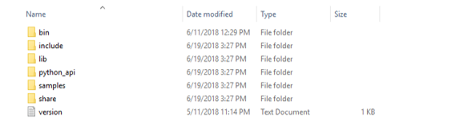
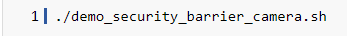
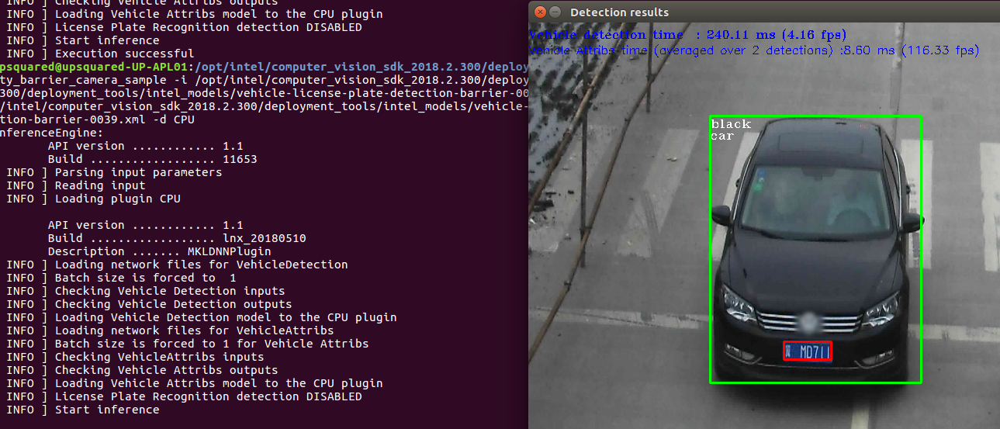

## Explore Intel® OpenVINO™ toolkit Samples
### Introduction
The OpenVINO™ toolkit is a comprehensive toolkit for quickly developing applications and Solutions that emulate human vision. Based on Convolutional Neural Networks (CNNs), the Toolkit extends computer vision workloads across Intel hardware, maximizing performance.
### The OpenVINO™ toolkit:
- Enables the CNN-based deep learning inference on the edge.
- Supports heterogeneous execution across Intel's computer vision accelerators, using a common API for the CPU, Intel® Integrated Graphics, Intel® Movidius™ Neural Compute Stick, and FPGA. However, we are not covering Intel® Movidius™ and FPGA in this lab.
- Speeds time-to-market through an easy-to-use library of computer vision functions and pre-optimized kernels.
- Includes optimized calls for computer vision standards, including OpenCV, OpenCL, and OpenVX

### Pre-requisites
* **System Requirements**
  - Only the CPU, Intel® Integrated Graphics, and Intel® Movidius™ Neural Compute Stick options are supported for the Windows installation. Linux is required for using the FPGA or Intel® Movidius™. Myriad™ 2 VPU options.
* **Processors**
  - 6th – 8th Generation Intel® Core™
  - Intel® Xeon® v5 family, Intel® Xeon® v6 family
* **Operating System**
  - Ubuntu* 16.04.3 long-term support (LTS), 64-bit
  - CentOS* 7.4, 64-bit
  - Yocto Project* Poky Jethro* v2.0.3, 64-bit (for target only)

### Exploration
   This lab starts with exploring and understanding the Intel® OpenVINO™ toolkit related packages installed in your device and running the prebuilt sample applications available with OpenVINO™ toolkit. Next lab session is to build a customized application using OpenVINO™ toolkit.

### Observation
Observe the folder structure available within OpenVINO™ toolkit and the performance difference between CPU and GPU.

### Learning Outcome
By the end of this module, the participant is expected to understand the Intel®
  OpenVINO™ toolkit, installation structure and performance difference between CPU and GPU.
### To View the Packages installed on your Device
* **OpenVINO™ toolkit installer**                                                 
 OpenVINO™ toolkit by default installs at opt\Intel\computer_vision_sdk_2018.1.265\
* **OpenVINO™ toolkit sample applications showing various OpenVINO™ capabilities**
OpenVINO™ samples is made available in opt\Intel\computer_vision_sdk_2018.1.265                         \deployment_tools\inferenceengine\samples\build\
* **OpenVINO™ toolkit Documentation directory**
opt\Intel\computer_vision_sdk_2018.1.265\deployment_tools\documentation
* **OpenVINO™ toolkit pre-trained models**
opt\Intel\computer_vision_sdk_2018.1.265\deployment_tools\intel_models

### Understanding the Packages
Go to opt\Intel\computer_vision_sdk_2018.1.265\deployment_tools\inferenceengine to understand the package contents.

- **bin** folder has 64-bit runtime libraries for OpenVINO™ toolkit samples
For example, cLDNN64.dll, cLDNNPlugin.dll and so on.
- **doc** folder has documentation for OpenVINO™ samples like classification, object detection, interactive_face_detection and so on.
- **include** folder has several header files required for developing application using OpenVINO™ toolkit.
- **lib** folder has 64-bit plugin library like inference engine and libiomp5md are useful for video applications.
-  Inferenceengine.dll is the software library for loading inference engine plugins for CPU, GPU and so on.
- libiomp5md.dll is Intel® OMP runtime library is used for developing application using OpenMP.

### Running the Sample Programs
* **Security Barrier Camera Sample**                            
**Description**                           
Showcase Vehicle Detection, followed by Vehicle Attributes and License Plate Recognition are applied on top of Vehicle Detection. The vehicle attributes execution barrier reports the general vehicle attributes, like the vehicle type and colour, whether the type is something like car, van, or bus.
* **Verify the Installation Using the Demo Scripts**            
- Go to the Inference Engine demo directory:                                    
  
- Run the Image Classification demo script.         
This demo uses the Model Optimizer to convert a SqueezeNet model to the .bin and .xml
Intermediate Representation (IR) files. The Inference Engine requires this model conversion so it can use the IR as input and achieve optimum performance on Intel hardware.This demo also builds the sample applications included in the package.
                       
This demo uses the cars.png image in the demo directory. When the demo completes, you will have the label and confidence for the top-10 categories.

   
- Run the Inference Pipeline demo script.             
This demo uses the cars.png image in the demo directory and shows an inference pipeline using three of the pre-trained models. The demo uses vehicle recognition in which vehicle attributes build on each other to narrow in on a specific attribute.              
First, an object is identified as a vehicle. This identification is used as input to the next model, which identifies specific vehicle attributes, including the license plate. Finally, the attributes identified as the license plate are used as input to the third model, which recognizes specific characters in the license plate.             
This demo also builds the sample applications included in the package.

          
  When the demo completes, you will see an image that displays the resulting frame with detections rendered as bounding boxes, and text.

  
- Press esc button to terminate.

### Lessons Learnt
- Intel® OpenVINO™ toolkit, libraries, header and sample code files and available model
- 	Performance difference in detection time, fps with security_barrier sample.
- converted a SqueezeNet model to the .bin and .xml
