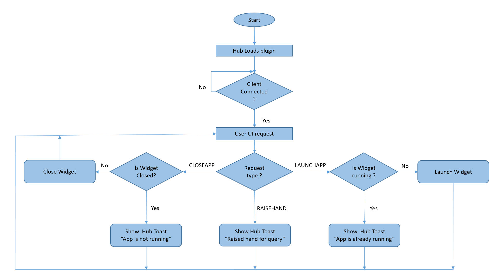
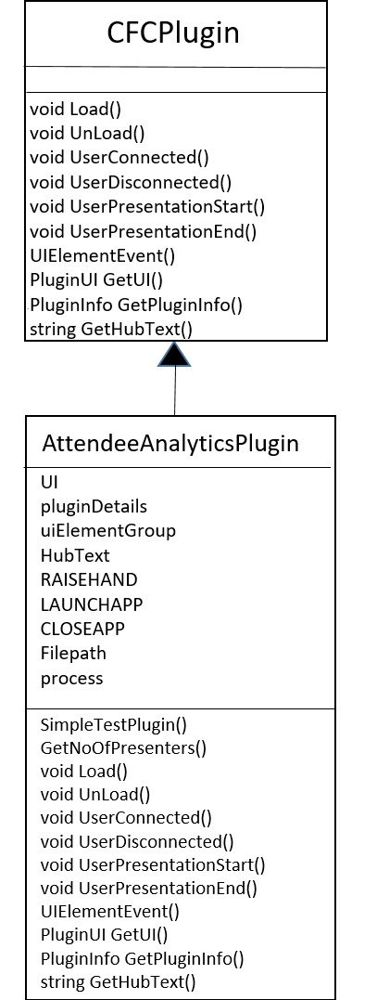
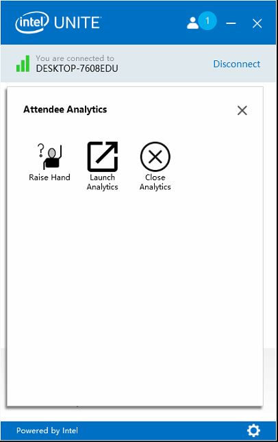
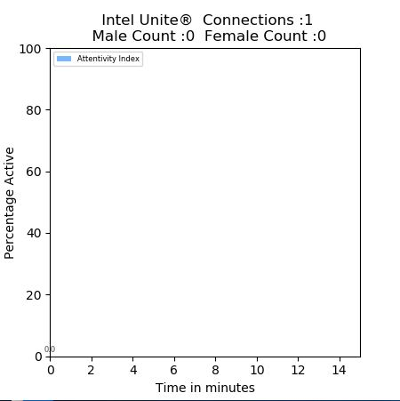

# Enhancing the Intel Unite® Plugin and Integrating it with external solutions
## Lab Overview
In the previous lab a sample Intel Unite® plugin is developed to display Toast messages on the hub. In this lab, the functionality of sample plugin is enhanced to capture the no. of users connected to and presenting on the Intel Unite® hub. Also, the integration of the plugin with Intel® Distribution of OpenVINO™ toolkit is covered here.


## Flow Diagram

  


## Class Diagram


  


## Tasks to be done
- Enhancing the sample plugin UI for additional functionalities
- Capturing the Intel Unite® software session data using Intel Unite® Plugin SDK
- Developing an external widget solution based on Intel® Distribution of OpenVINO™ toolkit       
- Intel Unite® plugin integration with the external widget solution

### Enhancing the sample plugin UI for additional functionalities
The plugin can be customized using various options provided in the Intel Unite® plugin SDK.
- Replace #TODO:  Declare attributes for advanced plugin
- Paste the following lines
```c
const string LAUNCHAPP = "00000000-0000-0000-0000-000000000009";
const string CLOSEAPP = "00000000-0000-0000-0000-000000000010";
String str = null;
String filepath = @"C:\\Users\\intel\\Desktop\\Retail\\OpenVINO\\UniteData.json";
Process p = null;
```
- Replace #TODO: Add UI elements for advanced plugin
- Paste the following lines

```c
uiElementGroup.UIElements.Add(new PluginUIElement(new Guid(LAUNCHAPP), UIElementType.Button, "Launch Analytics", "", ResourceToBytes(new Uri("/AttendeeAnalyticsPlugin;component/launch.png", System.UriKind.Relative))));

uiElementGroup.UIElements.Add(new PluginUIElement(new Guid(CLOSEAPP), UIElementType.Button, "Close Analytics", "", ResourceToBytes(new Uri("/AttendeeAnalyticsPlugin;component/close.png", System.UriKind.Relative))));
```

###  Capturing the Intel Unite® software session data  using Intel Unite® plugin SDK
To dive deep, the real time application data of the Intel Unite® software can be captured using the CFCPlugin library. The ```UserEventArgs``` object holds list of CurrentUsers. ```e.CurrentUsers.count``` gives the no. of Unite® clients connected to the hub. Using the CFCPlugin, no. of users presenting desktop can be captured.
- Replace #TODO: fetch Intel Unite application data
- Paste the following lines
```c
public int GetNoOfPresenters(UserEventArgs e)
{
    int i = 0;
    foreach (UserInfo user in e.CurrentUsers) // Loop through List with foreach
    {
        if (user.isPresenting)
        {
            i++;
        }
    }
    return i;
}
```

The above captured data are to be saved in JSON format for integration with external widget solution (discussed in the next tasks). This data should be updated when a user connects/disconnects and when a user presentation starts/ends.

- Replace #TODO: Implement Overridden method for Advanced plugin
- Paste the following lines

```c
str = "{\"usersConnected\":" + e.CurrentUsers.Count + ",\n\"usersPresenting\":" + GetNoOfPresenters(e) + ",\n\"timestamp\":\"" + DateTime.Now.ToString("h:mm:ss") + "\"}";
System.IO.File.WriteAllText(filepath, str);
```
### Developing an external widget solution based on Intel® Distribution of OpenVINO™ toolkit
The external widget solution that is being developed will fetch data from the two different applications, Intel® Distribution of OpenVINO™ toolkit application and the Intel Unite® plugin application.

- On the hub, Run local server by using below command

```c
cd C:\users\intel\Desktop\Retail\OpenVINO\CloudAnalyticsServer
C:\users\intel\Desktop\Retail\OpenVINO\CloudAnalyticsServer> node server.js
```

- In order to run the interactive_face_detection_sample.exe for the Advanced Plugin, open the command prompt and perform the following.

```c
cd C:\users\intel\Desktop\Retail\OpenVINO\inference_engine\bin\intel64\Debug\
C:\users\intel\Desktop\Retail\OpenVINO\inference_engine\bin\intel64\Debug>interactive_face_detection_sample.exe
```

For simplicity, an external python application, Widget.pyw is already created at the path ***C:\Users\intel\Desktop\Retail\"Intel Unite"***.

This python application reads the live data generated by Intel Unite® plugin and interactive_face_detection_sample application and performs analytics on the data to calculate number of Intel Unite® software connections, no. of males, no. of females present in the room and no. of people looking at the hub camera. Using this information, the application plots a graph of attentivity index. Attentivity index is the no. of people attentive in the meeting room i.e., the no. of people watching the presentation. This Python application captures those values and plots a bar for every 1 minute. The application displays this information on the hub which can be seen by all the participants in the meeting. Any Client connected to this hub can launch or close this widget during the session.

Paste the following code.
```c
import time
from threading import Timer
from watchdog.observers import Observer
from watchdog.events import FileSystemEventHandler
import json
from matplotlib.backends.backend_tkagg import FigureCanvasTkAgg
import matplotlib as mpl
import matplotlib.pyplot as plt
import numpy as np
import tkinter as tk
import pandas as pd
import math
from tkinter import *
from threading import Thread

connections=[0]
presentations=[0]
facecount=[0]
malecount=[0]
femalecount=[0]
attentivecount=[0]
unite_timestamp=[0]
ov_timestamp=[0]
ov_flag=False
unite_flag=False
ov_temp=[0]
counter = 0;
average_males=[0]
average_females=[0]
average_attentivity=[0]
ind = [0]

class Handler(FileSystemEventHandler):

    def invokemethod(self):
        print("in innvoke method")
        plotGraph()
        Timer(60, self.invokemethod, ()).start()

    def on_any_event(self,event):
        global unite_flag,ov_flag
        print("Inside  change");
        print(event.src_path);
        if(event.src_path=="C:\\Users\\intel\\Desktop\\Retail\\OpenVINO\\AttentivityData.json"):
                 self.jsonRead_OVData(event.src_path)
        elif(event.src_path=="C:\\Users\\intel\\Desktop\\Retail\\OpenVINO\\UniteData.json"):
                 self.jsonRead_uniteData(event.src_path)
        if unite_flag==True or ov_flag==True:
            unite_flag=False
            ov_flag=False

    def jsonRead_uniteData(self,path):
        global unite_flag
        with open(path) as f2:
            UniteData = json.load(f2)        
        if(unite_timestamp[-1]!=UniteData["timestamp"]):
            unite_flag=True
            unite_timestamp.append(UniteData["timestamp"])
            connections.append(UniteData["usersConnected"])
            presentations.append(UniteData["usersPresenting"])

    def jsonRead_OVData(self,path):
        global ov_flag
        OVData=[]
        try:
            with open(path) as f1:
                OVData = json.load(f1)
                print("file open is done")
            if(OVData== None):
                print("no value read from openvino")
            if(ov_timestamp[-1]!=OVData["timestamp"]):
                print("value is taken from file")
                ov_flag=True
                ov_timestamp.append(OVData["timestamp"])
                facecount.append(OVData["facecount"])
                malecount.append(OVData["malecount"])
                femalecount.append(OVData["femalecount"])
                attentivecount.append((OVData["attentivityindex"]/OVData["facecount"])*100)
        except:
            print("Unexpected error occured")

class MyThread(Thread):
    def __init__(self):
        Thread.__init__(self)

    def run(self):
        print("in run")
        event_handler=Handler()
        event_handler.jsonRead_OVData("C:\\Users\\intel\\Desktop\\Retail\\OpenVINO\\AttentivityData.json")
        event_handler.jsonRead_uniteData("C:\\Users\\intel\\Desktop\\Retail\\OpenVINO\\UniteData.json")
        observer = Observer()
        observer.schedule(event_handler, "C:\\Users\\intel\\Desktop\\Retail\\OpenVINO", recursive=False)
        observer.start()
        observer.join()
        print("leaving run")


def plotGraph():
    global counter
    if(len(malecount) and len(femalecount) and len(attentivecount)):
        malemean = math.ceil(sum(malecount)/len(malecount))
        femalemean = math.ceil(sum(femalecount)/len(femalecount))
        attentivityindex  = math.ceil(sum(attentivecount)/len(attentivecount))
    else:
        malemean=0
        femalemean=0
        attentivityindex=0

    average_males.append(malemean)
    average_females.append(femalemean)
    average_attentivity.append(attentivityindex) 
    del malecount[:]
    del femalecount[:]
    del attentivecount[:]

    ov_temp.append(counter)
    counter = counter+1
    males = np.array(average_males)
    females = np.array(average_females)
    attentivityvalue = np.array(average_attentivity)
    ind = [x for x, _ in enumerate(ov_temp)]
    plt.clf()    
    ax = plt.gca()
    ax.set_xbound(-1.0 ,5.0)
    plt.xlim((0, 15))
    plt.ylim((0, 100))

    print(attentivityvalue[-1])
    frequencies = attentivityvalue
    freq_series = pd.Series(frequencies)
    temptext=" \n Intel Unite®  Connections :"+ str(connections[-1])+"\n  Male Count :"+str(int(malemean))+"  Female Count :"+str(int(femalemean))
    plt.title(temptext)
    plt.bar(ov_temp, attentivityvalue, width=0.8, label='Attentivity Index', color='#77b7ff')
    plt.ylabel("Percentage Active",labelpad=0.5)
    plt.xlabel("Time in minutes")
    plt.legend(loc="upper left",prop={'size': 6})
    rects = ax.patches

    # For each bar: Place a label
    for rect in rects:
        # Get X and Y placement of label from rect.

        y_value = rect.get_height()
        x_value = rect.get_x() + rect.get_width() / 2

        # Number of points between bar and label. Change to your liking.
        space = 2
        # Vertical alignment for positive values
        va = 'bottom'
        # Use Y value as label and format number with one decimal place
        label = "{:.1f}".format(y_value)

        # Create annotation
        plt.annotate(
            label,                      # Use `label` as label
            (x_value, y_value),         # Place label at end of the bar
            xytext=(0, space),          # Vertically shift label by `space`
            textcoords="offset points", # Interpret `xytext` as offset in points
            ha='center', fontsize=6,
            color='gray',               # Horizontally center label
            va=va)                      # Vertically align label differently for
                                        # positive and negative values.

    fig.canvas.draw_idle()
    print("Graph")


event_handler = Handler()
Timer(1, event_handler.invokemethod, ()).start()  
myThreadOb1 = MyThread()
myThreadOb1.setName('Widget Thread')
myThreadOb1.start()
# This defines the Python GUI backend to use for matplotlib
mpl.use('tkAgg')

# Initialize an instance of Tk
root = tk.Tk()
root.overrideredirect(1)

# Initialize matplotlib figure for graphing purposes
fig = plt.figure(figsize=(4.5,4.5), dpi=100)

# Special type of "canvas" to allow for matplotlib graphing
canvas = FigureCanvasTkAgg(fig, master=root)
plot_widget = canvas.get_tk_widget()

males = np.array(malecount)
females = np.array(femalecount)
plot_widget.grid(row=0, column=0)
root.mainloop()
```

### Intel Unite® Plugin integration with the external widget solution

For controlling the above created external widget solution, the button events, LAUNCHAPP and CLOSEAPP should be handled.
- Replace #TODO: Handling more events
- Paste the following lines

 ```c
 case LAUNCHAPP:
     if (this.p != null)
     {
         HubText = "User '" + e.TargetUser.Name.ToUpper() + "'" + " App already running";
         ShowHubToast(HubText, currentStateImage, 5);
     }
     else
     {
         this.p = Process.Start("C:\\Users\\intel\\Desktop\\Retail\\"Intel Unite"\\Widget.pyw");
     }
     break;

 case CLOSEAPP:
     if (this.p != null)
     {
         this.p.Kill();
         this.p = null;
     }
     else
     {
         HubText = "User '" + e.TargetUser.Name.ToUpper() + "':" + " The App is not running";
         ShowHubToast(HubText, currentStateImage, 5);
         this.p = null;
     }
     break;
 ```

### Unload the Widget
- Replace #TODO: Unload the Widget
- Paste the following lines

```c
	if (this.p != null)
	{
	   this.p.Kill();
	   this.p = null;
	}
```

## Final Solution
Build solution and deploy the AttendeeAnalyticsPlugin.dll by following the steps discussed previously in sample plugin development.

In the client application, click on the Attendee Analytics plugin.

  


 Launch Analytics when clicked shows the following widget on the hub.

  

  The updated widget will look as follows.

     

  This widget can be controlled by any client connected to this hub. The client can close the widget by clicking on the Close Analytics button of the plugin.


The code for this solution is available [here](./solutions/AdvancedPluginSolution.md)

## Lesson Learnt
- Understanding the capabilities of Intel Unite® plugin
- Integration of the plugin with external solution based on Intel® Distribution of OpenVINO™ toolkit

[IWB Home](./IntelUnitePluginDevelopment.md)
