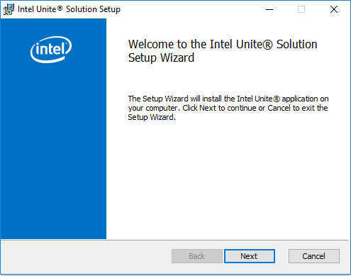
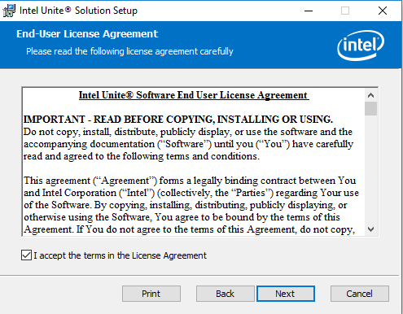
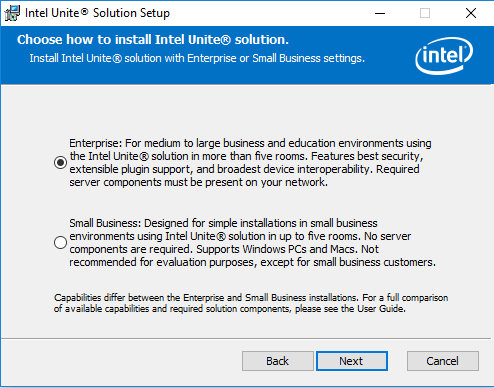
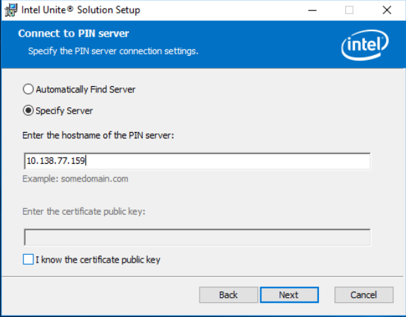
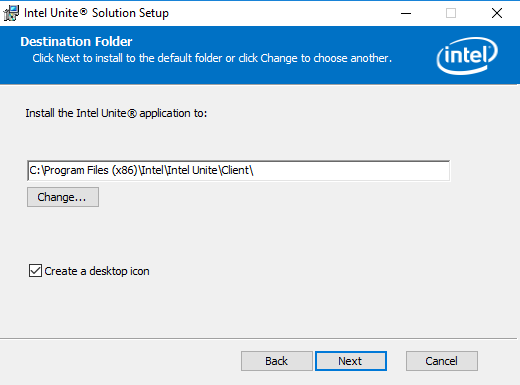
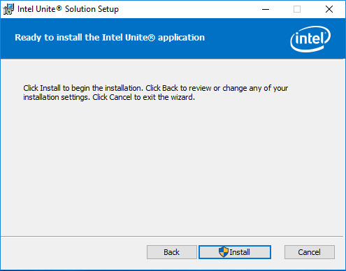
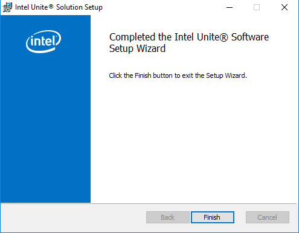
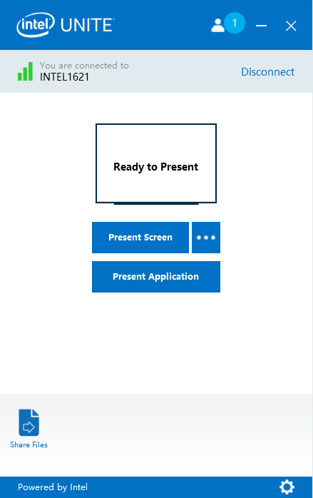

# Setting up Intel Unite® Client
In this lab, your NUC will be setup as Intel Unite® Client.

Follow the below steps to setup Intel Unite® Client in the NUC.

- Go to Desktop\Intel Unite Folder. To Install Client, double click on **Intel Unite® Client.mui.msi**.
- A window will pop up as below. Click **Next**

- Accept the terms and conditions and click **Next** to continue.

- Select the enterprise mode and click **Next**

- Select **Specify Server**
- Enter the IP address of the Intel Unite® server and click **Next** to continue.

- Keep the default installation path and select the checkbox for creating desktop icon.
- Click **Next** to continue

- Click **Install** to continue

- Click Finish to complete the installation process.

## Connect to Intel Unite® Hub
To start the Intel Unite® Client, double click on the Unite icon available at your desktop. A **Connect to a screen** will be displayed as below

Enter the **PIN** available from Unite® Hub to connect to the HUB

Now you are successfully connected to Hub

To start presenting the screen, click **Present Screen**.

## Next lab
[Developing and Deploying a sample Intel Unite® plugin](./SamplePluginDevelopment.md)
