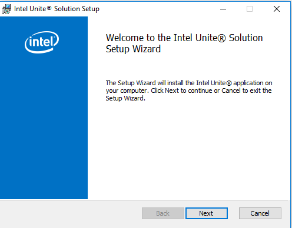
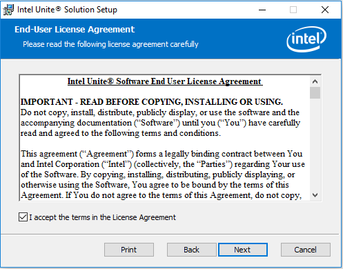
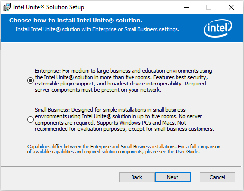
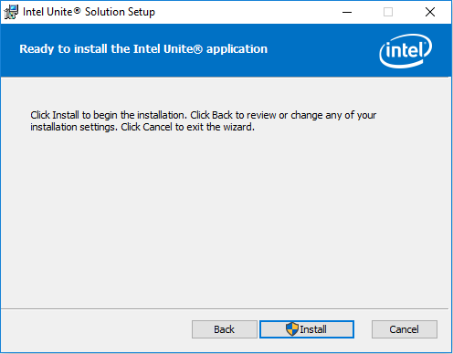
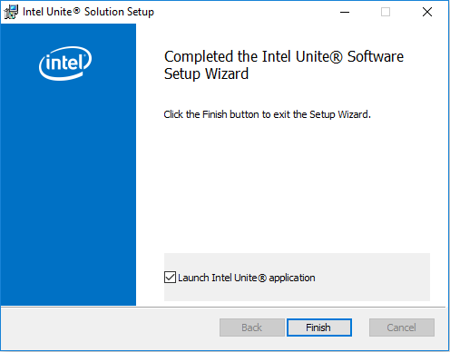

# Setting up Intel Unite® Hub
In this lab, your NUC will be setup as Intel Unite® Hub.

Follow the below steps to setup Intel Unite® Hub in your NUC.

- Go to Desktop\Intel Unite\ Folder. To Install Hub, double click on **Intel Unite® Hub.mui.msi**.
- A window will pop up as below. Click **Next**

- Accept the terms and conditions and click **Next** to continue.

- Select the enterprise mode and click **Next**

- Select **Specify Server**
- Enter the IP address of the Intel Unite® server and click **Next** to continue.

- Keep the default installation path and select the checkbox for creating desktop icon.
- Click **Next** to continue

- Click **Install** to continue

- Click Finish to complete the installation process.

## Start the Intel Unite® Hub
To start the Intel Unite® Hub, double click on the Unite icon available at your desktop. Accept the privacy statement, and proceed.

Once the Hub is started successfully a PIN will be visible at top right corner of your monitor. Wait for client to connect.

## Next Lab
[Setup Intel Unite® Client](./IntelUniteClientSetup.md)
