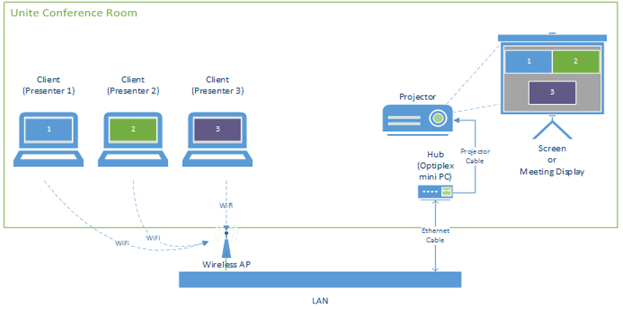

# Intel Unite® Plugin Development
The Intel Unite® solution powers productive and more secure collaboration. Meetings start fast with easy wireless content sharing to room displays and other devices connected to the corporate network. Intel Unite® Plugin development here is to imbibe external solutions into a featured app on Intel Unite® and is to join Intel’s mission to make meetings more productive.

## Overview of Intel Unite®
The Intel Unite® solution is modernizing Intel’s conference rooms, transforming them into smart, connected spaces where employees – both inside and outside the room – can collaborate more productively.
-	Eliminates cables, dongles and adapters that complicates connecting devices to displays. Meeting starts faster and productive time is increased.
-	Supports remote participation in the meeting by letting employees share content directly from their client devices from anywhere in the world.
-	Helps to share the conference room display fully operational through remote support and proactive issue identification and remediation.

The Intel Unite® solution consists of three components – an Enterprise Server, a Hub, and a Client.

  

- 	The Enterprise Server is the first component to be set up. When the Hub and Client applications are launched, they will use the Enterprise Server to exchange connection information and receive PIN assignments.
- 	The Hub is the Intel® Core™ vPro™ processor-based mini PC that is typically connected to a display or projector in a conference room.
- 	Clients connect to the Hub by entering the displayed PIN. Once connected, a Client can present content, view and annotate, and share files with other participants connected to the same Hub and interact with plugins installed on the Hub.

### Prerequisites
There are few software and tools are required for the Intel Unite® setup and plugin development. All these are installed in the hardware supplied as a part of workshop. To know about the Prerequisites, click [here]()

### Plugins on Intel Unite®
The Intel Unite® application supports the use of plugins. Plugins are software elements that extend the features and capabilities of the application, implementing user experience modalities.

The Intel Unite® software offers a plug-in Application Programming Interface (API) that gives the ability to incorporate business needs and functionality into an enterprise.

The Software Development Kit (SDK) for plugin development by Intel Unite® is intended for use by IT professionals, software developers and anyone looking to developing additional functionality for the Intel Unite® app.

## Lab Overview
Developing a plugin on Intel Unite® and integration with an external widget solution.

## Tasks for the plugin development process

- [Developing and Deploying a sample Intel Unite® plugin. ](./tasks/SamplePluginDevelopment.md)
- [Enhancing the Intel Unite® Plugin and Integration with external solutions.](./tasks/AdvancedPluginDevelopment.md)

In the first task, a sample plugin on Intel Unite® is created and deployed to display simple toast messages on the hub. As a continuation to the this task, the sample plugin is advanced for the integration with external solutions in the second task.

## Final solution

The final solution of Intel Unite® plugin is available  [here](./solution/AdvancedPluginSolution.md).
## Lesson Learnt
Plugin development on Intel Unite® and integration of plugin with external solutions.
