# Developing a sample Intel Unite® Plugin

## Lab Overview
In this lab, a sample plugin on Intel Unite® is created and deployed to display toast messages on the hub.

For simplicity, AttendeeAnalyticsPlugin.cs is already created at ***C:\Intel\Desktop\Retail\06-IWB\samples\AttendeeAnalyticsPlugin***, which includes required header files, overridden methods and TODOs that are to be replaced. The template for the plugin is available [here](./solutions/PluginTemplate.md)
- TODO is a small unit of module for code simplification.
- Replace all the TODOs with corresponding code snippets provided here.
- Keep all the other TODOs untouched. These will be discussed in the next lab.

In this Lab, a sample plugin for Intel Unite® is developed and deployed. Here, TODOs only for sample plugin are dealt and the rest are discussed in the next lab.

## Architecture of Sample Plugin
  

## Class Diagram

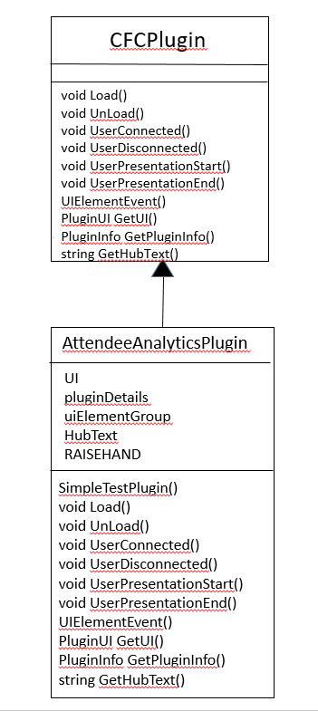

## This lab will be laid out as follows
- Creating a sample plugin on Intel Unite®
    - Declaring required variables for plugin development
    - Defining plugin properties
    - Adding the UI elements     
    - Handling User event on plugin


- Deployment of Intel Unite® plugin
    - Building the plugin
    - Signing the dll
    - Plugin Configuration in the Admin portal
    - Testing the Plugin

### Creating a sample plugin on Intel Unite®

#### Declaring variables for plugin UI
As class properties, create an object of PluginUI, which contains all details about the exposed UI elements. create an instance of PluginInfo, that holds the details about the plugin. Create UI groups object i.e., PluginUIElementGroup, as a grouping of UI elements which holds attributes such as Description, GroupName, Image ,ImageBytes,e bytes for Graphics with UI Group.

To add an element, every element should have a unique ```Guid```. Declare and define a class variable named ```RAISEHAND```.

- Replace #TODO: Declaring variables for plugin UI
- Paste the following lines

```c
PluginUI UI = null;
PluginInfo pluginDetails = new PluginInfo();
PluginUIElementGroup uiElementGroup = new PluginUIElementGroup();
String HubText = "";
const string RAISEHAND = "00000000-0000-0000-0000-000000000008";
```

#### Defining plugin properties
In the method ```public void SimpleToastPlugin()```, define the Plugin information , define the plugin UI and create UI elements. These properties are to display the details about the plugin such as name of the plugin, description about it, image for the plugin icon and other such details about the plugin.  

- Replace #TODO: Defining plugin properties
- Paste the following lines


```c
            pluginDetails.Name = "";
            pluginDetails.Id = new Guid("12345678-1234-1234-1234-123456781235");
            pluginDetails.Description = "Attendee Analytics";
            pluginDetails.Copyright = "";
            pluginDetails.Company = "";

            UI = new PluginUI();
            UI.pluginInfo = pluginDetails;
            UI.Groups = new List<PluginUIElementGroup>();

            uiElementGroup.GroupName = "Attendee Analytics";
            uiElementGroup.ImageBytes = ResourceToBytes(new Uri("/AttendeeAnalyticsPlugin;component/anlytics.png", System.UriKind.Relative));
            uiElementGroup.UIElements = new List<PluginUIElement>();
            uiElementGroup.Description = "A sample plugin for Hub toast";
```
#### Adding UI elements  
Add the button element to the ``` PluginUIElementGroup``` in order to display them on the client version of Intel Unite®. Even though the elements are created, they must be added to the UI Element Group to display them on the plugin UI.
- Replace #TODO: Adding UI elements
- Paste the following lines

```c
uiElementGroup.UIElements.Add(new PluginUIElement(new Guid(RAISEHAND), UIElementType.Button, "Raise Hand", "", ResourceToBytes(new Uri("/AttendeeAnalyticsPlugin;component/raisehand.png", System.UriKind.Relative))));
//TODO: Adding UI elements for advanced plugin
UI.Groups.Add(uiElementGroup);
  ```
####  Handling User event on plugin
Events on the plugin can be triggered on the hub. Here, a toast message should be displayed whenever the user clicks the button element. The method ```ShowHubToast()``` is used to display messages temporarily on the hub Temporarily display a message. An image is optional. The message will be shown from 1 to 10 seconds, depending on fade time. Toast messages are suppressed during presentations.  

Call ```FireUIUpdated()``` to notify the Intel Unite® application to update connected clients with changes to the UI. Use``` FireHubTextUpdated()``` to notify the Intel Unite® application with updates to the display’s status line.
- Replace #TODO: Handling User event on plugin
- Paste the following lines

```c
            LogMessage("Plugin Received UI Event: " + e.ElementId.ToString(), null);
            byte[] currentStateImage = new byte[0];

            switch (e.ElementId.ToString())
            {

                case RAISEHAND:
                    currentStateImage = ResourceToBytes(new Uri("/AttendeeAnalyticsPlugin;component/raisehand.png", System.UriKind.Relative));
                    HubText = "User '" + e.TargetUser.Name.ToUpper() + "'" + " raised hand for a query";
                    ShowHubToast(HubText, currentStateImage, 5);
                    break;
                    //TODO: Handling more events
            }
            FireHubTextUpdated();
            FireUIUpdated();
  ```

### Deploying the Intel Unite® Plugin
Follow these steps to deploy the Intel Unite® Plugin
#### Building the plugin
- Build the code developed to generate AttendeeAnalyticsPlugin.dll file.
    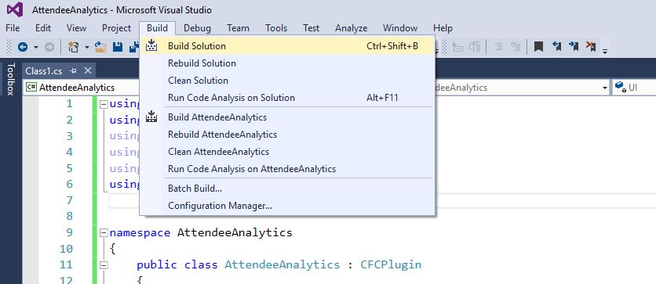

    The AttendeeAnalyticsPlugin.dll file is generated in the project folder bin\debug

    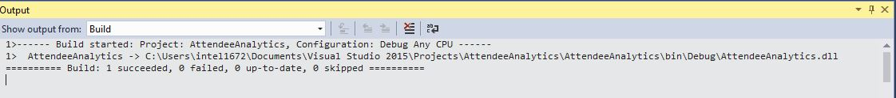


-	Copy the AttendeeAnalyticsPlugin.dll to the plugin directory within the hub installation directory  ***C:\ProgramFiles(x86)\Intel\Intel Unite\Hub\Plugins***.

  If the folder is not found in the given path, create a folder with name "Plugins" as per the above directory structure and copy the AttendeeAnalyticsPlugin.dll file.

  This is the folder which contains all the plugins that the hub serves to its clients.

    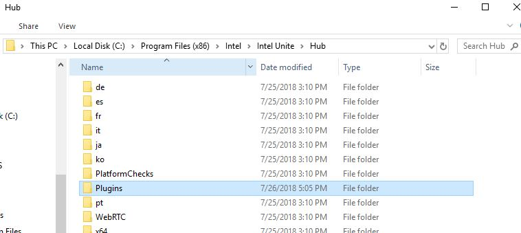

#### Signing the DLL
-	Adding Digital Signature to plugin:
    - Open the developer command prompt for Visual Studio in administrative mode.
    - PluginCertificateHash_NameOfThePlugine the directory to the folder where plugin is located.
    - Create a new certificate by following these steps
    ( *NOTE: Once the first two steps are performed, never repeat them*)
         - makecert -n "CN=UniteDeveloper" -r -pe -ss TestDeveloper UniteCertificate.cer
         - certmgr -add UniteCertificate.cer -s -r localmachine root
         - signtool sign /a /s TestDeveloper AttendeeAnalyticsPlugin.dll

         **Note**: Whenever there is change in the code and the solution is rebuild, perform only the last step i.e., signing the dll.

- Getting the	Plugin certificate Hash value
  -	Locate the plugin in the Plugins folder, right click on the AttendeeAnalyticsPlugin.dll and select Properties

        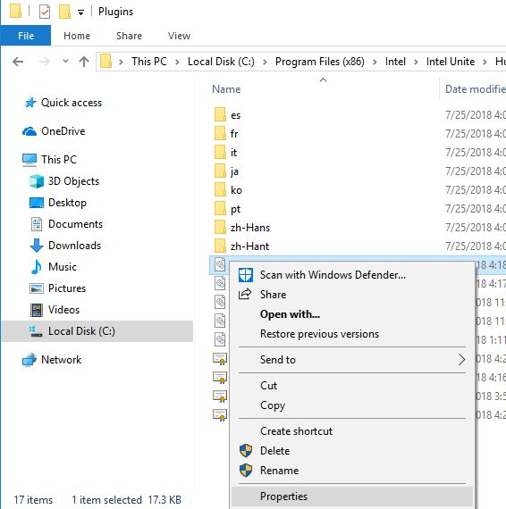

  -	When the plugin Properties window opens, Locate the Digital Signatures tab. Click OK to open.

        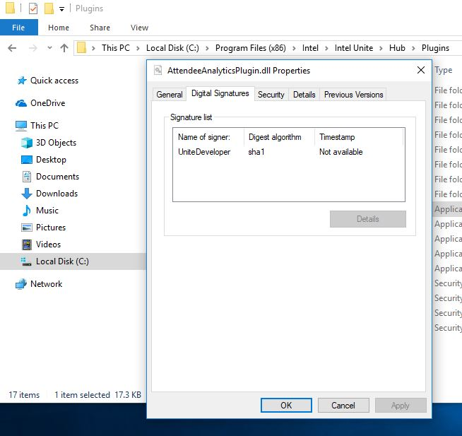

  -	Select Signature and click Details.

        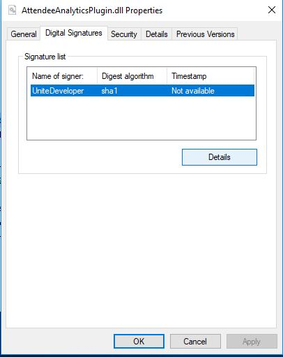
	- In the Digital Signature Details window, click View Certificate. If this window is not found, add the Digital Signature to plugin by following the step 3

        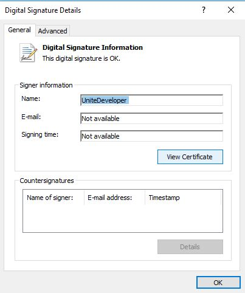
  -	In the Certificate window, select the Details tab and scroll down until the Thumbprint is found.

        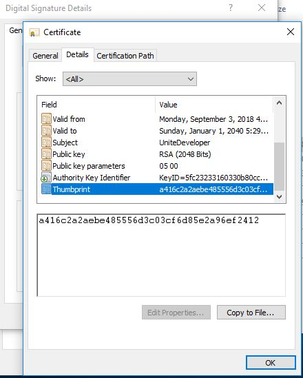
	- Select Thumbprint. After the value is displayed, copy it into a notepad or a text file by clicking Copy to File. Remove the spaces and save it.

  -	This key value will be used while creating the Profile for the plugin. The key value can be created and entered after the profile has been created. Continue to next section to know more about it.

#### Plugin Configuration in the Admin portal

- Adding Certificate Hash to a plugin in the admin portal
	 - Login to the admin portal using localhost/admin/#login and credentials.
   If the logging in for the first time, use the following default credentials

      - Username : admin@server.com
      - Password : Admin@1

    
   - Under Groups, select Profiles
    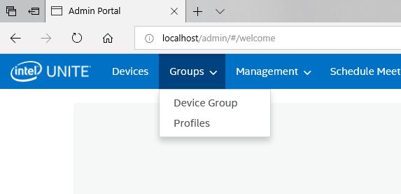

   - List of all the properties in the profile are visible here.
       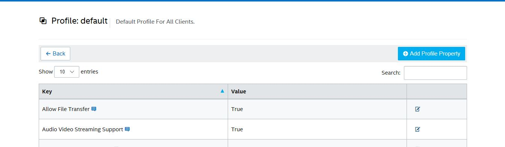

   -	Click Add Profile Property and enter the following details to enable the plugin.:
        - Key: PluginCertificateHash_NameOfThePlugin
        - Data Type: String
        - Unit: Text
        - Value: Enter the key value saved from the thumbprint

            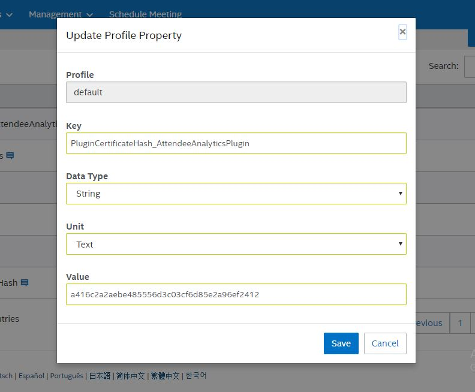
   - Save the property.
   -	Launch the Intel Unite® Hub in the Administrative mode from the command prompt. To view the log, launch the application in debug mode.
   -	Launch the Unite® client application and enter the pin from the hub.
   -	After the connection has been created, the plugin icon is visible at the bottom of the Intel Unite® Client Management window.


#### Testing the plugin

  - When the hub is restarted, the Attendee Analytics plugin will be loaded.

  - When the client connects to the hub, the plugin should be listed in the Intel Unite® client application home UI at the bottom.

       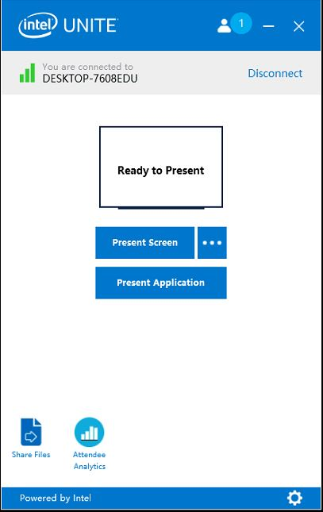

   - Click on the plugin icon to view the plugin home screen. The plugin elements such as buttons and information that are defined in the plugin UI will be visible here.

        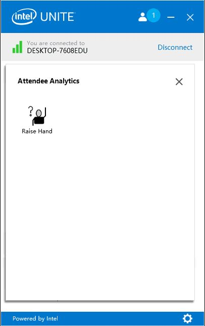


   - The Raise Hand icon here will fire a toast message on hub. Click on it to test the plugin behavior. The Log messages can be referred to see the plugin behavior when the hub is launched in the debug mode.

        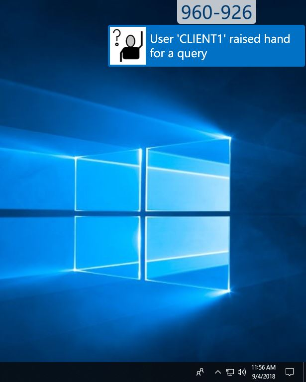

## Final solution
 The complete solution for the sample Intel Unite® plugin is available [here](./solutions/SamplePluginSolution.md).
## Lesson Learnt
Building and deploying a sample plugin on Intel Unite®.
