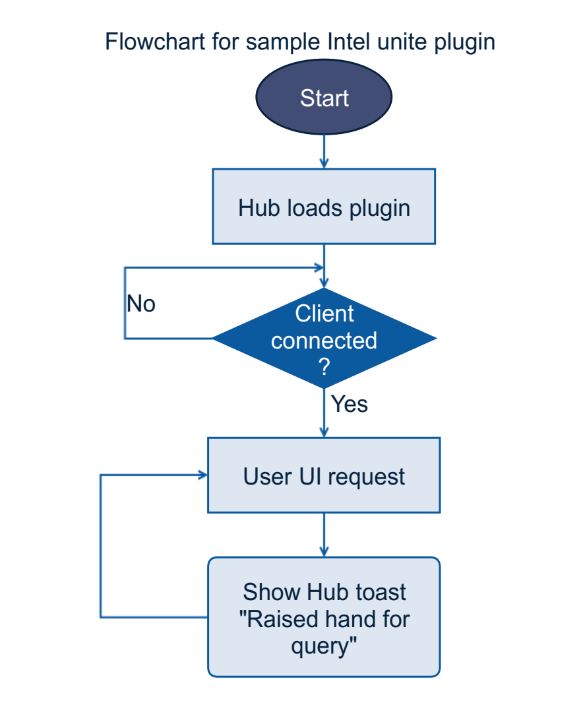

# Developing a sample Intel Unite® Plugin

## Lab Overview
In this lab, a sample plugin on Intel Unite® software is created and deployed to display toast messages on the hub.

For simplicity, AttendeeAnalyticsPlugin.sln is already created at ***C:\intel\Desktop\Retail\06-IWB\AttendeeAnalyticsPlugin***, which includes required header files and TODOs that are to be replaced. The template for the plugin is available [here](./solutions/PluginTemplate.md)
- TODO is a small unit of module for code simplification.
- Replace all the TODOs with corresponding code snippets provided here.
- Keep all the other TODOs untouched. These will be discussed in the next lab.

In this Lab, a sample plugin for Intel Unite® software is developed and deployed. Here, TODOs for sample plugin are only dealt and the rest are discussed in the next lab.

## Flow Diagram

  

## Class Diagram

  

## This lab will be laid out as follows
- Creating a sample plugin on Intel Unite® software
    - Declare plugin attributes
    - Initialize the plugin
    - Load the Plugin
    - User connection handling
    - Start User presentation
    - Handle user event
    - End User presentation
    - User connection handling
    - Unload the Plugin

- Deploy the Intel Unite® plugin
    - Building the plugin
    - Signing the dll
    - Plugin Configuration in the Admin portal
    - Testing the Plugin

### Creating a sample plugin on Intel Unite® Software

#### Declaring plugin attributes
As class properties, create an object of PluginUI, which contains all details about the exposed UI elements. Create an instance of PluginInfo, that holds the details about the plugin. Create UI groups object i.e., PluginUIElementGroup, as a grouping of UI elements which holds attributes such as Description, GroupName, Image, ImageBytes, IndicatorCount, UIElements for Graphics with UI Group.

To add an element, every element should have a unique ```Guid```. Declare and define a class variable named ```RAISEHAND```.

- Replace #TODO: Declaring plugin attributes
- Paste the following lines

```c
PluginUI UI = null;
PluginInfo pluginDetails = new PluginInfo();
PluginUIElementGroup uiElementGroup = new PluginUIElementGroup();
String HubText = "";
const string RAISEHAND = "00000000-0000-0000-0000-000000000008";
//TODO : Declare attributes for advanced plugin
```

#### Initialize the plugin
Create method ```public void SimpleToastPlugin()```, define the plugin information, define the plugin UI and create UI elements. These properties are to display the details about the plugin like name of the plugin, description, image for the plugin icon and other details about the plugin.  

Add the button element to the ``` PluginUIElementGroup``` in order to display them on the client version of Intel Unite® software. Even though the elements are created, they must be added to the UI Element Group to display them on the plugin UI.

- Replace #TODO: Initialize the plugin
- Paste the following lines


```c
public void SimpleToastPlugin()
{
    pluginDetails.Name = "";
    pluginDetails.Id = new Guid("12345678-1234-1234-1234-123456781235");
    pluginDetails.Description = "Attendee Analytics";

    UI = new PluginUI();
    UI.pluginInfo = pluginDetails;
    UI.Groups = new List<PluginUIElementGroup>();
    uiElementGroup.GroupName = "Attendee Analytics";
    uiElementGroup.ImageBytes = ResourceToBytes(new Uri("/AttendeeAnalyticsPlugin;component/Analytics_graph.png", System.UriKind.Relative));
    uiElementGroup.UIElements = new List<PluginUIElement>();
    uiElementGroup.Description = "";
    uiElementGroup.UIElements.Add(new PluginUIElement(new Guid(RAISEHAND), UIElementType.Button, "Raise Hand", "", ResourceToBytes(new Uri("/AttendeeAnalyticsPlugin;component/raisehand.png", System.UriKind.Relative))));
    //TODO: Add UI elements for advanced plugin
    UI.Groups.Add(uiElementGroup);
}
  ```
####  Load the plugin

 When Intel Unite® software is loaded, each plugin will receive the notification with the help of the method ``` public override void Load()```. Call the above created method here to initialize the plugin when it loads. It is always a best practice to write to the plugin event log using the method ```LogMessage()``` to ensure the correct execution of the plugin.

 - Replace #TODO: Load the plugin
 - Paste the following lines


```c
 public override void Load()
{
  LogMessage("Plugin Loaded", null);
  SimpleToastPlugin();
}
```
####  User connection Handling
When a client version of Intel Unite® software connects to software on the display, each plugin will receive this notification with the help of the following method. The UserEventArgs object consists of two properties CurrentUsers (List of all connected users) and  TargetUser (User that initiated the event)

- Replace #TODO: User connection Handling
- Paste the following lines
```c
public override void UserConnected(UserEventArgs e)
{
  //TODO: Implement Overridden method for Advanced plugin
  ShowHubToast(e.TargetUser.Name + " has joined!", new byte[0], 3);
  LogMessage("Plugin User Connect", null);
}
```


####  Start user presentation
When Intel Unite® software starts a presentation from a client machine while connected to a display, each plugin will receive this notification using the following method.
- Replace #TODO: Start user presentation
- Paste the following lines

```c
public override void UserPresentationStart(UserEventArgs e)
{

  //TODO: Implement Overridden method for Advanced plugin
  LogMessage("Plugin Presentation Started", null);
  ShowHubToast("Presentation started by " + e.TargetUser.Name, new byte[0], 5);
}
```


####  Handle User event
Events on the plugin can be triggered on the hub. Here, a toast message should be displayed whenever the user clicks on the button element. The method ```ShowHubToast()``` is used to display messages temporarily on the hub. An image is optional. The message will be shown from 1 to 10 seconds, depending on fade time. Toast messages are suppressed during presentations.  

Call ```FireUIUpdated()``` to notify the Intel Unite® application to update the connected clients with changes to the UI. Use``` FireHubTextUpdated()``` to notify the Intel Unite® application with updates to the display’s status line.


- Replace #TODO: Handle User event
- Paste the following lines

```c
public override void UIElementEvent(UIEventArgs e)
{
    LogMessage("Plugin Received UI Event: " + e.ElementId.ToString(), null);
    byte[] currentStateImage = new byte[0];

    switch (e.ElementId.ToString())
    {

        case RAISEHAND:
            currentStateImage = ResourceToBytes(new Uri("/AttendeeAnalyticsPlugin;component/raisehand.png", System.UriKind.Relative));
            HubText = "User '" + e.TargetUser.Name.ToUpper() + "'" + " raised hand for a query";
            ShowHubToast(HubText, currentStateImage, 5);
            break;
            //TODO: Handling more events

    }
    FireHubTextUpdated();
    FireUIUpdated();
}

public override PluginUI GetUI(UserEventArgs e)
{
    return UI;
}

public override PluginInfo GetPluginInfo()
{
    return pluginDetails;
}

public override string GetHubText()
{
    return HubText;
}

//TODO: fetch Intel Unite application data            
```
####  End User presentation
When Intel Unite® software ends a presentation from a client machine while connected to a display, each plugin will receive this notification by using this method.

- Replace #TODO: End User presentation
- Paste the following lines

```c
public override void UserPresentationEnd(UserEventArgs e)
{
  //TODO: Implement Overridden method for Advanced plugin
  LogMessage("Plugin Presentation End", null);
  ShowHubToast("Presentation ended by " + e.TargetUser.Name, new byte[0], 5);
}
```

####  User disconnection Handling
When a client version of Intel Unite® software disconnects from software on the display, each plugin will receive this notification with the help of the following method.

- Replace #TODO: User disconnection Handling
- Paste the following lines


```c
public override void UserDisconnected(UserEventArgs e)
{
//TODO: Implement Overridden method for Advanced plugin
ShowHubToast(e.TargetUser.Name + " has disconnected!", new byte[0], 3);
LogMessage("Plugin User Disconnect Loaded", null);
}
```

####  Unload the plugin
When Intel Unite® software is closed, each plugin will first receive this notification with the help of the following method. This method get called when the hub software is closed.


- Replace #TODO: Unload the plugin
- Paste the following lines


```c
public override void UnLoad()
{ 
  //TODO: Unload the Widget
  LogMessage("Plugin Unloaded", null);
}
```


### Deploying the Intel Unite® Plugin
Follow these steps to deploy the Intel Unite® plugin
#### Building the plugin
- Build the plugin code developed, to generate AttendeeAnalyticsPlugin.dll file.
    

    The AttendeeAnalyticsPlugin.dll file is generated in the project folder bin\Debug

    


-	Copy the AttendeeAnalyticsPlugin.dll to the plugin directory within the hub installation directory  ***C:\ProgramFiles(x86)\Intel\Intel Unite\Hub\Plugins***.

  If the folder is not found in the given path, create a folder with name "Plugins" as per the above directory structure and copy the AttendeeAnalyticsPlugin.dll file.

  This is the folder which contains all the plugins that the hub serves to its clients.

  

#### Signing the DLL
-	Adding Digital Signature to plugin:
    - Open the developer command prompt for Visual Studio in administrative mode.
    - Change the directory to the folder where plugin is located.
    - Create a new certificate by following these steps
    ( *NOTE: Once the first two steps are performed to create the certificate, never repeat them*)
         - makecert -n "CN=UniteDeveloper" -r -pe -ss TestDeveloper UniteCertificate.cer
         - certmgr -add UniteCertificate.cer -s -r localmachine root
         - signtool sign /a /s TestDeveloper AttendeeAnalyticsPlugin.dll

         **Note**: Whenever there is change in the code and the solution is rebuilt, perform only the last step i.e., signing the dll.

- Getting the	Plugin certificate Hash value
  -	Locate the plugin in the Plugins folder, right click on the AttendeeAnalyticsPlugin.dll and select Properties

  

  -	When the plugin Properties window opens, Locate the Digital Signatures tab.

  

  -	Select the signature and click Details.

  
	- In the Digital Signature Details window, click View Certificate. If this window is not found, add the Digital Signature to plugin by following the first step in this section.

  
  -	In the Certificate window, select the Details tab and scroll down until the Thumbprint is found.

  
	- Select Thumbprint. After the value is displayed, copy it onto a notepad or a text file. Remove the spaces and save it.

  -	This key value will be used while creating the Profile for the plugin. The key value can be created and entered after the profile has been created.

#### Plugin Configuration in the Admin portal

- Adding Certificate Hash to a plugin in the admin portal
	 - Login to the admin portal using localhost/admin/#login and credentials.
   If logging in for the first time, use the following default credentials
      - Username : admin@server.com
      - Password : Admin@1

    
   - Under Groups, select Profiles

    

   - List of all the properties in the profile are visible here.

    

   -	Click Add Profile Property and enter the following details to enable the plugin.
        - Key: PluginCertificateHash_AttendeeAnalyticsPlugin
        - Data Type: String
        - Unit: Text
        - Value: Enter the key value saved from the thumbprint

            

   - Save the property.
   -	Launch the Intel Unite® Hub. To view the log, run the application as administrator from the command prompt in debug mode.


#### Testing the plugin

  - When the hub is restarted, the Attendee Analytics plugin will be loaded.
  - Launch the Intel Unite® client application and enter the pin displayed on the hub.
  -	After the connection gets established, the plugin icon will be listed on the client Intel Unite® application home UI at the bottom section.

  

   - Click on the plugin icon to view the plugin home screen. The plugin elements such as buttons and information that are defined in the plugin UI will be visible here.

  


   - The Raise Hand icon in this plugin will fire a toast message on hub. Click on it to test the plugin behavior. The Log messages can be referred to see the plugin behavior when the hub is launched in the debug mode.

  

## Final solution
 The complete solution for the sample Intel Unite® plugin is available [here](./solutions/SamplePluginSolution.md).
## Lesson Learnt
Creating and deploying a sample plugin on Intel Unite® software.

## Next Lab
[Integrating external application with the sample Intel Unite® Plugin](./AdvancedPluginDevelopment.md)
