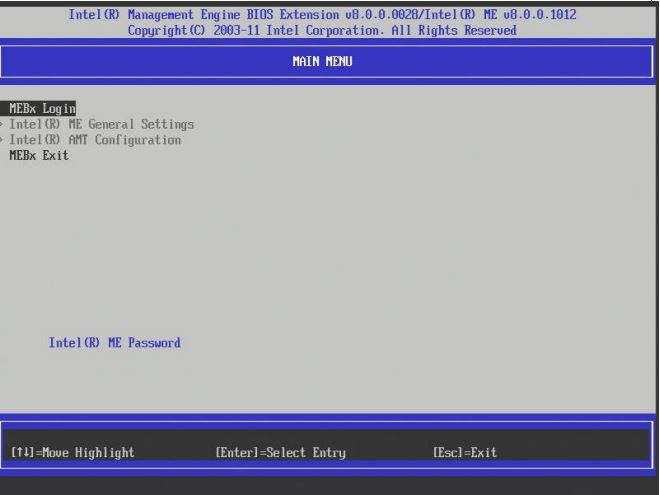
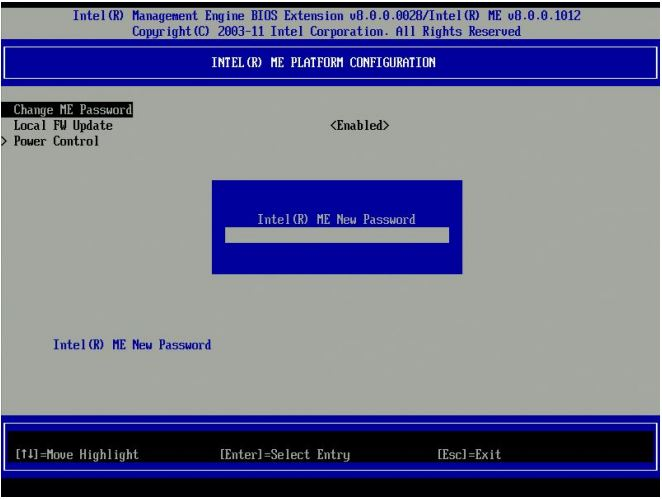

# Intel® Active Management Technology

 ## Intel® Active Management Technology

This guide is intended to be a starting point for testing your Intel® vPro™ technology systems within your environment.

It will guide you through setting up a "Sandbox" test environment using your own network environment so that you can test your specific use cases on Intel® vPro™ technology that ultimately reduces overall support costs and costly service/truck rolls.

The first step in enabling Intel® Active Management Technology is to install the Intel® AMT agent. In this lab, we will manually configure Intel® AMT from BIOS. Then we will verify that the agent is correctly installed by going to a web browser and accessing the Intel® AMT firmware based web configuration console. The Converged Security and Manageability Engine (CSME) powers the Intel® AMT system. As a component of the Intel® vPro™ platform, Intel AMT uses a number of elements in the Intel vPro platform architecture.
## Configuring Intel® Active Management Technology

Start by performing these actions on your Intel® IoT Gateway.

During power up, the Intel® AMT platform displays the BIOS startup screen, then it processes the Intel® Management Engine BIOS Extension  (Intel® MEBX). During this process, access to the Intel® MEBX can be made; however the method is BIOS vendor-dependent. Some methods are discussed here.

*   Most BIOS vendors add entry into the CSME via the one-time boot menu. Select the appropriate key (Ctrl+P is typical) and follow the prompts.
*   Some OEM platforms prompt you to press <Ctrl+P> after POST. When you press <Ctrl+P>, control passes to the Intel® MEBX (CSME) main menu.
*   Some OEMs integrate the CSME configuration inside the BIOS (uncommon).
*   Some OEMs have an option in the BIOS to show/hide the <Ctrl+P> prompt, so if the prompt is not available in the one-time boot menu, check the BIOS to activate the CTRL+P.

## Change Password
Enter the CSME default password admin

**Troubleshoot**:- If the Intel® NUC7 i7DNHE (Dawson Canyon) is already Intel® AMT configured, it may have Intel@1234 as password

*   Change the default password (required to proceed).
*   The new value must be a strong password.
*   It should contain at least one uppercase letter, one lowercase letter, one digit, and one special character, and be at least eight characters.
*   A management console application can change the Intel® AMT password without modifying the CSME password.

## AMT Configuration
*   Go back to previous menu using Esc key
*   Select Intel® AMT Configuration.
*   Select/Verify Manageability Feature Selection is Enabled.

## Network Configuration
*   Under the Network Setup menu Select 'TCP/IP Settings' and Press Enter.
*   The Network Setup menu changes to the TCP/IP Settings page
*   Goto Wired LAN IPV4 Configuration Under the TCP/IP Settings, Select 'Wired LAN IPV4 Configuration' and press Enter.
*   Enable DHCP
*   Activate Network Access option by enabling it

## Exit
*   Press Esc key to go to exit screen
*   Select "Y" to confirm Activating the interface.
*   Exit CSME.

## Use a Web Browser to Connet to the Intel® Active Management Technology web interface

To use the Intel® Active Management Technology web interface, open a browser and input the IP address of another Intel® vPro/AMT enabled device. The port number is 16992.

**For this step, you will need to work with the person next to you.**

You will not be able to access the Intel® AMT web interface, if you are using a web browser on the same machine.

Try to connect to your neighbor's Intel® IoT Gateway and let them connect to yours. http://x.x.x.x:16992

When prompted for username/password, type admin for username and Intel@1234 as the password

You are now connected. Please explore different sections.

## [Optional] Wireless AMT Configuration

This step allows you to enable wireless access to a remote machine using AMT.

**Note:** A second AMT configured machine (#2) is required with a wired connection to a network device (ex. router) and powered ON.

1.  Connect your AMT configured machine (#1) to the network device mentioned above via a wired connection
2.  Disable WiFi at this time
3.  Open a web browser on machine #1 and type machine #2's IP address and port 16992 into the address field (ex. <IP_Address>:16992)
4.  Once you are logged into the AMT web interface, Click Wireless Settings in the left side bar.
5.  Enable the S0, Sx/AC option
6.  Click Submit
7.  Repeat the steps above for machine #2
8.  Disconnect ethernet cables from both machines
9.  Enable WiFi for both machines
10. Open a web browser on machine #1 and type machine #2's IP address and port 16992 into the address field (ex. <IP_Address>:16992)
11. Log into the AMT web interface

You should now be able to connect to the machines wirelessly with the AMT web interface, Mesh Commander and Mesh Central.
