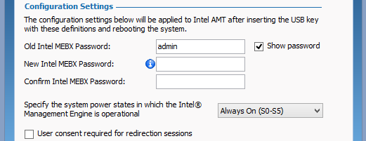
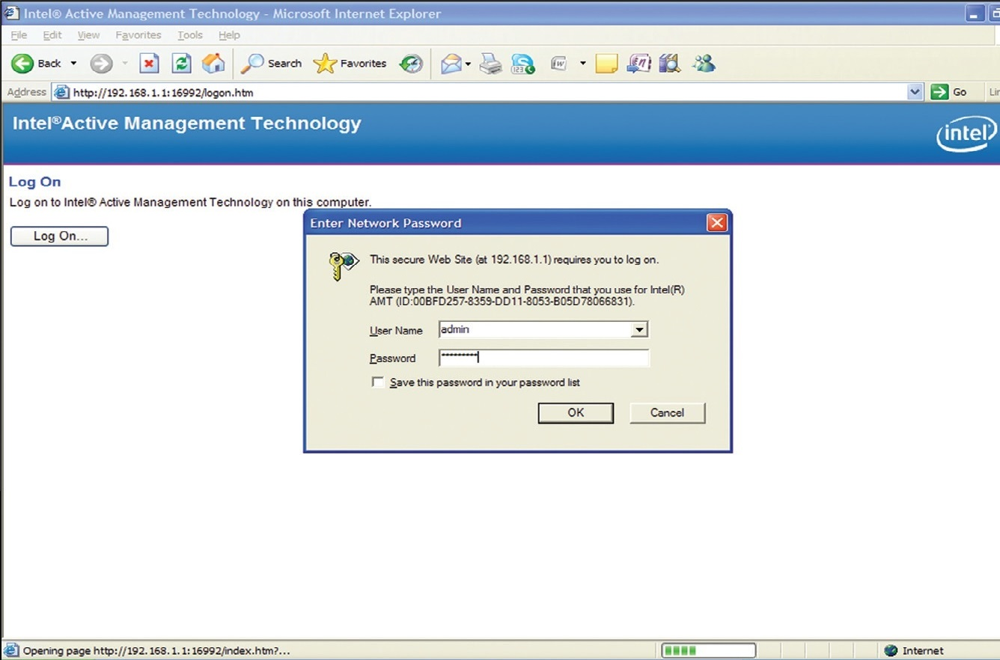
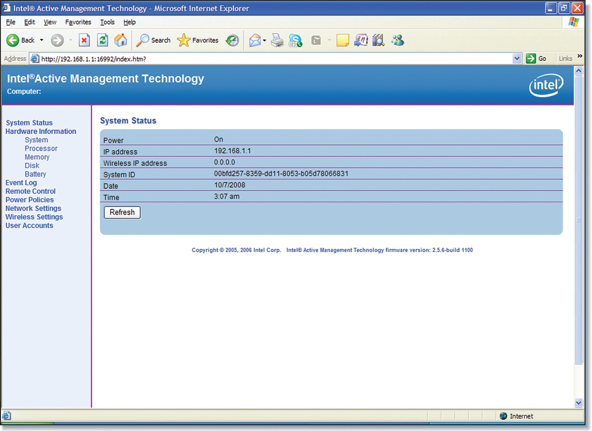

# Intel® AMT
## Intel® Active Management Technology

This guide is intended to be a starting point for testing your Intel® vPro™ technology systems within your environment.

It will guide you through setting up a "Sandbox" test environment using your own network environment so that you can test your specific use cases on Intel® vPro technology that ultimately reduces overall support costs and costly service/truck rolls.

The first step in enabling Intel® AMT is to install the Intel® AMT agent. In this lab, we will manually configure the AMT from BIOS. Then we will verify that the agent is correctly installed by going to a web browser and accessing the Intel® AMT firmware based web configuration console. The Converged Security and Manageability Engine (CSME) powers the Intel AMT system. As a component of the Intel® vPro™ platform, Intel AMT uses a number of elements in the Intel vPro platform architecture.
## Configuring Intel® AMT

Start by performing these actions on your Intel NUC.

1. **Shut down your machine**

2. **Power up your machine**

3. **Press Ctr+P to display the Intel Management Engine BIOS Extension (MEBX) main menu**

This method is BIOS vendor-dependent. Some methods are discussed below.**

*   Most BIOS vendors add entry into the CSME via the one-time boot menu. Select the appropriate key (**Ctrl+P** is typical) and follow the prompts.
*   Some OEM platforms prompt you to press <Ctrl+P> after POST. When you press <Ctrl+P>, control passes to the Intel MEBx (CSME) main menu.
*   Some OEMs integrate the CSME configuration inside the BIOS (uncommon).
*   Some OEMs have an option in the BIOS to show/hide the <Ctrl+P> prompt, so if the prompt is not available in the one-time boot menu, check the BIOS to activate the CTRL+P.

## Change Password
**Note**: If the password was already changed, skip the next 2 steps.

1. **Select MEBx Login and Press Enter.**
2. **Enter the default password *admin*.**

**Note**: If the NUC7i7DNHE (Dawson Canyon) is already AMT configured, it may have **Intel@1234** as the password

>   (For first time login) Type **Intel@1234** as the New Intel MEBX Password

* The new value must be a strong password.
* It should contain at least one uppercase letter, one lowercase letter, one digit, and one special character, and be at least eight characters.

**Note**: A management console application can change the Intel AMT password without modifying the CSME password.

## AMT Configuration
1. **Select Intel AMT Configuration and Press Enter**
2. **Select/Verify Manageability Feature Selection is Enabled**

## Network Configuration
1.   **Select Network Setup and Press Enter**
2.   **Select TCP/IP Settings and Press Enter**
3.   **Select Wired LAN IPV4 Configuration and Press Enter**
4.   **Enable DHCP Mode**
5.   **Press the Esc key 3 times to navigate to the Intel AMT Configuration menu**
6.   **Select Activate Network Access and Press Enter**
7.   **Select/Enter "Y" to confirm Activating the interface**

* **Note**: These steps enable **wired** network access for AMT.

## Exit
1.  **Press the Esc key 2 times to navigate to the Main menu and exit**
2.  **Select/Enter "Y"**

## Use a Web Browser to Connect to the Intel® Active Management Technology web interface
**Note**: Access to the Intel® AMT web interface with your machine's IP address is not allowed.

For this section, you will need to **work with another person**.
The goal is to connect to your neighbor's machine and vice versa.

1.   **Launch the Command Prompt by entering cmd in the Search box witin the Task bar**
2.   **Enter *ipconfig* in the Command Prompt window to get your IP Address**
3.   **Launch a web browser**
4.   **Type the IP address of your neighbor's machine with the port number 16992. (ex. *http://<ip_address>:16992*)**

5. **Type admin as the username and **Intel@1234** as the password

You are now connected. Please explore different sections.

