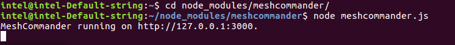
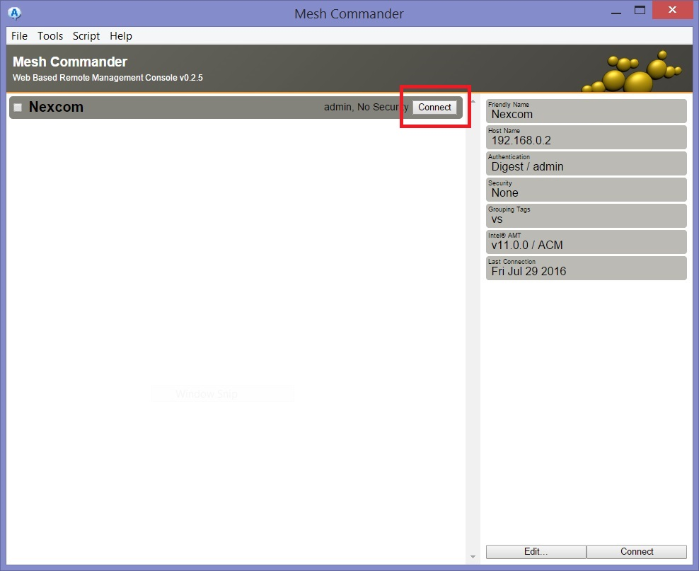
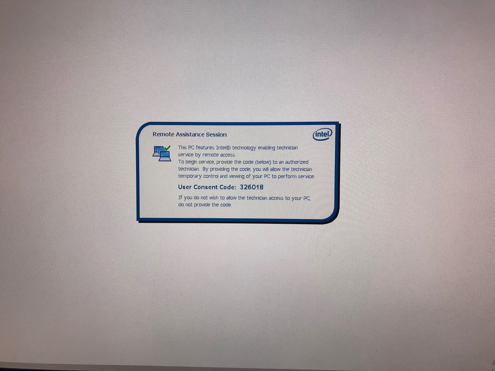
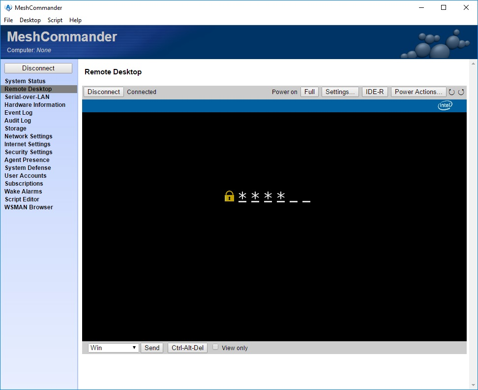
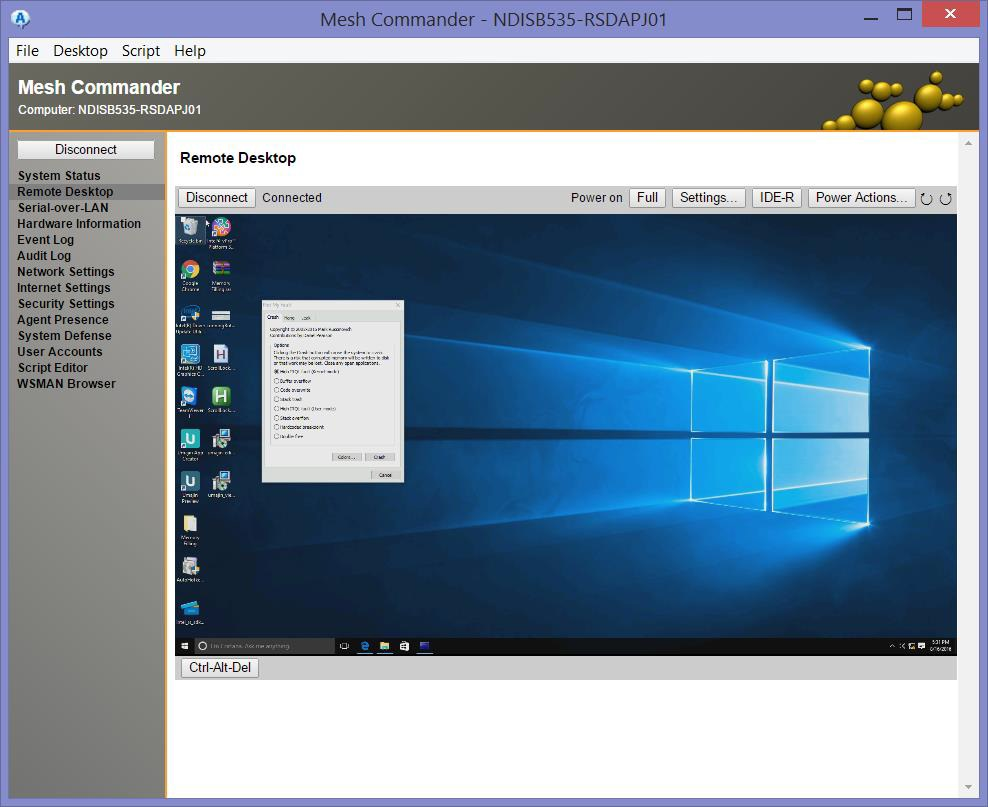
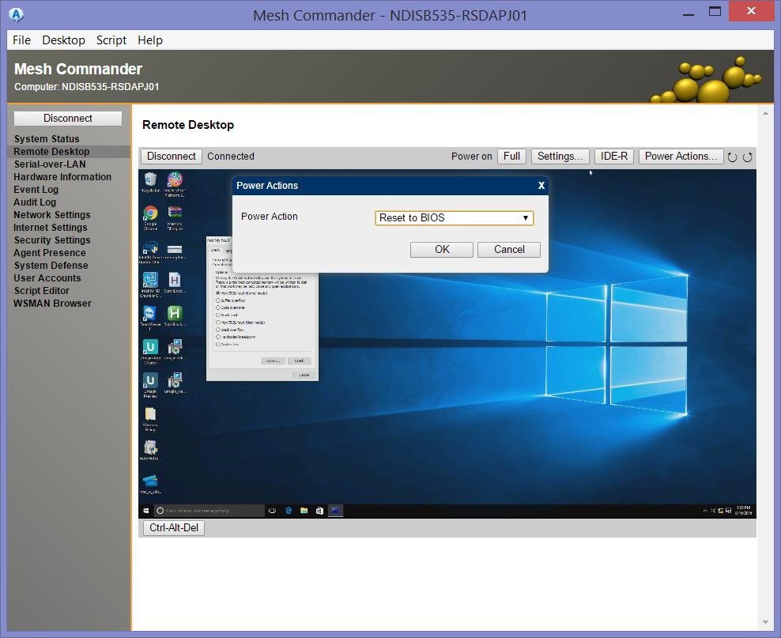
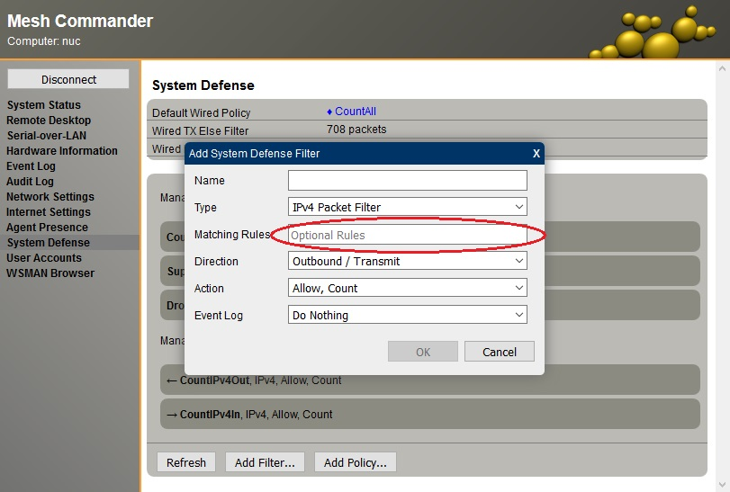

# Remote Configuration with Intel® Mesh Commander

## Read the Overview

The Mesh Commander is an application that provides an interface for using Intel® Active Management technology. Its project site states that its purpose is to make hardware configuration easy over Internet.

MeshCommander is primarily used for 1:1 remote management of devices. Current supported features include:

*   Hardware KVM viewer
*   Serial over LAN terminal
*   IDE-R support
*   Power control
*   Event viewer
*   Audit log viewer
*   Hardware asset
*   Account management
*   Network settings
*   WIFI management
*   User consent and control
*   Certificate & TLS management
*   CIRA & Environment Detection
*   WSMAN browser

## Launch the MeshCommander utility
The MeshCommander utility is already installed on your device.

*   Click the Start button in the Taskbar (in the lower left bottom corner of the screen) 
*   Type **Mesh Commander**.
*   Right click on the MeshCommander search result and select **Run as Administrator**.

## Add An Intel® AMT enabled Computer to MeshCommander
The first step is to add a system to the Intel AMT MeshCommander configuration utility. 

*   Click on **Add Computer...**.

*   Enter a **friendly name** for the device (ex. <ip_address>) 
    * Enter `cmd` in the Search box within the Taskbar. 
    * Click the Command Prompt result and type `ipconfig` in the window to get your machine's IP address. 
*This is a string that allows you to easily identify the system.*
*   (Optional) Type comma-separated string(s) to be used **tag(s)** 
*This allows you to put several systems together into recognizable categories.*
*   Enter either the **host name** or **IP address** of the device in Hostname text field.
*   Leave **authentication** as Digest / None.
*   Enter **admin** as the username and **Intel@1234** as the password.

## Connect to your Intel® IoT Gateway
Next to each computer that has been added to the system there is a button labeled connect.

    Click the Connect button to begin communicating with your gateway.
## Click Remote Desktop
After connecting to a system, you'll see the system information on the screen, such as the power state, the unique identifier and basic settings. Take a moment to browse around and see the different bits of information available to you.

## Click Connect Remote Desktop
To view the screen of the remote computer system, do the following steps:

*   Click on the **Remote Desktop** link in the left sidebar.
*   Click the **Connect** button as shown in the image 

**Note:** If you are prompted with the "Intel AMT Redirection port or KVM feature is disabled, click here to enable it." message, click it to enable.

* MeshCommander will ask you for a code in order to connect to the remote system. This code will be displayed on the **remote system** once you make a conenction request. 

* Enter this code into MeshCommander in order to connect to the remote machine. 

## Out of band Remote Desktop
You will now see the screen of the remote system.

You will be able to see the screen of the remote system even if the remote computer is rebooting, in the BIOS or in a crashed state.

## Power Actions Reset To BIOS
Notice the button labelled **Power Actions**. This button will display a dialog box that allows you to change the state of the system's power. You can start, stop, reboot or choose from other supported power states.

## Mesh Commander's System Defense panel

Within Mesh Commander's System Defense panel, you can add to Intel AMT network filters and policies that can be used to match certain type of network traffic. You can use Intel AMT system defense to count, drop or rate limit network traffic that matches certain rules. In this page, we look at how to create advanced filters that use the "Matching Rules" box in the "Add System Defense Filter" dialog box.

The "Matching Rules" field is a comma separated list of name and values. The names must have exact capitalization and no extra spaces must be added.

The first matching rule is the **ProtocolID**, usually TCP (6) or UDP (17). For example, if you want to match on TCP traffic, you put "ProtocolID=6" in the matching rules. You must specify a protocol id of TCP or UDP before you can use any of the other filters below.

**DestAddress** and **DestMask** to filter the destination of the packet. Both of these must be used at the same time. For example, you can set the matching rules to "ProtocolID=6,DestAddress=192.168.1.0,DestMask=255.255.255.0". This will filter all packets that go to 192.168.1.\*.

In addition, you can filter based on source address with **SrcAddress** and **SrcMask**. Both must be used at the same time. For example, you can have "ProtocolID=6,SrcAddress=192.168.1.0,SrcMask=255.255.0.0" to match all packets with a source address of 192.168.\*.

* For more information on AMT System Defense please refer to: https://software.intel.com/en-us/node/632165 
* For more more detailed information on IP Filtering with AMT please refer to *WS-Management > WS-Management Class Reference > AMT Classes > AMT_IPHeadersFilter* in the AMT SDK Guide: https://software.intel.com/sites/manageability/AMT_Implementation_and_Reference_Guide/default.htm
