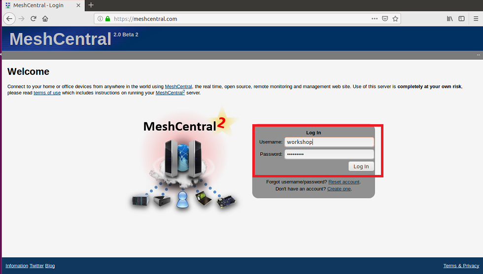
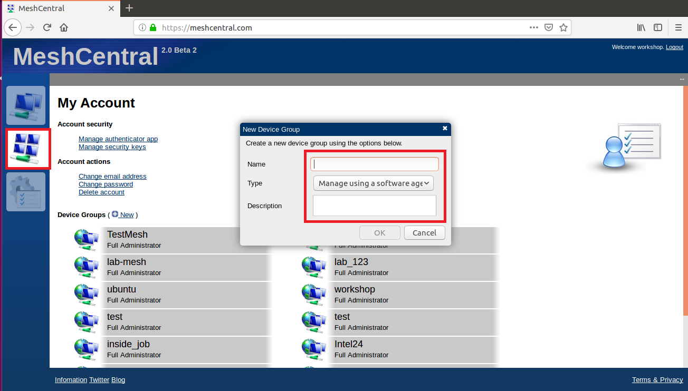
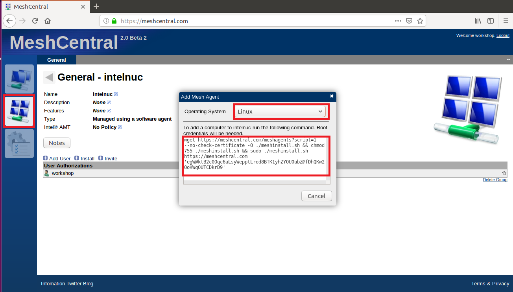
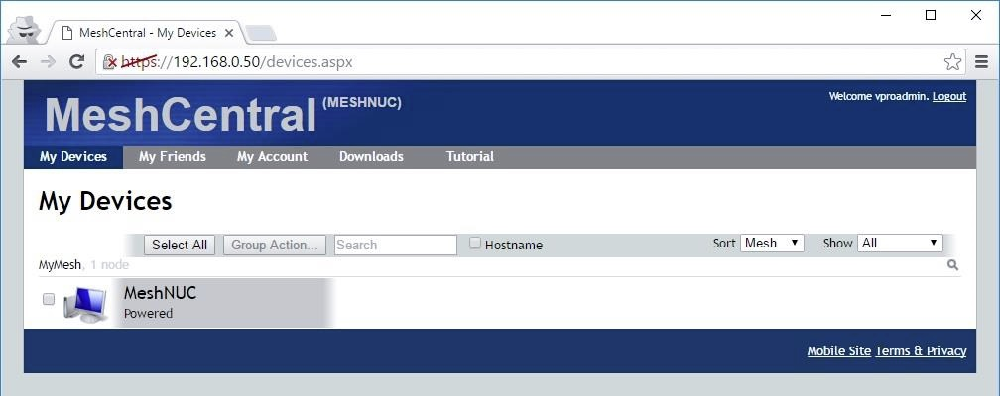
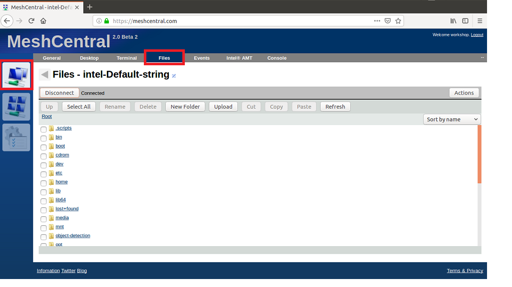
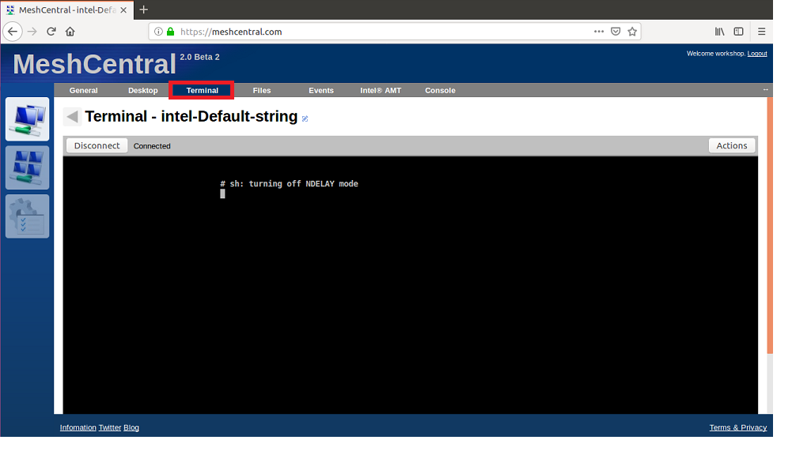
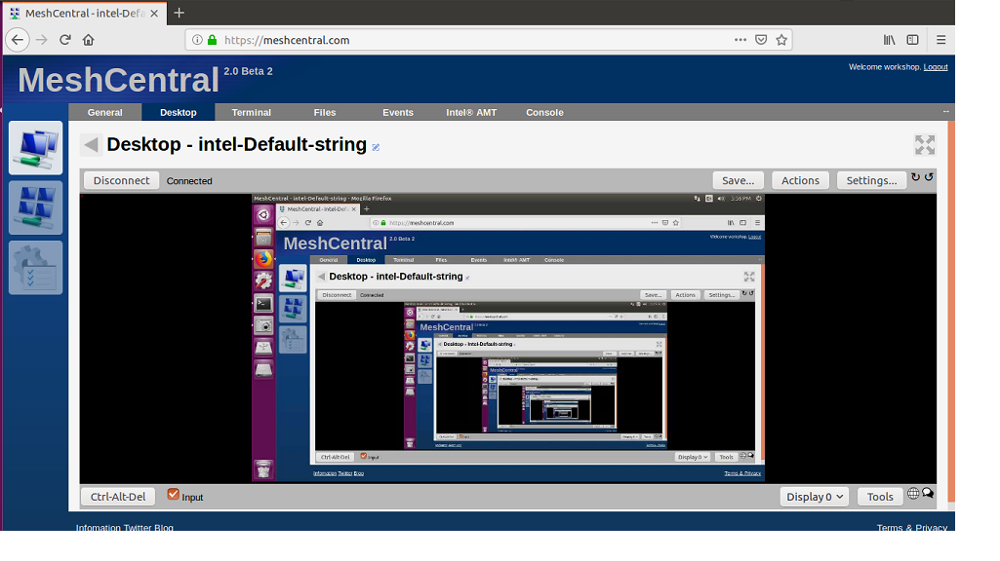

#  Remote System Management with MeshCentral
## Objective
MeshCentral is open source and peer-to-peer technology with a wide range of use cases, including web services that enable remote monitoring and management of computers and devices. Users can manage all their devices from a single web site, no matter the location of the computers or if they are behind routers or proxies.

In this module we will explore following

-   How to create device mesh?
-   How to remotely share desktop of remote machine?
-  How to explore file system on remote machine?
-  How to login to command line?

## Step1: Login to local mesh central server

Url: [http://www.meshcentral.com](http://www.meshcentral.com)

Username: workshop

Password: intel@123

## Step 2: Create Mesh Agent

Goto MyAccount tab > Device Groups > New

In the Create new device group popup, provide name and type.

Choose the "Manage using a software agent" option for type.

Provide description if needed and click OK.

## Step 3: Test & install the created Mesh
Goto MyAccount tab and click the newly created device group.

Have a look on Web Authorizations.

Click on Install. Select Linux. Run the commands given there in a linux
terminal to install the Mesh Agent.
Run the commands given there in a linux terminal to install the Mesh Agent.

## Step 4: Web device refresh

Goto MyDevices tab and click the newly created device group.

This is the method to see the connected devices through web interface.

## Step 5: Explore file system

This method gives access to the client file system.

File operations can be performed to check the level of control

## Step 6: Explore Terminal

This method gives access to terminal through which system supported
commands can be run.

## Step 7: Web Socket Desktop Loop

This method accessess the client desktop by web sockets.

It opens another web instance from desktop. This is repeated infnitely

.
