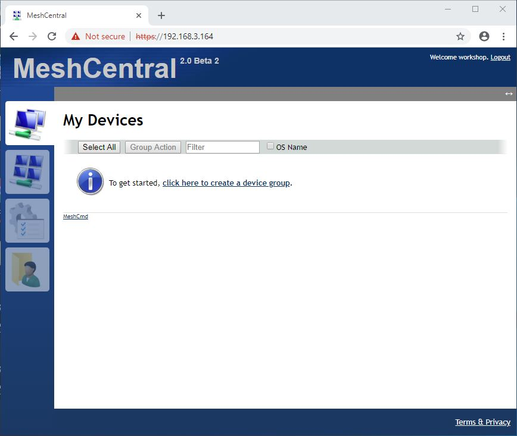
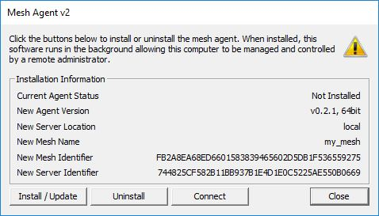
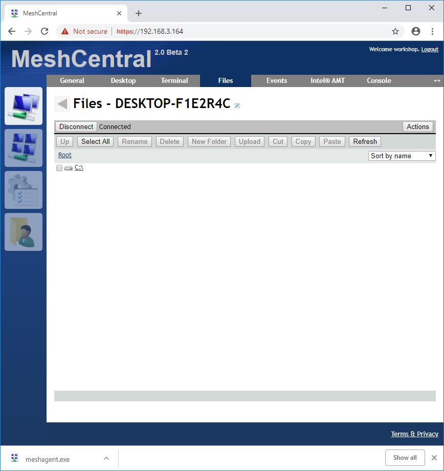
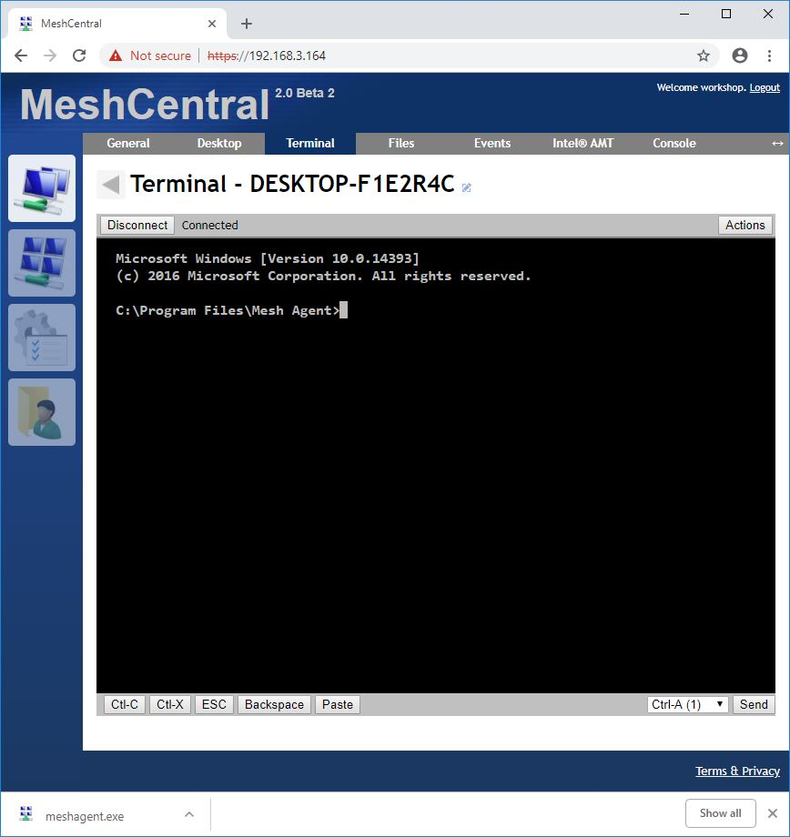

#  Remote System Management with MeshCentral
## Objective
Meshcentral is open source and peer-to-peer technology with a wide range of use cases, including web services that enable remote monitoring and management of computers and devices. Users can manage all their devices from a single web site, no matter the location of the computers or if they are behind routers or proxies.

In this module we will explore following

-   How to create device mesh?
-   How to remotely share desktop of remote machine?
-  How to explore file system on remote machine?
-  How to login to command line?

## Step1: Login to the local mesh central server
1. **Open your web browser (ex. Google Chrome)**
2. **Navigate to the local server's IP address provided during the workshop**
    * **Note**: We will provide the server's IP at the start of this lab session
3. **Type *workshop* as the User Name**
4. **Type *Intel@123* as the Password**

## Step 2: Create Devices Group

1.   **Click the My Devices icon**
2.   **Click the Add Devices Group button**
3.   **Enter a name for your group**

## Step 3: Test & install the created Mesh Agent

1.   **Click the Add Agent button**
1.   **Click Windows x64 (.exe)**
1.   **Click the Ok button**

1.   **Navigate to the file location of the downloaded Mesh Agent file**
1.   **Right Click the file > Run as administrator**
1.   **Click the Install/Update button**

## Step 4: Web device refresh

1.   **Navigate to the My Devices page**
	
**Note**: The newly added device will be shown here within the test Device Group

## Step 5: Explore file system

1.   Click the desired device
1.   Click the Files Tab
1.   Click the Connect button

1.   Browse the available file system

## Step 6: Explore Terminal

Supported commands can be ran within a terminal session on the remote device.

1.   Click the Terminal Tab
1.   Click the Connect button

**Note**: The terminal does not display the user's inputted text as they type.
You will initially be in the C:\Programs Files\Mesh Agent directory.

1.   Type **dir**
1.   Press Enter to see the inputted command and its corresponding output

## Other Actions
*For this part, select another device other than yours.*

### Send a message to the device
1.   Click the Toast button
2.   Enter text in the text box
3.   Click the Ok button

### View the current processes
1.   Click the Tools button

**Notes**: You can stop a process by clicking the trash can.

### Send commands to the device
1.   Select an option in the drop down to left of the Send button
1.   Click the Send button

You can also save a screenshot of the remote desktop as well as perform power cycle actions and many more.

