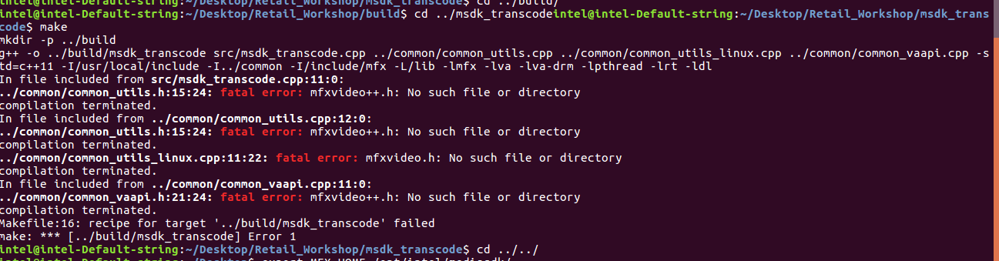
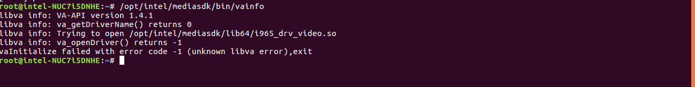

# Setup Development Environment with the Intel® NUC 7i7DNHE (Dawson Canyon)

## a) Install Ubuntu 16.04
Install a fresh and fully updated installation of Ubuntu 16.04 using the HWE rolling kernel. make sure the kernel is **4.14.x or higher**.

## b) Install the Intel® Distribution of OpenVINO™ toolkit for Linux*
Use steps described in the [install guide](https://software.intel.com/en-us/articles/OpenVINO-Install-Linux) to install the Intel® Distribution of OpenVINO™ toolkit, build sample demos, build inference engine samples.

**Warning:** This workshop content has been validated with Intel® Distribution of OpenVINO™ toolkit version R5 (l_openvino_toolkit_p_2018.5.445)

## c) Install the required packages for System Analyzer Tool
``` bash
sudo apt install ocl-icd-opencl-dev
sudo apt-get install libva-dev
```

## d) Install Intel® Media SDK
There are several components which need to be installed in order to use the Media SDK on Linux:
 - [libVA API](https://github.com/intel/libva)
 - [Intel® Graphics Memory Management Library](https://github.com/intel/gmmlib)
 - [Intel® Media Driver for VAAPI](https://github.com/intel/media-driver)
 - [Intel® Media SDK](https://github.com/Intel-Media-SDK/MediaSDK)

## Install Dependencies
Run the command below to install the required dependencies:
``` bash
sudo apt-get -y install git libssl-dev dh-autoreconf cmake libgl1-mesa-dev libpciaccess-dev
```
Create a working directory and export the path:
``` bash
mkdir -p $HOME/build-media-sdk
export WORKDIR=$HOME/build-media-sdk
```

## libVA
Run the following commands to build and install the libVA library:
``` bash
cd $WORKDIR
git clone https://github.com/intel/libva.git
cd libva
git checkout 2.2.0
./autogen.sh --prefix=/usr --libdir=/usr/lib/x86_64-linux-gnu
make -j4
sudo make install
```
## libVA Utils
Run the following commands to build and install libVA utils:
``` bash
cd $WORKDIR
git clone https://github.com/intel/libva-utils.git
cd libva-utils
git checkout 2.2.0
./autogen.sh --prefix=/usr --libdir=/usr/lib/x86_64-linux-gnu
make -j4
sudo make install
```
## Intel® Media Driver for VAAPI
Run the following commands to build the Media Driver for VAAPI:
``` bash
cd $WORKDIR
git clone https://github.com/intel/gmmlib.git
git clone https://github.com/intel/media-driver.git
cd $WORKDIR/gmmlib
git checkout 5ff84b923ec2ba1572c464dc8def73348571b440
cd $WORKDIR/media-driver
git checkout intel-media-18.2.0
mkdir -p $WORKDIR/build
cd $WORKDIR/build

cmake ../media-driver -DMEDIA_VERSION="2.0.0" \
-DBUILD_ALONG_WITH_CMRTLIB=1 \
-DBS_DIR_GMMLIB=`pwd`/../gmmlib/Source/GmmLib/ \
-DBS_DIR_COMMON=`pwd`/../gmmlib/Source/Common/ \
-DBS_DIR_INC=`pwd`/../gmmlib/Source/inc/ \
-DBS_DIR_MEDIA=`pwd`/../media-driver \
-DCMAKE_INSTALL_PREFIX=/usr \
-DCMAKE_INSTALL_LIBDIR=/usr/lib/x86_64-linux-gnu \
-DINSTALL_DRIVERS_SYSCONF=OFF \
-DLIBVA_DRIVERS_PATH=/usr/lib/x86_64-linux-gnu/dri

make -j8
sudo make install

export LIBVA_DRIVER_NAME=iHD
export LIBVA_DRIVERS_PATH=/usr/lib/x86_64-linux-gnu/dri
```
## Media SDK
Run the following commands to build and install the Media SDK:
``` bash
cd $WORKDIR
git clone https://github.com/Intel-Media-SDK/MediaSDK.git
cd MediaSDK
git checkout 3cfe1e06e89aa32102160b621938bbb5bf9a1e53
export MFX_HOME=`pwd`
perl tools/builder/build_mfx.pl --cmake=intel64.make.release
make -C __cmake/intel64.make.release/ -j4
cd __cmake/intel64.make.release
sudo make install
```
You can check everything is working as expected by running the 'vainfo' utility which will give an output similar to below in a working environment:
``` bash
libva info: VA-API version 1.1.0
libva info: va_getDriverName() returns 0
libva info: User requested driver 'iHD'
libva info: Trying to open /usr/lib/x86_64-linux-gnu/dri/iHD_drv_video.so
libva info: Found init function __vaDriverInit_1_1
libva info: va_openDriver() returns 0
vainfo: VA-API version: 1.1 (libva 2.1.1.pre1)
vainfo: Driver version: Intel iHD driver - 2.0.0
```
## Mesh Commander Installation

```bash
$ sudo apt install npm
$ npm install meshcommander
$ sudo apt install nodejs-legacy
```

## Additional Tools
Run the below command to install some additional packages required to complete the tutorials:
``` bash
sudo apt install ffmpeg intel-gpu-tools htop
pip install requests
```
> You will also need to install your preferred **text editor** (e.g. Brackets, vim)

> **Secure Boot should be disabled in the BIOS in order for Intel GPU analysis tools to work.**

#	Troubleshooting section
Here are some of the frequently occurring issues while setting up the Intel® Media SDK.
- **Unsupported Feature/Library Load Error**

  Make sure that you are using Dawson and Canyon device while running the media SDK samples otherwise will get library load error for media SDK decode samples as listed below

  

- **Fatal Error**

  When you are using fresh terminal to run the Media SDK samples, make sure to export the required Environment variables. Otherwise, you will get the error as listed below.

  

- **libva error**

  In case facing below libva error, Make sure required paths are exported as below.

  

```bash
export LD_LIBRARY_PATH="/usr/local/lib:/usr/lib64"
export LIBVA_DRIVERS_PATH=/opt/intel/mediasdk/lib64/
export LIBVA_DRIVER_NAME=iHD
export MFX_HOME=/opt/intel/mediasdk/
```
