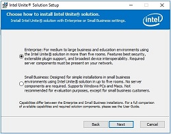
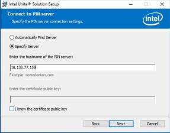
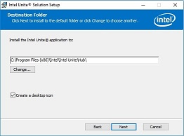
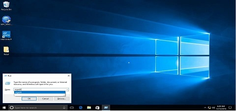
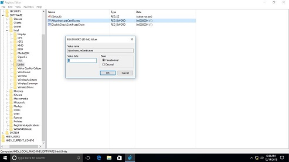

# Setup Development Environment with the Intel® NUC7i7DNHE (Dawson Canyon)


## Lab Overview and Objectives


The labs in the Intel Visual Retail Workshop are organized in a progression that will result in each attendee building their own automated and secured, multi-device IoT network supporting Visual Retail scenarios.

Start by making sure your computer, is ready for Visual Retail development.

By the end of this module, you should be able to:

*   Unbox and setup your Intel®  Hardware
*   Connect to your Intel® NUC7i7DNHE (Dawson Canyon) to power and monitor.
*   Install Windows 10 Pro
*   Install Media Server Studio
*   Install OpenCV with Python support
*   Copy the required lab exercises

## Hardware Requirements

6th Generation Core Processor (Skylake)

1\. Unscrew the NUC7i7DNHE (Dawson Canyon) kit.

2\. Upgrade 1 DDR3 RAM in provided slot properly.

3\. Insert Solid state drive in the back case.

4\. Screw the NUC7i7DNHE (Dawson Canyon) kit.

5\. Power on the NUC7i7DNHE (Dawson Canyon) with Monitor connected.


## Software Requirements

- All the required software are available in google Drive, Use only those software

`https://drive.google.com/drive/folders/11MGGSnwJVd1br2L3LeQQPzR4KgkiJ-cd `

## Manual Windows Configuration

1\. Power on the Intel NUC7i7DNHE (Dawson Canyon)

2\. Download Windows 10 pro or if you have a Windows 10 pro use that to create a bootable USB.

3\. Press F10 and boot from USB with Windows 10 pro and install.

4\. Set Username: intel and Password: intel123

5\. Download python 3.6.5 from [here](https://drive.google.com/open?id=1ucYeJmbPDNzz3Ub_BMVrpTZrAa1S5Pro) and Install .
*Note:* Run the python installer and make sure the checkbox “Add Python 3.6 to PATH” is checked and python is installed for all users.

6\. Install OpenCV and requests package using the following commands
`	pip3 install opencv-python`
` pip3 install requests`

7\. Download cmake-3.13 from [here](https://drive.google.com/open?id=1I9w4d9iioiWUPYFaP9Fa9b0XpiGBAPlt)

8\. Download node-v10.13.0-x64 .msi from [here](https://drive.google.com/open?id=1ogk0uWWGdgoScNttASpFuJjsTcRnGCUS)

9\. Download Visual Studio from [here](https://drive.google.com/open?id=1WIJp8lz1bs7EYrVwQw8EZkKSShlDbu1n)
*Note:* A stub installer (executable) will be download. Make sure the system is connected to internet and double click on the executable. Select only C++ and .NET for quick installation.

10\.Download OpenVINO toolkit R1 version from [here](https://drive.google.com/open?id=1M2g_Os7nxyuYiUbUDAw9SRyBjKcAoJBY) and install the OpenVINO-2019.1.087 version toolkit.
  - Run the commands for model optimizer in command prompt(Admin)
    `> cd
C:\Program Files (x86)\IntelSWTools\openvino_2019.1.087\deployment_tools\model_optimizer\install_prerequisites
> install_prerequisites.bat
`
  - Use the Demo Scripts to Verify Your Installation
   `> cd  C:\Program Files (x86)\IntelSWTools\openvino_2019.1.087\deployment_tools\demo
   > demo_squeezenet_download_convert_run.bat
   > demo_security_barrier_camera.bat `

11\. Download Intel MediaSDK from [here](https://drive.google.com/open?id=1QrytXS-FMzwEGm_oN7rGjU7_q_iHJJmb) and install MediaSDK. Make sure to restart the system to set all Environment variable properly. If it gives graphic driver error, follow step 17 in this guide to install Graphic driver. Restart the system.

12\. Download Mesh Commander from [here](https://drive.google.com/open?id=12UgiIqlu-Xd6-wzkGlKNsJhhAqzYnIRn) and install it.
13\. Copy the Retail workshop folder from [here](https://drive.google.com/drive/folders/1Ap8XQ5qgv1UA2XdoBaYGlWw3pOemJct9) and extract it in Desktop .

14\. To validate Visual Retail workshop contents. Please refer step by step procedure from [here](https://github.com/SSG-DRD-IOT/intel_retail_workshop)

15\. Intel Unite Hub installation

- Run Intel Unite® Hub.mui.msi from [here](1.	Run Intel Unite® Hub.mui.msi from here).We are using 3.3.153 version for Unite. Follow the steps shown in installer.
- Select the enterprise mode and click Next.



- Click Specify Server.
    - Enter the IP address of the Intel Unite® server (Any IP address/local IP for place holder).
    - Do not check I know the certificate public key
    - Click Next

      

    - Browse the destination folder and select the checkbox for creating desktop icon.
    - Install location should be C:\Program Files (x86)\Intel\Intel Unite\Hub
    - Create a desktop Icon
    - Click Next

      

    - Click Install to continue and finish the installation process
    - Create a folder on Desktop. Name it Unite HUB, move the Unite hub shortcut to this folder
16\. Skip certificate check in Registry
- Run REGEDIT and Follow this steps to skip the certificate check and add the registry in the machine. Open Registry editor and change the following.
- Go to Run and type regedit and Enter



- HKEY_LOCAL_MACHINE\software\Intel\Unite\ DisableCheckCertificateChain (DWORD) -> Set to 1


- HKEY_LOCAL_MACHINE\software\Intel\Unite\AllowInsecureCertificates (DWORD) -> Set to 1



- *Note:* If the above are not present, create them in the paths specified above.
17\. Intel Unite Client     
- Copy the client installer Intel Unite® Client.mui.msi from [here](https://drive.google.com/drive/folders/1PeGkLO9Ai9b8BU05O4U42o3ILXJ6tjAL)  and paste it in Documents folder. Installation is not needed and will be done during workshop.   

## Download pretrained xml files using below commands.

```bash
cd   C:\Program Files (x86)\IntelSWTools\openvino\deployment_tools\tools\model_downloader

// Security Barrier demo
python downloader.py --name  'vehicle-license-plate-detection-barrier-0106'

python downloader.py --name  'vehicle-attributes-recognition-barrier-0039'

python downloader.py --name  'license-plate-recognition-barrier-0001.xml'

// Interactive face detection
python downloader.py --name  'face-detection-adas-0001'

python downloader.py --name  'age-gender-recognition-retail-0013'

python downloader.py --name  'head-pose-estimation-adas-0001'
```


## Read about the next lab

Congratulations! You have successfully setup your Intel® NUC7i7DNHE (Dawson Canyon) with Windows for Visual Retail workshop. In the next section, you will learn how to enhance the video performance using Intel software.
