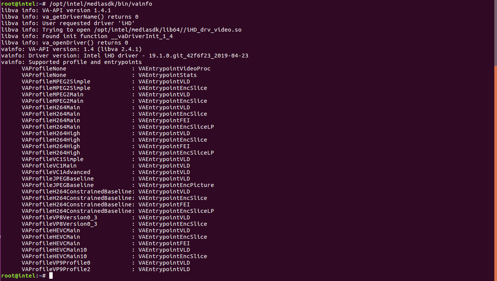

# Setup Development Environment with the Intel® NUC 7i7DNHE (Dawson Canyon)

## a) Install Ubuntu 16.04
Install a fresh and fully updated installation of Ubuntu 16.04 using the HWE rolling kernel. make sure the kernel is **4.20.x or higher**.

## b) Install the Intel® Distribution of OpenVINO™ toolkit for Linux*
Use steps described in the [install guide](https://software.intel.com/en-us/articles/OpenVINO-Install-Linux) to install the Intel® Distribution of OpenVINO™ toolkit, build sample demos, build inference engine samples.

**Warning:** This workshop content has been validated with Intel® Distribution of OpenVINO™ toolkit version 2019 R1 (l_openvino_toolkit_p_2019.1.094)

## c) Install the required packages for System Analyzer Tool
``` bash
sudo apt install ocl-icd-opencl-dev
sudo apt-get install libva-dev
```

## d) Install Intel® Media SDK
- Download the MediaStack.tar.gz file [here](https://github.com/Intel-Media-SDK/MediaSDK/releases/tag/intel-mediasdk-19.1.0).
- Extract the MediaStack.tar.gz by using below command.
    `$ tar -xvzf MediaStack.tar.gz`
- After extraction navigate to folder and install_media.sh by using below commands.

   ```bash
   $ cd MediaStack

   $ sudo ./install_media.sh
```
- You can check everything is working as expected by running the 'vainfo' utility which will give an output similar to below image.

  ```bash
    $ sudo -s
    # apt-get install vainfo
    # /opt/intel/mediasdk/bin/vainfo
  ```
  
## Mesh Commander Installation

```bash
$ sudo apt install npm
$ npm install meshcommander
$ sudo apt install nodejs-legacy
```

## Additional Tools
Run the below command to install some additional packages required to complete the tutorials:
``` bash
sudo apt install ffmpeg intel-gpu-tools htop
pip install requests
```
> You will also need to install your preferred **text editor** (e.g. Brackets, vim)

> **Secure Boot should be disabled in the BIOS in order for Intel GPU analysis tools to work.**

## Downloading pretrained models
- Navigate to /opt/intel/openvino/deployment_tools/tools/model_downloader directory and run downloader.py by using below Commands

```bash
$ sudo -s
# cd /opt/intel/openvino/deployment_tools/tools/model_downloader
# python downloader.py --name  'vehicle-license-plate-detection-barrier-0106'
# python downloader.py --name  'vehicle-attributes-recognition-barrier-0039'
# python downloader.py --name  'license-plate-recognition-barrier-0001.xml'
# python downloader.py --name  'face-detection-adas-0001'
# python downloader.py --name  'age-gender-recognition-retail-0013'
# python downloader.py --name  'head-pose-estimation-adas-0001'

```
#	Troubleshooting section
Here are some of the frequently occurring issues while setting up the Intel® Media SDK.
- **Unsupported Feature/Library Load Error**

  Make sure that you are using Dawson and Canyon device while running the media SDK samples otherwise will get library load error for media SDK decode samples as listed below

  

- **Fatal Error**

  When you are using fresh terminal to run the Media SDK samples, make sure to export the required Environment variables. Otherwise, you will get the error as listed below.

  

- **libva error**

  In case facing below libva error, Make sure required paths are exported as below.

  

```bash
export LD_LIBRARY_PATH="/usr/local/lib:/usr/lib64"
export LIBVA_DRIVERS_PATH=/opt/intel/mediasdk/lib64/
export LIBVA_DRIVER_NAME=iHD
export MFX_HOME=/opt/intel/mediasdk/
```
