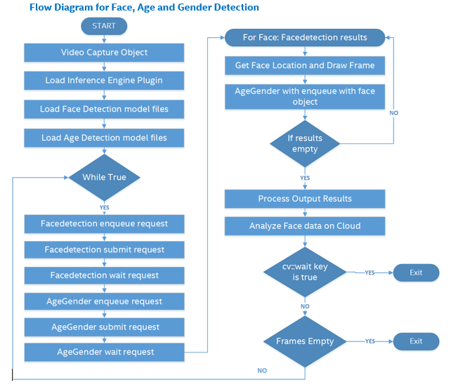

# Age and Gender Detection using the Intel® Distribution of OpenVINO™ toolkit
### Lab Overview
We have done Face Detection in our previous module. Now, we identify Age and Gender for the identified faces.    
We  build upon our Face Detection code and add Age, Gender identification code in this module.

**Class diagram for AgeGender detection**


### Tasks TODO for Age and Gender Detection:
-	Include CPU as plugin device for parallel inferencing.
-	Load pre-trained data model for Age and Gender detection.
-	Once Face Detection result is available, submit inference request for Age and Gender Detection
-	Mark the identified faces inside rectangle and put text on it for Age and Gender.
-	Observe Age and Gender Detection in addition to face.



### Define a AgeGenderDetection class
Here, we will define a class that includes the declaration of data member and member functions that will be used for Age and Gender detection using the Intel® Distribution of OpenVINO™ toolkit.
- Replace #TODO: Define class for Age & Gender Detection
- Paste the following code

```
struct AgeGenderDetection {
	std::string input;
	std::string outputAge;
	std::string outputGender;
	int enquedFaces = 0;
	ExecutableNetwork net;
	InferenceEngine::InferencePlugin * plugin;
	InferRequest::Ptr request;
	std::string & commandLineFlag = FLAGS_Age_Gender_Model;
	std::string topoName = "Age Gender";
	const int maxBatch = FLAGS_n_ag;

	void submitRequest() ;
	void wait();
	void matU8ToBlob(const cv::Mat& orig_image, Blob::Ptr& blob, float scaleFactor = 1.0, int batchIndex = 0);
	void enqueue(const cv::Mat &face);
	struct Result { float age; float maleProb; };
	Result operator[] (int idx) const {
		auto  genderBlob = request->GetBlob(outputGender);
		auto  ageBlob = request->GetBlob(outputAge);

		return{ ageBlob->buffer().as<float*>()[idx] * 100,
			genderBlob->buffer().as<float*>()[idx * 2 + 1] };
	}
	void load(InferenceEngine::InferencePlugin & plg);
	CNNNetwork read();
};

```

### Setup the Blob for Age and Gender detection
This is used to process the original image from live feed and populate blob data detection data from captured Mat buffer.
- Replace #TODO: AgeGender-Blob Detection
- paste the following code

```
void AgeGenderDetection::matU8ToBlob(const cv::Mat& orig_image, Blob::Ptr& blob, float scaleFactor , int batchIndex )
 {
    SizeVector blobSize = blob.get()->dims();
    const size_t width = blobSize[0];
    const size_t height = blobSize[1];
    const size_t channels = blobSize[2];

    float* blob_data = blob->buffer().as<float*>();

    cv::Mat resized_image(orig_image);
    if (width != orig_image.size().width || height != orig_image.size().height) {
	    cv::resize(orig_image, resized_image, cv::Size(width, height));
   }

   int batchOffset = batchIndex * width * height * channels;

   for (size_t c = 0; c < channels; c++) {
	   for (size_t h = 0; h < height; h++) {
		   for (size_t w = 0; w < width; w++) {
			   blob_data[batchOffset + c * width * height + h * width + w] =
				resized_image.at<cv::Vec3b>(h, w)[c] * scaleFactor;
		   }
	   }
   }
}

```

### Parse the CNNNetwork from given IR
This method is used to parse the intermediate representation format of CNNNetwork models (that is .bin and .xml files).
-  Replace #TODO: AgeGenderDetection-Parse CNNNetworks
- Paste the following code.

```
CNNNetwork AgeGenderDetection::read()  {

	InferenceEngine::CNNNetReader netReader;
	/** Read network model **/
	netReader.ReadNetwork(FLAGS_Age_Gender_Model);

	//	/** Set batch size to 16
	netReader.getNetwork().setBatchSize(16);

	/** Extract model name and load it's weights **/
	std::string binFileName = fileNameNoExt(FLAGS_Age_Gender_Model) + ".bin";
	netReader.ReadWeights(binFileName);

	/** Age Gender network should have one input two outputs **/
	InferenceEngine::InputsDataMap inputInfo(netReader.getNetwork().getInputsInfo());

	auto& inputInfoFirst = inputInfo.begin()->second;
	inputInfoFirst->setPrecision(Precision::FP32);
	inputInfoFirst->getInputData()->setLayout(Layout::NCHW);
	input = inputInfo.begin()->first;

	// ---------------------------Check outputs ------------------------------------------------------
	InferenceEngine::OutputsDataMap outputInfo(netReader.getNetwork().getOutputsInfo());

	auto it = outputInfo.begin();
	auto ageOutput = (it++)->second;
	auto genderOutput = (it++)->second;

	outputAge = ageOutput->name;
	outputGender = genderOutput->name;
	return netReader.getNetwork();
}
```

### Load CNNNetwork for AgeGender detection
Here, we will define a method that will be used for loading the CNNNetworks that will be used for Age and Gender detection.
- Replace #TODO: AgeGenderDetection-LoadNetwork
- Paste the following code

```
void AgeGenderDetection::load(InferenceEngine::InferencePlugin & plg)  {
     net = plg.LoadNetwork(this->read(), {});
     plugin = &plg;
}
```

### Populate the Inference Request
This method is used populate the inference request and push the frames in to a queue for further processing.
- Replace #TODO: AgeGenderDetection-populate Inference Request
- Paste the following code.

```
void AgeGenderDetection::enqueue(const cv::Mat &face) {

  if (!request) {
    request = net.CreateInferRequestPtr();
  }

  auto  inputBlob = request->GetBlob(input);
  matU8ToBlob(face, inputBlob, 1.0f, enquedFaces);
  enquedFaces++;
}
```

### Submit inference request and wait for result
Here we will define methods to submit inference request and wait for inference result.
- Replace #TODO: AgeGenderDetection-submit Inference Request and wait
- Paste the following lines

```
void AgeGenderDetection::submitRequest()  {
	if (!enquedFaces) return;

	request->StartAsync();
	enquedFaces = 0;
}

void AgeGenderDetection::wait() {
  if (!request) return;
	request->Wait(IInferRequest::WaitMode::RESULT_READY);
}
```

### Initialise the pararameters
Here initialize the parameters which are required to process the output.
- Replace #TODO: Age and Gender detection 1
- Paste the following lines

```
int faceCountThreshold = 100;
	int curFaceCount = 0;
	int prevFaceCount = 0;
	int index = 0;
	int malecount = 0;
	int femalecount = 0;
	int attentivityindex = 0;
	int framecounter = 0;

```

### Include CPU as Plugin Device
Till now, we have defined all the required methods for Age and Gender detection. Now we will extend our Face detection application with Age and Gender detection.
We will use CPU as plugin device for inferencing Age and Gender
- Replace #TODO: Age and Gender detection 2
- Paste the following lines

```
plugin = PluginDispatcher({ "../../../lib/intel64", "" }).getPluginByDevice("CPU");
pluginsForDevices["CPU"] = plugin;
//TODO: HeadPose Detection 1


```

### Load Pre-trained Optimized Model for Age and Gender Inferencing
We need CPU as plugin device for inferencing Age and Gender and load pre-retained model for Age and Gender Detection on CPU
- Replace #TODO: Age and Gender Detection 3
- Paste the following lines

```
FLAGS_Age_Gender_Model = "C:\\Intel\\computer_vision_sdk_2018.3.343\\deployment_tools\\intel_models\\age-gender-recognition-retail-0013\\FP32\\age-gender-recognition-retail-0013.xml";
AgeGenderDetection AgeGender;
AgeGender.load(pluginsForDevices["CPU"]);

//TODO: HeadPose Detection 2

```

### Submit Inference Request
- Replace #TODO: Age and Gender Detection 4
- Paste the following lines

```
 //Submit Inference Request for age and gender detection and wait for result
 AgeGender.submitRequest();
 AgeGender.wait();

//TODO: HeadPose Detection 3

```

### Use identified Face for Age and Gender Detection
Clip the identified Faces and send inference request for identifying Age and Gender
- Replace #TODO: Age and Gender Detection 5
- Paste the following lines

```
//Clipped the identified face and send Inference Request for age and gender detection
for (auto face : FaceDetection.results) {
	auto clippedRect = face.location & cv::Rect(0, 0, 640, 480);
	auto face1 = frame(clippedRect);
	AgeGender.enqueue(face1);
	//TODO: HeadPose Detection 4
}

// Got the Face, Age and Gender detection result, now customize and print them on window
std::ostringstream out;
index = 0;
curFaceCount = 0;
malecount=0;
femalecount=0;
attentivityindex = 0;

 ```

### Customize the Result for Display
Now we got result for Face, Age and Gender detection. We can customize the output and display this on the screen
- Replace #TODO: Age and Gender Detection 6
- Paste the following lines

```
  out.str("");
  curFaceCount++;

  //Draw rectangle bounding identified face and print Age and Gender
  out << (AgeGender[index].maleProb > 0.5 ? "M" : "F");

  if(AgeGender[index].maleProb > 0.5)
    malecount++;
  else
    femalecount++;

  out << "," << static_cast<int>(AgeGender[index].age);

  cv::putText(frame,
              out.str(),
              cv::Point2f(result.location.x, result.location.y - 15),
              cv::FONT_HERSHEY_COMPLEX_SMALL,
              0.8,
              cv::Scalar(0, 0, 255));
  //TODO: HeadPose Detection 5
  index++;

 ```

### The Final Solution
Keep the TODOs as it is. We will re-use this program during Cloud Integration.     
For complete solution click on following link [face_AgeGender_detection.cpp](./solutions/agegenderdetection.md)

- Build the solution in visual studio
- Executable will be generated at ***C:\Users\Intel\Desktop\Retail\05-OpenVINO\inference_engine\bin\intel64\Debug*** directory.
- Run the application by using below command. Make sure camera is connected to the device.
- Open command prompt and type this command

```
C:\Users\Intel\Desktop\Retail\05-OpenVINO\inference_engine\bin\intel64\Debug\interactive_face_detection_sample.exe

 ```

- On successful execution, Face, Age and Gender will get detected.

### Lesson Learnt
In addition to Face, Age and Gender Detection using the Intel® Distribution of OpenVINO™ toolkit.

## Next Lab
[HeadPose Detection using the Intel® Distribution of OpenVINO™ toolkit](./Headpose_Detection.md)
