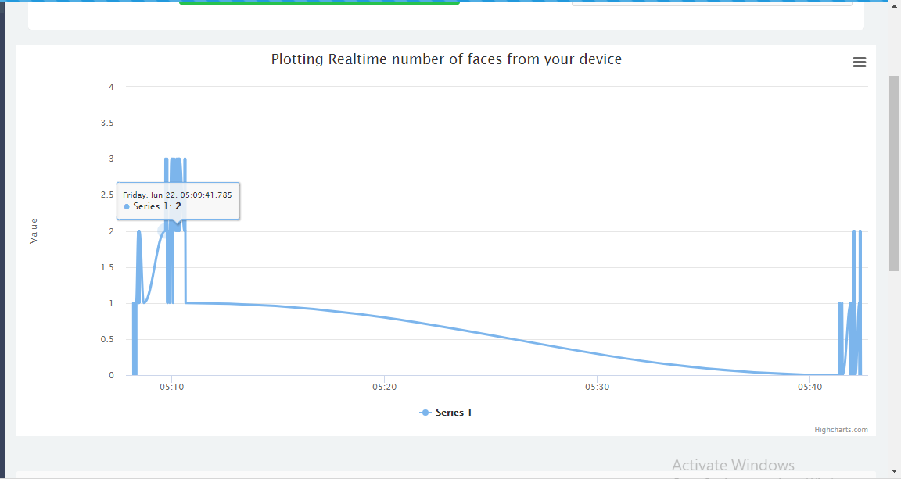

# Analyze Face and Gender Data on Cloud
### Lab Overview
We have done Face, Age and Gender Detection in our previous modules. Also, we have successfully counted number of faces so far.

In this Lab, we will publish this data to local cloud for analysis.
### Tasks to do in this lab
- Declare a device id that will be used for publishing the data to cloud
- Integrate a Python* script for publishing the data to cloud
- Publish the number of faces after showing the face count
- Login to cloud and view charts showing the number of faces

### Declare the Device Id
- Replace #TODO: Cloud Integration 1
- Paste the following line and replace the device id “1234” with your device id written on your computer.

```
std::string deviceId="1234";
```

### Publish Number of Faces to Cloud
We counted the number of faces successfully. Now, we will publish it to cloud for analysis.       

**Note:** We are not publishing video stream or pictures of the screen. We are only publishing the number of faces. For publishing the data to cloud we will be integrating a python script.
- The following content should be present in a python script called as “cloud.py” and should be available in ***Desktop > Retail > 05-OpenVINO***
- If file is not present, create a "cloud.py" file and add the following code snippet into that file.

```
import requests
import sys
import json
import time

id = sys.argv[1]
facecount = int(sys.argv[2])
malecount = int(sys.argv[3])
femalecount = int(sys.argv[4])
attentivityindex= int(sys.argv[5])

count = {"facecount":facecount, "malecount":malecount, "femalecount":femalecount, "attentivityindex":attentivityindex, "timestamp":time.strftime('%H:%M:%S')}
query = 'id=' + str(id) + '&value=' + str(facecount) +'&malecount=' + str(malecount) +'&femalecount=' + str(femalecount);
with open('C:\\Users\\intel\\Desktop\\Retail\\05-OpenVINO\\AttentivityData.json', 'w') as file:
     file.write(json.dumps(count))

resp = requests.get('http://192.168.43.107:9002/analytics/face?'+ query);
if resp.status_code != 201:
	print("Unable to submit the data")
else:
    print("Data Submitted for analysis")
 ```
### Integrate cloud module
- Replace #TODO: Cloud Integration 2 with below code snippet

```
//Submit data to Intel Unite on framecounter basis
  if (framecounter == 10)
  {
    prevFaceCount = curFaceCount;
    slog::info << framecounter << slog::endl;
    //Integrate python module to submit data to cloud
    std::string cmd = "C:\\Users\\intel\\Desktop\\Retail\\05-OpenVINO\\cloud.py " + id + " " + std::to_string(curFaceCount) + " " + std::to_string(malecount) + " " + std::to_string(femalecount) + " " + std::to_string(attentivityindex);
    int systemRet = std::system(cmd.c_str());
    if (systemRet == -1)
      slog::info << "System fails : " << slog::endl;
    slog::info << "Number of faces in the frame are : " << curFaceCount << slog::endl;
    slog::info << "male count is " << malecount << slog::endl;
    slog::info << "female count is " << femalecount << slog::endl;
    slog::info << "Atentivity index is " << attentivityindex << slog::endl;
    framecounter = 0;
  }
```
### Visualizing your Data on the Cloud
Real time visualization of number of people, age and gender on local cloud
- Run local server by using below command
- Go to C:\users\intel\Desktop\Retail\05-OpenVINO\CloudAnalyticsServer

```
node server.js
 ```
- Go to http://localhost:9002
- Example : 127.0.0.1:9002
- Enter your device id
- Click the plot
- See the real time face count on cloud



###  Final Solution
For complete solution click on following link [analyse_face_data_on_cloud.cpp](./solutions/cloudanalysis.md) which includes Face, Age and Gender detection using the Intel® Distribution of OpenVINO™ toolkit.

- Build the solution in visual studio
- Executable will be generated at ***C:\Users\Intel\Desktop\Retail\05-OpenVINO\inference_engine\bin\intel64\Debug*** directory.
- Run the application by using below command. Make sure camera is connected to the device.
- Open command prompt and type this command

```
C:\Users\Intel\Desktop\Retail\05-OpenVINO\inference_engine\bin\intel64\Debug\interactive_face_detection_sample.exe
 ```
- On successful execution, face will get detected and file.json will be created at ***C:\Users\Intel\Desktop\Retail\05-OpenVINO\.***
### Lesson Learnt
Interfacing Intel® Distribution of OpenVINO™ toolkit with cloud and visualizing data on cloud.


##  

[Video Analytics Home](./README.md)
