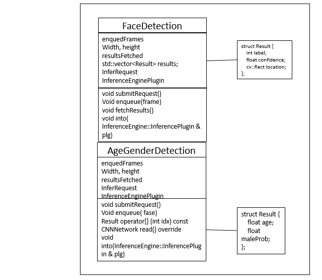
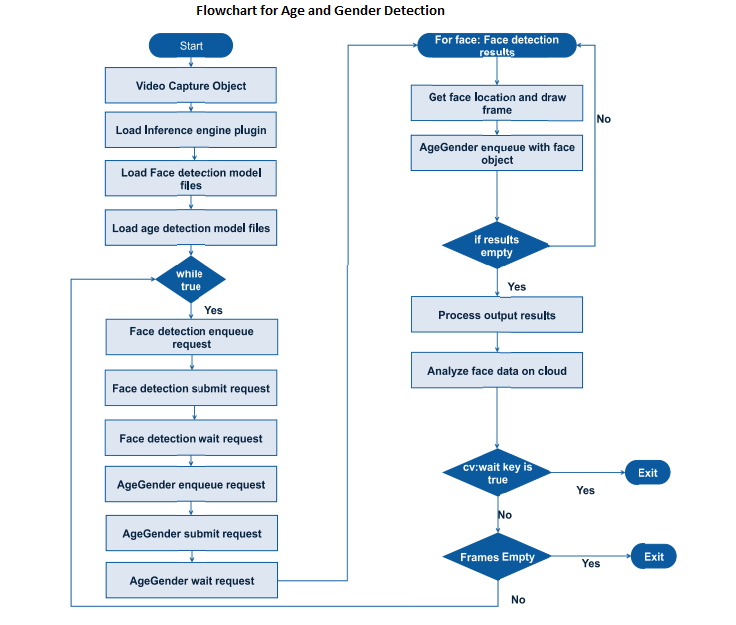

# Age and Gender Detection using the Intel® Distribution of OpenVINO™ toolkit
### Lab Overview
We have done Face Detection in our previous module. Now, we identify Age and Gender for the identified faces.    
We  build upon our Face Detection code and add Age, Gender identification code in this module.

**Class diagram for AgeGender detection**



### Tasks TODO for Age and Gender Detection:
-	Include CPU as plugin device for parallel inferencing.
-	Load pre-trained data model for Age and Gender detection.
-	Once Face Detection result is available, submit inference request for Age and Gender Detection
-	Mark the identified faces inside rectangle and put text on it for Age and Gender.
-	Observe Age and Gender Detection in addition to face.



### 1)Initialise the pararameters
Here initialize the parameters which are required to process the output.
- Replace #TODO: Age and Gender detection 1 with the following lines of code

```cpp
int faceCountThreshold = 100;
int curFaceCount = 0;
int prevFaceCount = 0;
int index = 0;
int malecount = 0;
int femalecount = 0;
int attentivityindex = 0;
int framecounter = 0;

```
### 2)Define Frame height and width
- Replace #TODO: Age and Gender detection 2 with the following lines of code
```
const size_t width = (size_t)cap.get(cv::CAP_PROP_FRAME_WIDTH);
const size_t height = (size_t)cap.get(cv::CAP_PROP_FRAME_HEIGHT);
```

### 3)Select CPU as Plugin Device

Till now, we have defined all the required methods for Age and Gender detection. Now we will extend our Face detection application with Age and Gender detection.

We will use CPU as plugin device for inferencing Age and Gender
- Replace #TODO: Age and Gender detection 3
- Paste the following lines

```cpp
plugin = PluginDispatcher({ "../../../lib/intel64", "" }).getPluginByDevice("CPU");
pluginsForDevices["CPU"] = plugin;


```

### 4)Load Pre-trained Optimized Model for Age and Gender Inferencing

In previous step, CPU is selected as plugin device. Now, load pre-trained optimized model for age and gender detection inferencing on CPU.

- Replace #TODO: Age and Gender Detection 4 with the following lines of code

```cpp
FLAGS_Age_Gender_Model = "C:\\Intel\\computer_vision_sdk\\deployment_tools\\intel_models\\age-gender-recognition-retail-0013\\FP32\\age-gender-recognition-retail-0013.xml";
AgeGenderDetection ageGenderDetector(FLAGS_Age_Gender_Model, FLAGS_d_ag, FLAGS_n_ag, FLAGS_dyn_ag, FLAGS_async);
ageGenderDetector.load(pluginsForDevices["CPU"]);
//TODO: HeadPose Detection 1


```

### 5)Start Inferencing
Till now Required Frame height and width is defined, CPU has been selected for plugin device and loaded pre-trained optimized model for inferencing. Now it is time to start inferencing.
- Replace #TODO: Age and Gender Detection 5 with the following lines of code

```cpp
//Submit Inference Request for age and gender detection and wait for result
ageGenderDetector.submitRequest();
ageGenderDetector.wait();
//TODO: HeadPose Detection 2

```

### 6)Process Face detection Inference Results
At this stage face detection Inference results will be available for further processing. Here, identified face will be clipped off and will be used for identifying age and gender in next request for inferencing.
Clip the identified Faces and send inference request for identifying Age and Gender
- Replace #TODO: Age and Gender Detection 6 with the following lines of code

```cpp
//Clipped the identified face and send Inference Request for age and gender detection
for (auto face : faceDetector.results){
auto clippedRect = face.location & cv::Rect(0, 0, width, height);
auto face1 = frame(clippedRect);
ageGenderDetector.enqueue(face1);
//TODO: HeadPose Detection 3
}

// Got the Face, Age and Gender detection result, now customize and print them on window
std::ostringstream out;
index = 0;
curFaceCount = 0;
malecount=0;
femalecount=0;
attentivityindex = 0;

 ```

### 7)Process Age and Gender detection Results for display
Now we got result for Face, Age and Gender detection. We can customize the output and display this on the screen
- Replace #TODO: Age and Gender Detection 7 with the following lines of code

```cpp
out.str("");
curFaceCount++;
//Draw rectangle bounding identified face and print Age and Gender
out << (ageGenderDetector[index].maleProb > 0.5 ? "M" : "F");
if (ageGenderDetector[index].maleProb > 0.5)
malecount++;
else
femalecount++;
out << "," << static_cast<int>(ageGenderDetector[index].age);
cv::putText(frame, out.str(), cv::Point2f(result.location.x, result.location.y - 15), cv::FONT_HERSHEY_COMPLEX_SMALL, 0.8, cv::Scalar(0, 0, 255));
//TODO: HeadPose Detection 4
index++;
 ```

### The Final Solution
Keep the TODOs as it is. We will re-use this program during Cloud Integration.     
For complete solution click on following link [age_gender_detection](./solutions/agegenderdetection.md)

- Build the solution in visual studio
- Executable will be generated at ***C:\Users\Intel\Desktop\Retail\OpenVINO\deployment_tools\inference_engine\samples\build\intel64\Debug*** directory.
- Run the application by using below command. Make sure camera is connected to the device.
- Open command prompt and type this command

```
C:\Users\Intel\Desktop\Retail\OpenVINO\deployment_tools\inference_engine\samples\build\intel64\Debug\interactive_face_detection_demo.exe

 ```
- On successful execution, Face, Age and Gender will get detected.

### Lesson Learnt
In addition to Face, Age and Gender Detection using the Intel® Distribution of OpenVINO™ toolkit.

## Next Lab
[HeadPose Detection using the Intel® Distribution of OpenVINO™ toolkit](./Headpose_Detection.md)
