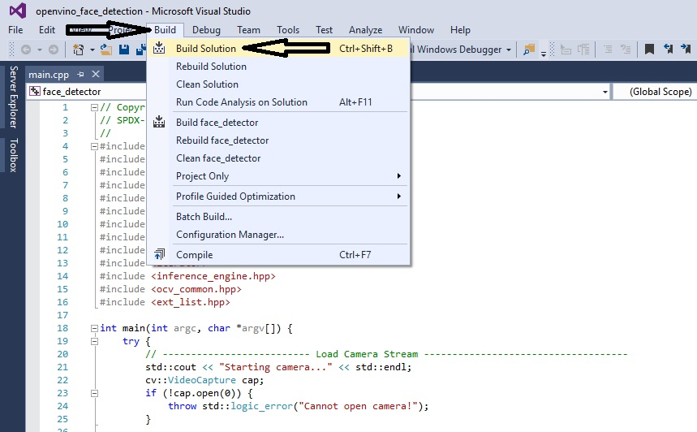
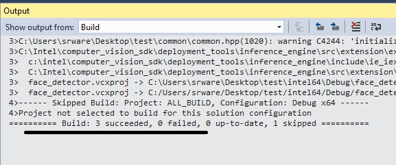
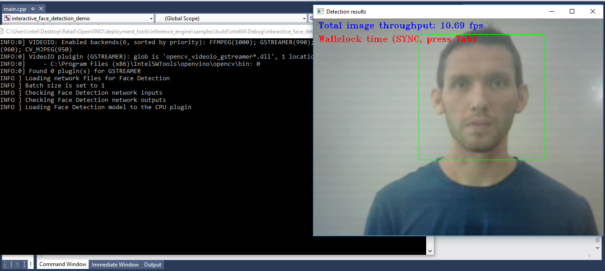
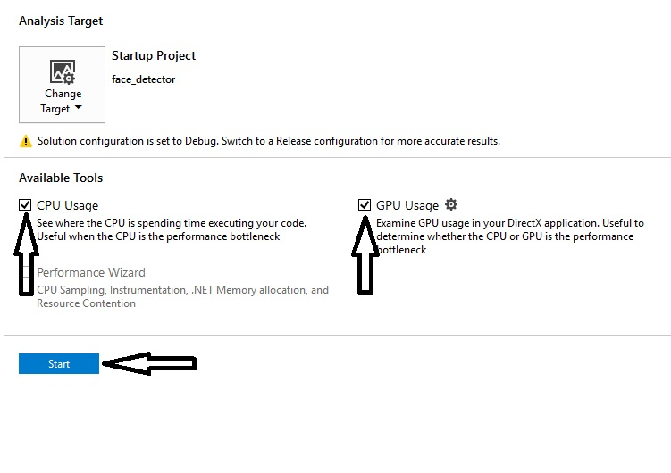
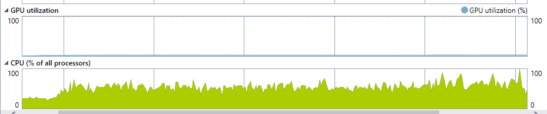
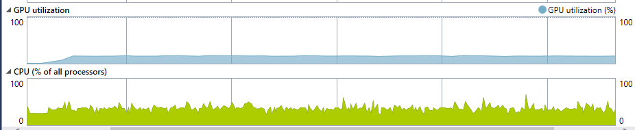
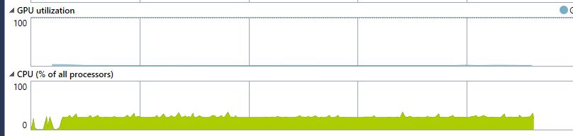

# Face Detection using Intel® accelerators

### Lab Overview
We have done face detection in our previous module in synchronous mode. In this tutorial you will enhance the performance with Asynchronous mode inferecing, inferencing with Intel® Graphics and Intel® Myriad™ VPU.

## Asynchronous Infer Requests
The OpenVINO™ Inference Engine supports asynchronous requests which means you can execute the next request whilst processing the output from the current one. This is a good way of improving performance as you don't need to wait for the current request to finish before executing the next.

In this section we will modify our code to execute asynchronously and see how this impacts performance.

### 1. Select Plugin for inference engine
Select CPU as plugin device to load Face Detection pre trained optimized model
-Replace the following lines of code
```cpp

	//Select plugins for inference engine
	std::map<std::string, InferencePlugin> pluginsForDevices;

	//Select GPU as plugin device to load Face Detection pre trained optimized model
	InferencePlugin plugin = PluginDispatcher({ "../../../lib/intel64", "" }).getPluginByDevice("GPU");
	pluginsForDevices["GPU"] = plugin;
	//TODO: Age and Gender Detection 3


	//Load pre trained optimized data model for face detection
	FLAGS_Face_Model = "C:\\Program Files (x86)\\IntelSWTools\\openvino\\deployment_tools\\tools\\model_downloader\\Transportation\\object_detection\\face\\pruned_mobilenet_reduced_ssd_shared_weights\\dldt\\face-detection-adas-0001.xml";
	FaceDetection faceDetector(FLAGS_Face_Model, FLAGS_d, 1, false, FLAGS_async, FLAGS_t, FLAGS_r);
	faceDetector.load(pluginsForDevices["GPU"]);


```
with this:

```cpp

		FLAGS_d = "CPU";
		//Select plugins for inference engine
		std::map<std::string, InferencePlugin> pluginsForDevices;

		//Select GPU as plugin device to load Face Detection pre trained optimized model
		InferencePlugin plugin = PluginDispatcher().getPluginByDevice(FLAGS_d);
		if ((FLAGS_d.find("CPU") != std::string::npos)) {
			plugin.AddExtension(std::make_shared<Extensions::Cpu::CpuExtensions>());

		}  
		pluginsForDevices[FLAGS_d] = plugin;
		//TODO: Age and Gender Detection 3


		//Load pre trained optimized data model for face detection
		FLAGS_Face_Model = "C:\\Program Files (x86)\\IntelSWTools\\openvino\\deployment_tools\\tools\\model_downloader\\Transportation\\object_detection\\face\\pruned_mobilenet_reduced_ssd_shared_weights\\dldt\\face-detection-adas-0001.xml";
		FaceDetection faceDetector(FLAGS_Face_Model, FLAGS_d, 1, false, FLAGS_async, FLAGS_t, FLAGS_r);
		faceDetector.load(pluginsForDevices[FLAGS_d]);
		//TODO: Async Infer Requests 1

```

### 2. Add OpenCV objects to store additional camera frames
We need to add two OpenCV **Mat** objects to store an additional camera frame so we are able to work with two frames at once. Clone the current frame and read the next frame. Start the timer to calculate the throughput.
- Replace **//TODO: Async_Infer_Requests 1**  with the following lines of code.

``` cpp

	Timer timer;
	size_t framesCounter = 0;
	bool isLastFrame;
	bool frameReadStatus;
	cv::Mat prev_frame, next_frame;
	bool isModeChanged = false;

	// Reading the next frame
	frameReadStatus = cap.read(frame);

```

### 3. Populate the input for the next request.
We now need to make some modification to the **Main Loop**. We no longer want to populate the current **InferRequest** at the start of the loop as this only needs to be done once before the loop begins. We now need to grab the **next** frame from the camera and populate the input for the **next** request at the start of the loop. We can also execute the next request asynchronously before we move on to processing the output from the current request.

- Replace this existing **Main Inference Loop** with the following lines of code.

``` cpp

	// Main inference loop
	while (true) {
		timer.start("total");
		framesCounter++;
		isLastFrame = !frameReadStatus;


		// No valid frame to infer if previous frame is the last
		if (!isLastFrame) {
			faceDetector.enqueue(frame);
			faceDetector.submitRequest();
		}
		// Retrieving face detection results for the previous frame
		faceDetector.wait();
		faceDetector.fetchResults();

		if (!isLastFrame) {
			frameReadStatus = cap.read(next_frame);
		}

		auto prev_detection_results = faceDetector.results;

		for (auto & result : prev_detection_results) {
			cv::Rect rect = result.location;

			// Giving same colour to male and female
			auto rectColor = cv::Scalar(0, 255, 0);

			cv::rectangle(next_frame, result.location, rectColor, 1);
		}

        //TODO: Async Infer Requests 2
		const int key = cv::waitKey(1);
		if (27 == key)  // Esc
			break;

		cv::imshow("Detection results", frame);

		if (!cap.retrieve(frame)) {
			break;
		}

		if (9 == key) {  // Tab
			faceDetector.isAsync ^= true;

		}
	}
```
### 4. Format the output for Display

- Display the throughput in fps on the camera console window.
- Replace **//TODO: Async_Infer_Requests 2**  with the following lines of code.

```cpp
		std::ostringstream out;
		out << "Wallclock time " << (faceDetector.isAsync ? "(TRUE ASYNC)      " : "(SYNC, press Tab) ");
		cv::putText(next_frame, out.str(), cv::Point2f(10, 50), cv::FONT_HERSHEY_TRIPLEX, 0.6, cv::Scalar(0, 0, 255));
		out.str("");
		out << "Total image throughput: " << std::fixed << std::setprecision(2)
			<< 1000.f / (timer["total"].getSmoothedDuration()) << " fps";
		cv::putText(next_frame, out.str(), cv::Point2f(10, 20), cv::FONT_HERSHEY_TRIPLEX, 0.6,
			cv::Scalar(255, 0, 0));
		//TODO: Async_Infer_Requests 3

```

### 5. Make input ready for next iteration.
 - Finally, instead of grabbing the next frame from the camera at the end of the **Main Loop** we need to swap the **previous** and **next** requests before the loop starts it's next iteration and close the timer.

- Replace **//TODO: Async_Infer_Requests 3**  with the following lines of code.

``` cpp
	prev_frame = frame;
	frame = next_frame;
	next_frame = cv::Mat();
	timer.finish("total");    

```
That's all the changes we need to make so we can now **build the solution** and check performance.

## Build & Run The Code

 - Build the solution: **Build->Build Solution**



 - Make sure the application built successfully by checking the **Output** log in the bottom left pane.


 - Ensure you have a USB camera connected to your host device before continuing.

 - Run the application by pressing **F5** on your keyboard or clicking the **'Local Windows Debugger'** button in the main toolbar.


 - A console window will load and begin showing debug output. Once the camera has loaded and the main loop begins a window will also appear showing the camera frames and fps values in the top left.


 - Press TAB, to switch between SYNC/ASYNC mode
 - Press the **Esc** to stop the application


## Running On Intel® Graphics
As mentioned previously the OpenVINO™ Inference Engine comes with plugins to support a range of Intel® hardware.

 - Before we make any modifications we can use the **Performance Profiler** utility in Visual Studio to analyse the **CPU** and **GPU** usage of the current code. To run the application using the **Performance Profiler**:
     - Select **Debug->Performance Profiler...**
     - Make sure **CPU Usage** and **GPU Usage** are ticked and click **Start** to begin profiling.



 - The application will load as normal whilst the profiling tool records usage data in the background. Let the application run for a few seconds before pressing the **Esc** key to close the application and stop the profiling session.

 - Now go back to Visual Studio and take a look at the **GPU Utilization** and **CPU** graphs. Notice that CPU usage is high and GPU usage is low as we would expect when using the CPU plugin for inference.



 - Now we will try using the integrated **GPU** which requires a modification which is performance related. For best performance on GPU it is generally best to use a model with **FP16** data type as appose to the **FP32** model we have been using up to now. All of the pretrained models are provided with FP16 and FP32 variants so this is a simple case of changing the **model** variable to point to the **FP16** model.

 - In order to run on an Intel® GPU, we simply change the **device**  to **CPU** or **GPU**.
 - Replace the following lines of code:

``` cpp

   FLAGS_d = "CPU";

```
with this, in case of GPU:

```cpp
   FLAGS_d = "GPU";
```

``` cpp

FLAGS_Face_Model= "C:\\Program Files (x86)\\IntelSWTools\\openvino\\deployment_tools\\tools\\model_downloader\\Transportation\\object_detection\\face\\pruned_mobilenet_reduced_ssd_shared_weights\\dldt\\face-detection-adas-0001-fp16.xml";

```

 - **Build the solution** and make sure the code compiled successfully by checking the **Output** log in the bottom left pane.

 - Run the application using the **Performance Profiler** once again to monitor **CPU** and **GPU** usage. You will notice **CPU usage** is significantly reduced whilst the application is running whereas **GPU usage** is increased.



## Running On Intel® Myriad™ VPU
The **Myriad™** Inference Engine plugin supports VPU devices such as the Intel® Neural Compute Stick. Dedicated accelerators such as this offer an alternative to traditional CPU and GPU hardware which can be useful for adding computer vision workloads to existing solutions where CPU and GPU are already heavily utilized.

 - VPU devices only support **FP16** data type so we will need to use the FP16 variant of our pre-trained face detection model as we did when running on the GPU in the previous section.

 - In order to run on an Intel® Myriad™ VPU, we simply change the **device**  to **MYRIAD**.
 - Replace the following lines of code:

``` cpp

   FLAGS_d = "GPU";

```
with this, in case of MYRIAD:

```cpp
   FLAGS_d = "MYRIAD";
```

 - **Build the solution** and make sure the code compiled successfully by checking the **Output** log in the bottom left pane.

 - Ensure you have an Intel® Neural Compute Stick plugged into your host before continuing.

 - Run the application using the **Performance Profiler** once again to monitor **CPU** and **GPU** usage. You will notice that using a dedicated VPU for inference has drastically reduced the utilisation of the **CPU** and **GPU** which frees these resources up for other workloads.




### The Final Solution

For complete solution, see [openvino face detection with accelerators](./openvino_VPU_async.md)


- Build the solution in visual studio
- Executable will be generated at ***C:\Users\Intel\Desktop\Retail\OpenVINO\deployment_tools\inference_engine\samples\build\intel64\Debug*** directory.
- To run the application by using command prompt.
- Open command prompt and type below command
- *NOTE:Make sure camera is connected to the device.*

```sh
> C:\"Program Files (x86)"\IntelSWTools\openvino\bin\setupvars.bat
> C:\Users\Intel\Desktop\Retail\OpenVINO\deployment_tools\inference_engine\samples\build\intel64\Debug\interactive_face_detection_demo.exe

 ```
 - On successful execution, face will get detected.

### Lesson Learnt
We looked at ways of improving performance by taking advantage of asynchronous calls in the Inference Engine API before exploring the ease of which the same code can be run on various different hardware in the Intel® portfolio such as GPUs and Intel® Myriad™ VPUs.


## Next Lab
[Age and Gender Detection using the Intel® Distribution of OpenVINO™ toolkit](./Age_Gender_Detection.md)
