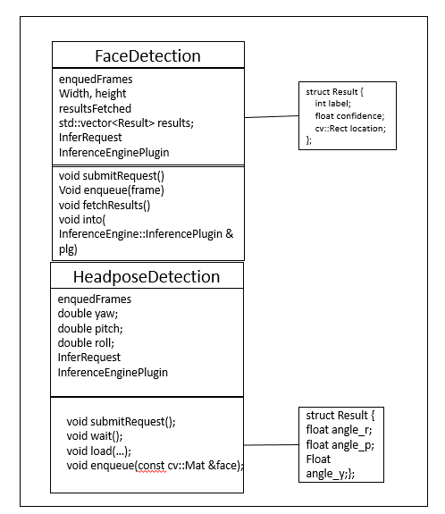
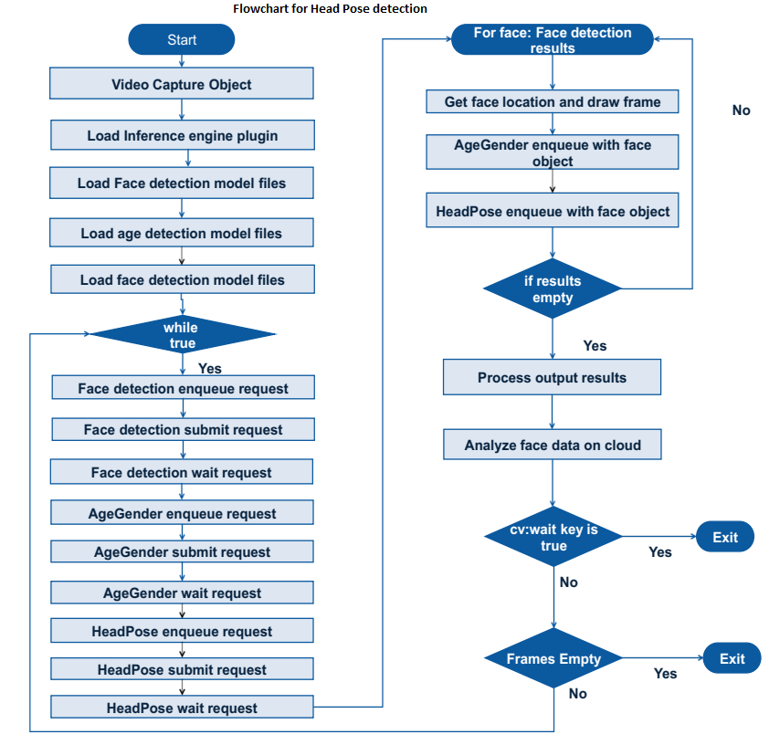

# Head Pose Detection using Intel® Distribution of  OpenVINO™ toolkit
### Lab Overview
We have done face, age and gender Detection in our previous labs. Now, we will detect Head pose for the identified faces.    
We build upon our Face, Age and Gender detection code from previous labs to add Head Pose detection code in this module.

**Class diagram for Head Pose Detection**



### Tasks TODO for Head Pose Detection:
-	Select CPU as plugin device for head pose detection inference.
-	Load pre-trained data model for head pose detection.
-	Once face detection result is available, submit inference request for head pose detection
-	Mark the identified faces inside rectangle and draw Raw ,Yaw and Pitch axis.
-	Observe head pose detection in addition to face, age and gender.




### 1. Select CPU as plugin device
In previous labs,  Face, Age and Gender detection is done. Now, the application will be extended with head pose detection. Here, the CPU will be used as plugin device for inferencing head pose detection. Which is already selected for Age and Gender detection in previous lab.

### 2. Load pre-trained optimized model for head pose Inferencing
:  Load pre-retained optimized model for head pose detection on CPU as CPU is already selected as plugin device previously.
- Replace **#TODO: HeadPose Detection 1** with the following lines of code

```cpp
FLAGS_m_hp = "/opt/intel/computer_vision_sdk/deployment_tools/intel_models/head-pose-estimation-adas-0001/FP32/head-pose-estimation-adas-0001.xml";
  	HeadPoseDetection headPoseDetector(FLAGS_m_hp, FLAGS_d_hp, FLAGS_n_hp, FLAGS_dyn_hp, FLAGS_async);
	headPoseDetector.load(pluginsForDevices["CPU"]);


```

### 3. Start Inferencing
Till now Plugin device is selected, and loaded pre-trained optimized model for inferencing. Now it is time to start inferencing.
- Replace **#TODO: HeadPose Detection 2** with the following lines of code

```cpp
//Submit Inference Request for HeadPose detection and wait for result
headPoseDetector.submitRequest();
headPoseDetector.wait();

```

### 4. Use identified face for head pose detection
Clip the identified Faces and send inference request for detecting head pose
- Replace **#TODO: HeadPose Detection 3** with the following line of code

```cpp
headPoseDetector.enqueue(face1);

```

### 5. Calculate attentivityindex
Now, the attentivityindex will be calculated using Yaw angle available from head pose inference result.
- Replace **#TODO: HeadPose Detection 4** with the following lines of code

```cpp
if (index < headPoseDetector.maxBatch) {
cv::Point3f center(rect.x + rect.width / 2, rect.y + rect.height / 2, 0);
headPoseDetector.drawAxes(frame, center, headPoseDetector[index], 50);
if (headPoseDetector.yaw > -0.4 && headPoseDetector.yaw < -0.001)
{
attentivityindex++;
}
}

 ```

### The Final Solution

Keep the TODOs as it is. We will re-use this program during Cloud Integration.     
For complete solution click on following link [headpose_detection](./solutions/Headposedetection.md)

### Build the Solution and Observe the Output

- Go to ***~/Desktop/Retail/OpenVINO/samples/build***  directory
- Do  make by following commands   
- Make sure environment variables set when you are doing in fresh terminal.

```bash

# make

```

- Executable will be generated at ***~/Desktop/Retail/OpenVINO/samples/build/intel64/Release*** directory.
- Run the application by using below command. Make sure camera is connected to the device.

```bash
# cd ~/Desktop/Retail/OpenVINO/samples/build/intel64/Release
# ./interactive_face_detection_demo
 ```


- On successful execution, Face, Age  Gender and HeadPose will get detected.

### Lesson Learnt
In addition to face, age and gender - added head pose Detection using  OpenVINO™ toolkit.

## Next Lab
[Analyze data on Cloud](./Analyse_face_data_on_cloud.md)
