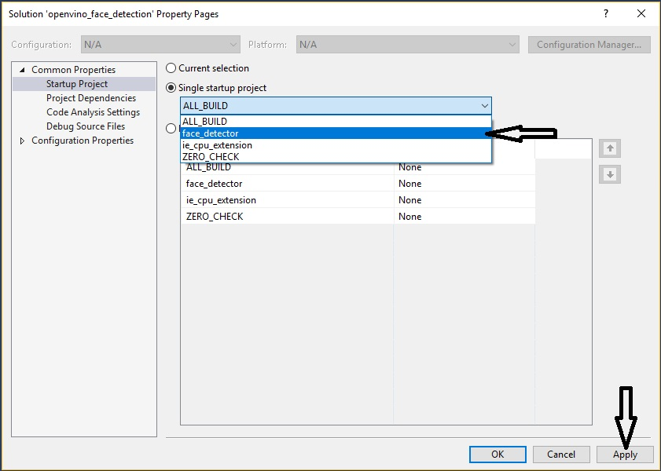
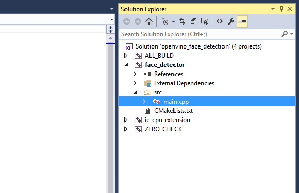
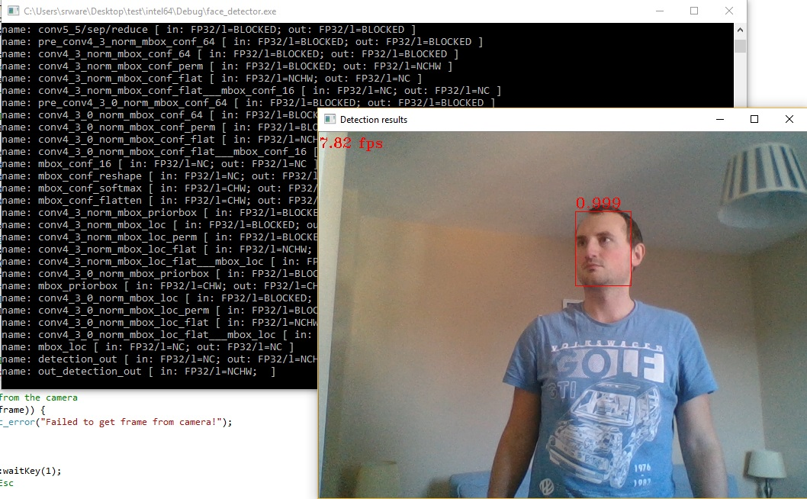

# Simple Face Detection using Intel® OpenVINO™ Toolkit (Windows)
In this tutorial you will build a simple application capable of detecting faces in a live camera stream using the Intel® OpenVINO™ Toolkit and an Intel® pretrained model. Once completed you will have an understanding of the code required to start creating your own OpenVINO™ based solutions and how to target various accelerators in the Intel® portfolio (CPU, GPU, VPU).

## Getting Started

- The tutorial code is provided as a CMake project so the first step is to use a CMake generator to generate our Visual Studio Solution so we can use the Visual Studio IDE for developing and debugging the code. A batch file to automate this process is provided in the project directory:
- **Double-click** the **'create_vs2015_solution.bat'** file to generate the VS Solution files > **"Retail_Workshop\openvino_face_detection\create_vs2015_solution.bat"**

- Once completed you can load the **'openvino_face_detection'** Visual Studio Solution file which you just generated > **"Retail_Workshop\openvino_face_detection\openvino_face_detection.sln"**

- Once Visual Studio has loaded you will notice there are 4 projects in our solution listed in the **Solution Explorer** in the right-hand pane. The main application project is called **'face_detector'** and contains the main application code. Before we get started we need to set this project to be the default for debugging. **Right-click** on the top level solution in the **Solution Explorer** window and select **Properties**


- In the **Properties** window select **'face_detector'** in the **Single startup project** drop down box and then click **Apply** and finally **OK** to close the window.



- Expand the **face_detector** project in the **Solution Explorer** in the right-hand pane and navigate to the **'src'** directory. **Double-click** on the **main.cpp** file to load the main application code.



## Understanding The Code
Take a look through the existing code using the comments as a guide. The code in it's current form simply uses the OpenCV library to capture frames from a USB camera and render them to a window. There is a crude timer implementation to give a rough guide to the number of frames per second being processed by the code in it's entirety.

The basic flow is outlined below:

1. Open first camera device
2. Grab a frame from the camera
3. Start the main loop
- Draw frame to a window
- Grab next frame from camera
- Loop until 'Esc' key is pressed

## Build & Run The Code

- Build the solution: **Build->Build Solution**


- Make sure the application built successfully by checking the **Output** log in the bottom left pane.


- Ensure you have a USB camera connected to your host device before continuing.

- Run the application by pressing **F5** on your keyboard or clicking the **'Local Windows Debugger'** button in the main toolbar.


- A console window will load and begin showing debug output. Once the camera has loaded and the main loop begins a window will also appear showing the camera frames and fps values in the top left.


- Press the **Esc** to stop the application

## Face Detection using Intel® OpenVINO™ Toolkit
We will now add the necessary code to implement real-time face detection using the Intel(® OpenVINO™ Toolkit. We will specifically be using the Inference Engine API included as part of the toolkit along with an Intel® provided pretrained model which will allow us to perform inference on each camera frame and highlight faces detected within it.

A typical Inference Engine API workflow which we will implement in the following section is outlined below:

1. **Select Plugin** - The Inference Engine uses a plugin architecture. An Inference Engine plugin is a software component which provides an implementation for inference on a given Intel® hardware device. There are a number of plugins included with the Intel® Distribution of OpenVINO™ Toolkit for a range of target hardware including CPU, GPU, VPU and FPGA.
2. **Read the Intermediate Representation** - The Inference Engine requires an Intermediate Representation (IR) of a given model which can be generated by the **Model Optimizer** utility included with OpenVINO™. The Intermediate Representation files (xml+bin) need to be loaded into a **CNNNetwork** class which represents the network in host memory.
3. **Configure inputs and outputs** - After loading the network we need to specify input and output precision and the layout of the network so resources can be allocated correctly when we create an **InferRequest** later on.
4. **Load the network** - The Inference Engine plugin will compile and load the network to the desired device so inference can begin.
5. **Set input data** - With the network loaded, you are able to create an **InferRequest** which allocates memory to hold the input and output. At this point you will also prepare the input by writing image data of the required size for the network to the allocated buffer for example.
6. **Execute** - With input and output memory defined and the input data prepared we can execute the **InferRequest** which will populate the output memory with detection results.
7. **Get the output** - After inference is completed you can retrieve the data from the output memory and parse the results.

Let's start implementing the above steps in our own application code:

- All of the required header files are already included but we do need to pull in the **Inference Engine namespace**. Add the following line beneath the existing includes at the top of the **'main.cpp'** file:

``` cpp
using namespace InferenceEngine;
```
- Next we will create some variables to hold key information which will be used in the rest of our code. Add the following before the **'main'** function in the code:
 - **model** - This is the path to the pretrained model we are going to use.
 - **device** - This determines the Inference Engine plugin we want to use.
 - **threshold** - This determines the required confidence level for a face to be highlighted in the output window. The threshold value should be in the range 0-1.

``` cpp
std::string model = "C:\\Program Files (x86)\\IntelSWTools\\openvino\\deployment_tools\\tools\\model_downloader\\Transportation\\object_detection\\face\\pruned_mobilenet_reduced_ssd_shared_weights\\dldt\\face-detection-adas-0001.xml";
std::string device = "CPU";
float threshold = 0.5;
```

- Next we will add the code to load the required Inference Engine plugin for our chosen hardware which is determined by the **device** variable we set previously (**CPU** in this case).
 - The **PluginDispatcher** helper class finds and loads a suitable plugin to an **InferencePlugin** class based on the requested device.
 - We compile the CPU extensions library along with our application (**ie_cpu_extension** project in the VS Solution) which contains code to support important layers that do not come with the default CPU plugin. We load these extensions to our plugin using the **AddExtension** function call.

Copy the following and add it after the **camera initialisation** code.

``` cpp
      std::cout << "Loading plugin" << std::endl;

      InferencePlugin plugin = PluginDispatcher({""}).getPluginByDevice(device);
      printPluginVersion(plugin, std::cout);

      /** Loading default extensions **/
      if (device.find("CPU") != std::string::npos) {
          plugin.AddExtension(std::make_shared<Extensions::Cpu::CpuExtensions>());
      }
```

- The next step is to read the model we are going to use for face detection. This is an Intel® provided pretrained model (SSD model with a MobileNet backbone) which is already in the required Intermediate Representation (IR) format. The Intermediate Representation consists of an XML file which describes the network layout and layers and a binary file which contains the model weights.
 - We use a **CNNNetReader** to read the model and it's weights. The path to the model was defined earlier in our **'model'** variable.

Copy the following and add it after the **plugin loading** code from the previous step.

``` cpp
      std::cout << "Loading network files..." << std::endl;

      /** Read network model and weights**/
      CNNNetReader netReader;
      netReader.ReadNetwork(model + ".xml");
      netReader.ReadWeights(model + ".bin");
```

- The next step is to specify what the input and output to the network looks like so that sufficient memory can be allocated for each **InferRequest**. This step requires some knowledge of the network layout for the model being used although there are some helper functions provided by the **CNNNetReader** class which allow us to probe the network for the required information.
 - The model we are using for face detection expects **input** blobs where the first element contains the string "input" and the second element is a shape in the format [NxCxHxW] where:
   - **N** is the batch size
   - **C** is the number of channels in the image (3 in this case in the order Blue, Green, Red)
   - **H** is the height of the image (this model expects an image with a height of 384 pixels)
   - **W** is the width of the image (this model expects an image with a width of 672 pixels)

- The **output** blobs from the network consist of a name element first and a second element with the shape [1, 1, N, 7], where **N** is the number of detected items. For each detection there is a **'Description'** which consists of 7 elements in the format [image_id, label, conf, x_min, y_min, x_max, y_max] where:
- **image_id** is the ID of the image in the batch
- **label** is the predicted class ID. For the face detection model there is only one but a model could be capable of detecting multiple objects
- **conf** is the confidence level for the predicted class which in this case indicates how likely it is that what has been detected is actually a face
- **x_min, y_min** are the coordinates of the top left bounding box corner for the detected item
- **x_max, y_max** are the coordinates of the bottom right bounding box corner for the detected item

Add the following after the **network reading** code from the previous step.

``` cpp
      std::cout << "Configuring input & output blobs" << std::endl;

      InputsDataMap inputInfo(netReader.getNetwork().getInputsInfo());
      auto inputName = inputInfo.begin()->first;
      InputInfo::Ptr& input = inputInfo.begin()->second;
      input->setPrecision(Precision::U8);
      input->getInputData()->setLayout(Layout::NCHW);

      OutputsDataMap outputInfo(netReader.getNetwork().getOutputsInfo());
      auto outputName = outputInfo.begin()->first;
      DataPtr& output = outputInfo.begin()->second;
      const SizeVector outputDims = output->getTensorDesc().getDims();
      const int numDetections = outputDims[2];
      const int objectSize = outputDims[3];
      output->setPrecision(Precision::FP32);
      output->setLayout(Layout::NCHW);
```

- Next we need to load our network to the **InferencePlugin** we initialised earlier. To do this we call the **LoadNetwork** function of our plugin which then handles compiling the network for the intended inference device (CPU, GPU etc...) and loading it so that it can begin handling inference requests. An **ExecutableNetwork** instance is returned which we can use in the following steps to perform inference on the camera frames. Add the following after the code from the previous step.

``` cpp
      std::cout << "Loading model to the plugin" << std::endl;

      ExecutableNetwork network = plugin.LoadNetwork(netReader.getNetwork(), {});
```

- Next we will create an **InferRequest** which will allocate memory for our input and output blobs. We will then populate the input blob before processing the **InferRequest** through the network previously loaded to our **InferencePlugin**. Add the following after the code from the previous step to create the required **InferRequest**.

``` cpp
      InferRequest::Ptr infer_request = network.CreateInferRequestPtr();
```

Now we have everything setup we can begin performing inference on the frames being grabbed from the camera inside the **Main Loop**.

- First of all we need to populate the input blob with the frame data from the camera. We use a helper function called **matU8ToBlob** which converts an OpenCV **Mat** object into a blob of the expected format for our network. This function resizes the image from the camera to the required size for the network and then populates the blob buffer with image data in the expected BGR format.

``` cpp
          /* Resize and copy data from the camera frame to the input blob */
          Blob::Ptr input_blob = infer_request->GetBlob(inputName);
          matU8ToBlob<uint8_t>(curr_frame, input_blob);
```

- Next we execute the **InferRequest** using the synchronous (blocking) **Infer()** function call. This will process our input blob through the network which will in turn populate our output blob with information about the items detected which we can parse in the next step.

``` cpp
          // Execute the infer request
          infer_request->Infer();
```

- Next we process the output by reading the output blob buffer which should now be full of data describing the detected items in the format described previously [image_id, label, conf, x_min, y_min, x_max, y_max]. We iterate through the detected items, check the confidence level against our **threshold** variable and then use the bounding box coordinates to highlight the area in our output window.

``` cpp
          /* Process output blob */
          const float *detections = infer_request->GetBlob(outputName)->buffer().as<PrecisionTrait<Precision::FP32>::value_type*>();
          for (int i = 0; i < numDetections; i++) {
              float confidence = detections[i * objectSize + 2];
              float xmin = detections[i * objectSize + 3] * width;
              float ymin = detections[i * objectSize + 4] * height;
              float xmax = detections[i * objectSize + 5] * width;
              float ymax = detections[i * objectSize + 6] * height;

              if (confidence > threshold) {
                  std::ostringstream conf;
                  conf << std::fixed << std::setprecision(3) << confidence;
                  cv::putText(curr_frame,
                      conf.str(),
                      cv::Point2f(xmin, ymin - 5), cv::FONT_HERSHEY_COMPLEX_SMALL, 1,
                      cv::Scalar(0, 0, 255));
                  cv::rectangle(curr_frame, cv::Point2f(xmin, ymin), cv::Point2f(xmax, ymax), cv::Scalar(0, 0, 255));
              }
          }
```

The **Main Loop** should now look like this...

``` cpp
      while (true) {
          /* Resize and copy data from the camera frame to the input blob */
          Blob::Ptr input_blob = infer_request->GetBlob(inputName);
          matU8ToBlob<uint8_t>(curr_frame, input_blob);

          // Execute the infer request
          infer_request->Infer();

          //---------------------------------------- Calculate performance metrics -----------------------------------------------------
          endTime = std::chrono::high_resolution_clock::now();
          ms timer = std::chrono::duration_cast<ms>(endTime - startTime);
          startTime = endTime;

          std::ostringstream out;
          out << std::fixed << std::setprecision(2) << 1000.f / timer.count() << " fps";
          cv::putText(curr_frame, out.str(), cv::Point2f(0, 20), cv::FONT_HERSHEY_TRIPLEX, 0.6, cv::Scalar(0, 0, 255));
          //-----------------------------------------------------------------------------------------------------------------------------

          /* Process output blob */
          const float *detections = infer_request->GetBlob(outputName)->buffer().as<PrecisionTrait<Precision::FP32>::value_type*>();
          for (int i = 0; i < numDetections; i++) {
              float confidence = detections[i * objectSize + 2];
              float xmin = detections[i * objectSize + 3] * width;
              float ymin = detections[i * objectSize + 4] * height;
              float xmax = detections[i * objectSize + 5] * width;
              float ymax = detections[i * objectSize + 6] * height;

              if (confidence > threshold) {
                  std::ostringstream conf;
                  conf << std::fixed << std::setprecision(3) << confidence;
                  cv::putText(curr_frame,
                      conf.str(),
                      cv::Point2f(xmin, ymin - 5), cv::FONT_HERSHEY_COMPLEX_SMALL, 1,
                      cv::Scalar(0, 0, 255));
                  cv::rectangle(curr_frame, cv::Point2f(xmin, ymin), cv::Point2f(xmax, ymax), cv::Scalar(0, 0, 255));
              }
          }

          // Display results in output window
          cv::imshow("Face Detector", curr_frame);

          // Grab next frame from the camera
          if (!cap.read(curr_frame)) {
              throw std::logic_error("Failed to get frame from camera!");
          }

          // ESC to exit
          const int key = cv::waitKey(1);
          if (27 == key)  // Esc
              break;
      }
```
- Once again **build the solution** and make sure the code built successfully by checking the **Output** log in the bottom left pane.

- Run the application by pressing **F5** on your keyboard or clicking the **'Local Windows Debugger'** button in the main toolbar.

  - When the output window loads and begins showing the camera frames you will notice that faces are bound by a red box. The value above the box is the confidence level. Run the application for a while and note down the average **fps** shown in the top left of the output window. In the next section we will look at ways to improve inference performance.



- Press the **Esc** to stop the application

## Asynchronous Infer Requests
The OpenVINO™ Inference Engine supports asynchronous requests which means you can execute the next request whilst processing the output from the current one. This is a good way of improving performance as you don't need to wait for the current request to finish before executing the next.

In this section we will modify our code to execute asynchronously and see how this impacts performance.

- The first thing we need to do is add a second OpenCV **Mat** object to store an additional camera frame so we are able to work with two frames at once. Add the following code directly under the original **Mat** object.

``` cpp
      cv::Mat next_frame;
```

- The second thing we need to do is add a second **InferRequest** object which we can use for the next request while the current one is being executed. Add the following code directly beneath our original **InferRequest**.

``` cpp
      InferRequest::Ptr infer_request_next = network.CreateInferRequestPtr();
```

- The next thing we need to do is to populate the input of the current **InferRequest** and execute it asynchronously **before** the **Main Loop**. From then on we will only ever populate the input of the **next** request inside the main loop. Add the following code just before the **Main Loop**.

``` cpp
      /* Resize and copy data from the first camera frame to the current input blob */
      Blob::Ptr input_blob = infer_request->GetBlob(inputName);
      matU8ToBlob<uint8_t>(curr_frame, input_blob);

      // Execute the first infer request
      infer_request->StartAsync();
```
**Note:** Previously we used the **Infer()** function call on our **InferRequest** which is a blocking call. We are now using the **StartAsync()** call which returns immediately.

- We now need to make some modification to the **Main Loop**. We no longer want to populate the current **InferRequest** at the start of the loop as this only needs to be done once before the loop begins. We now need to grab the **next** frame from the camera and populate the input for the **next** request at the start of the loop. We can also execute the next request asynchronously before we move on to processing the output from the current request.

Replace this existing code at the start of the **Main Loop**:

``` cpp
          /* Resize and copy data from the camera frame to the input blob */
          Blob::Ptr input_blob = infer_request->GetBlob(inputName);
          matU8ToBlob<uint8_t>(curr_frame, input_blob);

          // Execute the infer request
          infer_request->Infer();
```

With this:

``` cpp
          /* Prepare next input blob */
          if (!cap.read(next_frame)) { // Grab next frame from camera
              throw std::logic_error("Failed to get frame from camera!");
          }

          /* Resize and copy the next camera frame to the next input blob */
          Blob::Ptr input_blob_next = infer_request_next->GetBlob(inputName);
          matU8ToBlob<uint8_t>(next_frame, input_blob_next);

          // Execute the next infer request while waiting for the current one to complete                
          infer_request_next->StartAsync();
```

- Once we setup and execute the next request we need to wait for the current request to complete before processing the output. To do this we use the **Wait()** call on our current **InferRequest** which blocks the main thread until a result is returned.

``` cpp
          /* Wait for current infer request to complete */
          infer_request->Wait(IInferRequest::WaitMode::RESULT_READY);
```

- Finally, instead of grabbing the next frame from the camera at the end of the **Main Loop** we need to swap the **current** and **next** requests before the loop starts it's next iteration.

Replace this code near the end of the **Main Loop**:

``` cpp
          // Grab next frame from the camera
          if (!cap.read(curr_frame)) {
              throw std::logic_error("Failed to get frame from camera!");
          }
```
With this:

``` cpp
          // Swap the next and current requests for the next iteration
          curr_frame = next_frame;
          next_frame = cv::Mat();
          infer_request.swap(infer_request_next);
```

- That's all the changes we need to make so we can now **build the solution** once again. Make sure the code built successfully by checking the **Output** log in the bottom left pane.

- Run the application by pressing **F5** on your keyboard or clicking the **'Local Windows Debugger'** button in the main toolbar. Once again run the application for a while and take note of the average **fps** value which should now be higher than before.

- Press the **Esc** to stop the application

## Running On Intel® Graphics
As mentioned previously the OpenVINO™ Inference Engine comes with plugins to support a range of Intel® hardware. Up to now we have been using the **CPU** plugin but with minimal changes we are able to use the integrated Intel® GPU or a dedicated accelerator such as a Movidius™ VPU.

- Before we make any modifications we can use the **Performance Profiler** utility in Visual Studio to analyse the **CPU** and **GPU** usage of the current code. To run the application using the **Performance Profiler**:
   - Select **Debug->Performance Profiler...**
   - Make sure **CPU Usage** and **GPU Usage** are ticked and click **Start** to begin profiling.


- The application will load as normal whilst the profiling tool records usage data in the background. Let the application run for a few seconds before pressing the **Esc** key to close the application and stop the profiling session.

- Now go back to Visual Studio and take a look at the **GPU Utilization** and **CPU** graphs. Notice that CPU usage is high and GPU usage is low as we would expect when using the CPU plugin for inference.


- Now we will try using the integrated **GPU** which requires two modifications to the code the first of which is performance related. For best performance on GPU it is generally best to use a model with **FP16** data type as appose to the **FP32** model we have been using up to now. All of the pretrained models are provided with FP16 and FP32 variants so this is a simple case of changing the **model** variable to point to the **FP16** model.

``` cpp
std::string model = "C:\\Program Files (x86)\\IntelSWTools\\openvino\\deployment_tools\\tools\\model_downloader\\Retail\\object_detection\\face\\sqnet1.0modif-ssd\\0004\\dldt\\face-detection-retail-0004-fp16.xml";
```

- The second change we need to make is to the **device** variable which needs to change from **CPU** to **GPU**.

``` cpp
std::string device = "GPU";
```

- **Build the solution** and make sure the code compiled successfully by checking the **Output** log in the bottom left pane.

- Run the application using the **Performance Profiler** once again to monitor **CPU** and **GPU** usage. You will notice **CPU usage** is significantly reduced whilst the application is running whereas **GPU usage** is increased.


## Running On Intel® Myriad™ VPU
The **Myriad™** Inference Engine plugin supports VPU devices such as the Intel® Neural Compute Stick. Dedicated accelerators such as this offer an alternative to traditional CPU and GPU hardware which can be useful for adding computer vision workloads to existing solutions where CPU and GPU are already heavily utilised.

- VPU devices only support **FP16** data type so we will need to use the FP16 variant of our pretrained face detection model as we did when running on the GPU in the previous section.

- In order to run on an Intel® Myriad™ VPU we simply change the **device** variable to **MYRIAD**.

``` cpp
std::string device = "MYRIAD";
```

- **Build the solution** and make sure the code compiled successfully by checking the **Output** log in the bottom left pane.

- Ensure you have an Intel® Neural Compute Stick plugged into your host before continuing.

- Run the application using the **Performance Profiler** once again to monitor **CPU** and **GPU** usage. You will notice that using a dedicated VPU for inference has drastically reduced the utilisation of the **CPU** and **GPU** which frees these resources up for other workloads.


> If you missed some steps or didn't have time to finish the tutorial the completed code is available in the **openvino_face_detection_final** directory.

## Conclusion
In this tutorial we have created a simple application which is able to detect faces in a live camera stream using the Intel® OpenVINO™ Toolkit and an SSD pretrained model. We looked at the basic OpenVINO™ workflow and used the Inference Engine API to add basic face detection functionality to our application. We then looked at ways of improving performance by taking advantage of asynchronous calls in the Inference Engine API before exploring the ease of which the same code can be run on various different hardware in the Intel® portfolio such as GPUs and Intel® Myriad™ VPUs.

## Next Steps
[Age and Gender Detection using the Intel® Distribution of OpenVINO™ toolkit](./Age_Gender_Detection.md)

A number of Inference Engine samples are included with OpenVINO™ which allow you to explore it's capabilities using pretrained models. The sample executables can be found in the following directory:

> Documents\Intel\OpenVINO\inference_engine_samples_2015\intel64\Release

You can find additional information about the samples with examples of how to use them [HERE](https://software.intel.com/en-us/articles/OpenVINO-IE-Samples).

## Additional Resources
[Intel® OpenVINO™ Toolkit](https://software.intel.com/en-us/openvino-toolkit)

[Inference Engine Developer Guide](https://software.intel.com/en-us/articles/OpenVINO-InferEngine)

[Pretrained Models](https://software.intel.com/en-us/openvino-toolkit/documentation/pretrained-models)
