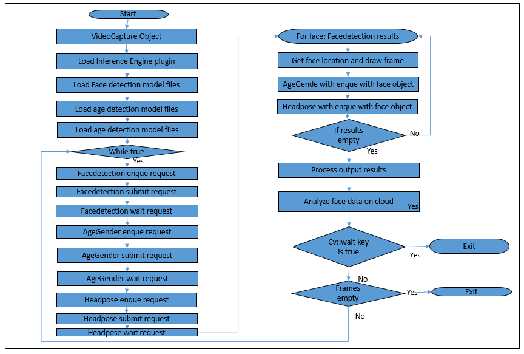

# Head Pose Detection using  OpenVINO™ toolkit
### Lab Overview
We have done Face and Age,Gender Detection in our previous module. Now, we identify Headpose for the identified faces.    
We  build upon our Face Detection code and add Age ,Gender add HeadPose identification code in this module.

**Class diagram for HeadPose Detection**


### Tasks TODO for HeadPose Detection:
-	Include CPU as plugin device for headpose detection inference.
-	Load pre-trained data model for Headpose detection.
-	Once Face Detection result is available, submit inference request for Headpose Detection
-	Mark the identified faces inside rectangle and draw Raw ,Yaw and Pitch axis.
-	Observe HeadPose Detection in addition to face.



### Define a HeadPose class
Here, we will define a class that includes the declaration of data member and member functions that will be used for HeadPose detection using OpenVINO™ toolkit.
1. **Replace *#TODO: Define class for HeadPose Detection* with the following lines**

```
struct HeadPoseDetection {

	ExecutableNetwork net;
	InferencePlugin * plugin;
	InferRequest::Ptr request;
	std::string & commandLineFlag = FLAGS_m_hp;
	std::string topoName = "Head Pose";
	const int maxBatch = FLAGS_n_hp;
	std::string input;
	std::string outputAngleR = "angle_r_fc";
	std::string outputAngleP = "angle_p_fc";
	std::string outputAngleY = "angle_y_fc";
	int enquedFaces = 0;
	cv::Mat cameraMatrix;
	double yaw;
	double pitch;
	double roll;
	void submitRequest();
	void wait();
	void matU8ToBlob(const cv::Mat& orig_image, Blob::Ptr& blob, float scaleFactor = 1.0, int batchIndex = 0);
	void load(InferenceEngine::InferencePlugin & plg);
	void enqueue(const cv::Mat &face);
	struct Results {
		float angle_r;
		float angle_p;
		float angle_y;
	};
	Results operator[] (int idx) const {
		Blob::Ptr  angleR = request->GetBlob(outputAngleR);
		Blob::Ptr  angleP = request->GetBlob(outputAngleP);
		Blob::Ptr  angleY = request->GetBlob(outputAngleY);

		return{ angleR->buffer().as<float*>()[idx],
			angleP->buffer().as<float*>()[idx],
			angleY->buffer().as<float*>()[idx] };
	}

	CNNNetwork read();

	void buildCameraMatrix(int cx, int cy, float focalLength);
	void drawAxes(cv::Mat& frame, cv::Point3f cpoint, Results headPose, float scale);
};

```

### Setup the Blob for HeadPose detection
This is used to process the original image from live feed and populate blob data detection data from captured Mat buffer.
1. **Replace *#TODO: HeadPose-Blob Detection* with the following lines**

```
void HeadPoseDetection::matU8ToBlob(const cv::Mat& orig_image, Blob::Ptr& blob, float scaleFactor, int batchIndex) {
	SizeVector blobSize = blob.get()->dims();
	const size_t width = blobSize[0];
	const size_t height = blobSize[1];
	const size_t channels = blobSize[2];

	float* blob_data = blob->buffer().as<float*>();

	cv::Mat resized_image(orig_image);
	if (width != orig_image.size().width || height != orig_image.size().height) {
		cv::resize(orig_image, resized_image, cv::Size(width, height));
	}

	int batchOffset = batchIndex * width * height * channels;

	for (size_t c = 0; c < channels; c++) {
		for (size_t h = 0; h < height; h++) {
			for (size_t w = 0; w < width; w++) {
				blob_data[batchOffset + c * width * height + h * width + w] =
					resized_image.at<cv::Vec3b>(h, w)[c] * scaleFactor;
			}
		}
	}
}
```

### Parse the CNNNetwork from given IR
This method is used to parse the intermediate representation format of CNNNetwork models (that is .bin and .xml files).
1. **Replace *#TODO: HeadPose-Parse CNNNetworks* with the following lines**

```
CNNNetwork HeadPoseDetection::read() {
	//slog::info << "Loading network files for Head Pose detection " << slog::endl;
	CNNNetReader netReader;
	/** Read network model **/
	netReader.ReadNetwork(FLAGS_m_hp);
	/** Set batch size to maximum currently set to one provided from command line **/
	netReader.getNetwork().setBatchSize(maxBatch);
	netReader.getNetwork().setBatchSize(maxBatch);
	//slog::info << "Batch size is sey to  " << netReader.getNetwork().getBatchSize() << " for Head Pose Network" << slog::endl;
	/** Extract model name and load it's weights **/
	std::string binFileName = fileNameNoExt(FLAGS_m_hp) + ".bin";
	netReader.ReadWeights(binFileName);
	/** Age Gender network should have one input two outputs **/
		InputsDataMap inputInfo(netReader.getNetwork().getInputsInfo());
	if (inputInfo.size() != 1) {
		throw std::logic_error("Head Pose topology should have only one input");
	}
	InputInfo::Ptr& inputInfoFirst = inputInfo.begin()->second;
	inputInfoFirst->setPrecision(Precision::FP32);
	inputInfoFirst->getInputData()->setLayout(Layout::NCHW);
	input = inputInfo.begin()->first;
	// ---------------------------Check outputs ------------------------------------------------------

	OutputsDataMap outputInfo(netReader.getNetwork().getOutputsInfo());
	if (outputInfo.size() != 3) {
		throw std::logic_error("Head Pose network should have 3 outputs");
	}
	std::map<std::string, bool> layerNames = {
		{ outputAngleR, false },
		{ outputAngleP, false },
		{ outputAngleY, false }
	};

	for (auto && output : outputInfo) {
		CNNLayerPtr layer = output.second->getCreatorLayer().lock();
		if (layerNames.find(layer->name) == layerNames.end()) {
			throw std::logic_error("Head Pose network output layer unknown: " + layer->name + ", should be " +
				outputAngleR + " or " + outputAngleP + " or " + outputAngleY);
		}
		if (layer->type != "FullyConnected") {
			throw std::logic_error("Head Pose network output layer (" + layer->name + ") has invalid type: " +
				layer->type + ", should be FullyConnected");
		}
		auto fc = dynamic_cast<FullyConnectedLayer*>(layer.get());
		if (fc->_out_num != 1) {
			throw std::logic_error("Head Pose network output layer (" + layer->name + ") has invalid out-size=" +
				std::to_string(fc->_out_num) + ", should be 1");
		}
		layerNames[layer->name] = true;
	}
	return netReader.getNetwork();
}
```
### Build Camera Matrix for HeadPose Detection
Here, this method takes camera frame Rows and Columns as input and builds the matrix.
1. **Replace *#TODO: HeadPoseDetection buildCameraMatrix* with the following lines**
```
void HeadPoseDetection::buildCameraMatrix(int cx, int cy, float focalLength) {
	if (!cameraMatrix.empty()) return;
	cameraMatrix = cv::Mat::zeros(3, 3, CV_32F);
	cameraMatrix.at<float>(0) = focalLength;
	cameraMatrix.at<float>(2) = static_cast<float>(cx);
	cameraMatrix.at<float>(4) = focalLength;
	cameraMatrix.at<float>(5) = static_cast<float>(cy);
	cameraMatrix.at<float>(8) = 1;
}
```

### Drawing Raw, Yaw and Pitch axis
This is used to process the headpose angle of identified face and draw Raw, Yaw and Pitch axis on the console.
1. **Replace #TODO: HeadPoseDetection-drawAxes* with the following lines**
```
void HeadPoseDetection::drawAxes(cv::Mat& frame, cv::Point3f cpoint, Results headPose, float scale) {
	yaw = headPose.angle_y;
	pitch = headPose.angle_p;
	roll = headPose.angle_r;

	pitch *= CV_PI / 180.0;
	yaw *= CV_PI / 180.0;
	roll *= CV_PI / 180.0;

	cv::Matx33f        Rx(1, 0, 0,
		0, cos(pitch), -sin(pitch),
		0, sin(pitch), cos(pitch));
	cv::Matx33f Ry(cos(yaw), 0, -sin(yaw),
		0, 1, 0,
		sin(yaw), 0, cos(yaw));
	cv::Matx33f Rz(cos(roll), -sin(roll), 0,
		sin(roll), cos(roll), 0,
		0, 0, 1);

	auto r = cv::Mat(Rz*Ry*Rx);
	buildCameraMatrix(frame.cols / 2, frame.rows / 2, 950.0);

	cv::Mat xAxis(3, 1, CV_32F), yAxis(3, 1, CV_32F), zAxis(3, 1, CV_32F), zAxis1(3, 1, CV_32F);

	xAxis.at<float>(0) = 1 * scale;
	xAxis.at<float>(1) = 0;
	xAxis.at<float>(2) = 0;

	yAxis.at<float>(0) = 0;
	yAxis.at<float>(1) = -1 * scale;
	yAxis.at<float>(2) = 0;

	zAxis.at<float>(0) = 0;
	zAxis.at<float>(1) = 0;
	zAxis.at<float>(2) = -1 * scale;

	zAxis1.at<float>(0) = 0;
	zAxis1.at<float>(1) = 0;
	zAxis1.at<float>(2) = 1 * scale;

	cv::Mat o(3, 1, CV_32F, cv::Scalar(0));
	o.at<float>(2) = cameraMatrix.at<float>(0);

	xAxis = r * xAxis + o;
	yAxis = r * yAxis + o;
	zAxis = r * zAxis + o;
	zAxis1 = r * zAxis1 + o;

	cv::Point p1, p2;

	p2.x = static_cast<int>((xAxis.at<float>(0) / xAxis.at<float>(2) * cameraMatrix.at<float>(0)) + cpoint.x);
	p2.y = static_cast<int>((xAxis.at<float>(1) / xAxis.at<float>(2) * cameraMatrix.at<float>(4)) + cpoint.y);
	cv::line(frame, cv::Point(cpoint.x, cpoint.y), p2, cv::Scalar(0, 0, 255), 2);

	p2.x = static_cast<int>((yAxis.at<float>(0) / yAxis.at<float>(2) * cameraMatrix.at<float>(0)) + cpoint.x);
	p2.y = static_cast<int>((yAxis.at<float>(1) / yAxis.at<float>(2) * cameraMatrix.at<float>(4)) + cpoint.y);
	cv::line(frame, cv::Point(cpoint.x, cpoint.y), p2, cv::Scalar(0, 255, 0), 2);

	p1.x = static_cast<int>((zAxis1.at<float>(0) / zAxis1.at<float>(2) * cameraMatrix.at<float>(0)) + cpoint.x);
	p1.y = static_cast<int>((zAxis1.at<float>(1) / zAxis1.at<float>(2) * cameraMatrix.at<float>(4)) + cpoint.y);

	p2.x = static_cast<int>((zAxis.at<float>(0) / zAxis.at<float>(2) * cameraMatrix.at<float>(0)) + cpoint.x);
	p2.y = static_cast<int>((zAxis.at<float>(1) / zAxis.at<float>(2) * cameraMatrix.at<float>(4)) + cpoint.y);
	cv::line(frame, p1, p2, cv::Scalar(255, 0, 0), 2);
	cv::circle(frame, p2, 3, cv::Scalar(255, 0, 0), 2);
}
```


### Load CNNNetwork for HeadPose detection
Here, we will define a method that will be used for loading the CNNNetworks that will be used for HeadPose detection.
1. **Replace *#TODO: HeadPose-LoadNetwork* with the following lines**

```
void HeadPoseDetection::load(InferenceEngine::InferencePlugin & plg) {

	net = plg.LoadNetwork(this->read(), {});
	plugin = &plg;

}
```

### Populate the Inference Request
This method is used populate the inference request and push the frames in to a queue for further processing.
1. **Replace #TODO: HeadPose-populate Inference Request* with the following lines**

```
void HeadPoseDetection::enqueue(const cv::Mat &face) {

	if (!request) {
		request = net.CreateInferRequestPtr();
	}

	Blob::Ptr  inputBlob = request->GetBlob(input);

	matU8ToBlob(face, inputBlob, 1.0f, enquedFaces);

	enquedFaces++;
}
```

### Submit inference request and wait for result
Here we will define methods to submit inference request and wait for inference result.
1. **Replace *#TODO: HeadPose-submit Inference Request and wait* with the following lines**

```
void HeadPoseDetection::submitRequest() {
	if (!enquedFaces) return;
	request->StartAsync();
	enquedFaces = 0;
}

void HeadPoseDetection::wait() {
	if (!request) return;
	request->Wait(IInferRequest::WaitMode::RESULT_READY);
}

```

### Include CPU as Plugin Device
Till now, we have defined all the required methods for HeadPose detection. Now we will extend our Face detection application with HeadPose detection.
We will use CPU as plugin device for inferencing HeadPose
1. **Replace *#TODO: HeadPose detection 1* with the following lines**
	* If you've completed the Age and Gender lab, skip this step.

```
plugin = PluginDispatcher({ "../../../lib/intel64", "" }).getPluginByDevice("CPU");
	pluginsForDevices["CPU"] = plugin;
```

### Load Pre-trained Optimized Model for HeadPose Inferencing
We need CPU as plugin device for inferencing HeadPose and load pre-retained model for HeadPose Detection on CPU
1. **Replace #TODO: HeadPose Detection 2* with the following lines**

```
FLAGS_m_hp = "C:\\Intel\\computer_vision_sdk_2018.3.343\\deployment_tools\\intel_models\\head-pose-estimation-adas-0001\\FP32\\head-pose-estimation-adas-0001.xml";
	HeadPoseDetection HeadPose;
	HeadPose.load(pluginsForDevices["CPU"]);

```

### Submit Inference Request
1. **Replace *#TODO: HeadPose Detection 3* with the following lines**

```
//Submit Inference Request for HeadPose detection and wait for result
	 HeadPose.submitRequest();
	 HeadPose.wait();

```

### Use identified Face for HeadPose Detection
Clip the identified Faces and send inference request for identifying HeadPose
1. **Replace *#TODO: HeadPose Detection 4* with the following lines**

```
HeadPose.enqueue(face1);

```

### Calculate attentivityindex
Here attentivityindex will be calculated on the basis of Yaw angle.
1. **Replace *#TODO: HeadPose Detection 5* with the following lines**

```
if (index < HeadPose.maxBatch) {

			cv::Point3f center(rect.x + rect.width / 2, rect.y + rect.height / 2, 0);
			HeadPose.drawAxes(frame, center, HeadPose[index], 50);
			if (HeadPose.yaw > -0.4 && HeadPose.yaw < -0.001)
			{
				attentivityindex++;

			}
		}

 ```

### The Final Solution
Keep the TODOs as it is. We will re-use this program during Cloud Integration.     
For complete solution click on following link [face_AgeGender_headpose_detection.cpp](./solutions/headpose.md)

1. **Build the solution in Visual Studio (Build > Build Solution)**
	* The Executable will be generated at **C:\Users\Intel\Desktop\Retail\05-OpenVINO\inference_engine\bin\intel64\Debug** directory

2. **Connect your web cam to your machine.**
3. **Open a command prompt window and type the following command:**
```
C:\Users\Intel\Desktop\Retail\05-OpenVINO\inference_engine\bin\intel64\Debug\interactive_face_detection_sample.exe
 ```
- On successful execution, Face, Age  Gender and HeadPose will get detected.

4. **Press Esc to terminate**

### Lesson Learnt
Face, Age, Gender and HeadPose Detection using OpenVINO™ toolkit.

### Next Lab
[Analyze face data on Cloud](Analyse_face_data_on_cloud.md)

