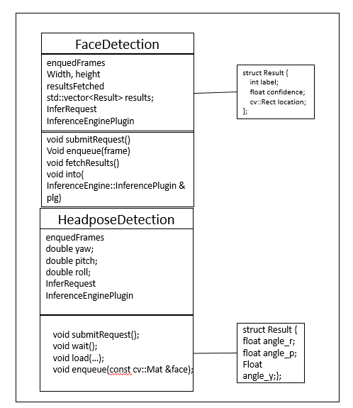

# Head Pose Detection using the Intel® Distribution of OpenVINO™ toolkit
### Lab Overview
We have done Face and Age, Gender Detection in our previous module. Now, we identify Headpose for the identified faces.    
We  build upon our Face Detection code and add Age ,Gender add HeadPose identification code in this module.

**Class diagram for HeadPose Detection**



### Tasks TODO for HeadPose Detection:
-	Include CPU as plugin device for headpose detection inference.
-	Load pre-trained data model for Headpose detection.
-	Once Face Detection result is available, submit inference request for Headpose Detection
-	Mark the identified faces inside rectangle and draw Raw, Yaw and Pitch axis.
-	Observe HeadPose Detection in addition to face.


### Load Pre-trained Optimized Model for HeadPose Inferencing
We need CPU as plugin device for inferencing HeadPose and load pre-retained model for HeadPose Detection on CPU
- Replace #TODO: HeadPose Detection 1
- Paste the following lines

```cpp
FLAGS_m_hp = "C:\\Intel\\computer_vision_sdk\\deployment_tools\\intel_models\\head-pose-estimation-adas-0001\\FP32\\head-pose-estimation-adas-0001.xml";
HeadPoseDetection headPoseDetector(FLAGS_m_hp, FLAGS_d_hp, FLAGS_n_hp, FLAGS_dyn_hp, FLAGS_async);
headPoseDetector.load(pluginsForDevices["CPU"]);

```

### Submit Inference Request
- Replace #TODO: HeadPose Detection 2
- Paste the following lines

```cpp
//Submit Inference Request for HeadPose detection and wait for result
headPoseDetector.submitRequest();
headPoseDetector.wait();


```

### Use identified Face for HeadPose Detection
Clip the identified Faces and send inference request for identifying HeadPose
- Replace #TODO: HeadPose Detection 3
- Paste the following lines

```cpp
headPoseDetector.enqueue(face1);

```

### Calculate attentivityindex
Here attentivityindex will be calculated on the basis of Yaw angle.
- Replace #TODO: HeadPose Detection 4
- Paste the following lines

```cpp
if (index < headPoseDetector.maxBatch) {
cv::Point3f center(rect.x + rect.width / 2, rect.y + rect.height / 2, 0);
headPoseDetector.drawAxes(frame, center, headPoseDetector[index], 50);
if (headPoseDetector.yaw > -0.4 && headPoseDetector.yaw < -0.001)
{
attentivityindex++;
}
}

 ```

### The Final Solution
Keep the TODOs as it is. We will re-use this program during Cloud Integration.     
For complete solution click on following link [headpose_detection](./solutions/headpose.md)
- Build the solution in visual studio
- Executable will be generated at ***C:\Users\Intel\Desktop\Retail\OpenVINO\inference_engine\samples\build\intel64\Debug*** directory.
- Run the application by using below command. Make sure camera is connected to the device.
- Open command prompt and type this command

```
C:\Users\Intel\Desktop\Retail\OpenVINO\inference_engine\samples\build\intel64\Debug\interactive_face_detection_demo.exe
 ```

- On successful execution, Face, Age  Gender and HeadPose will get detected.

### Lesson Learnt
In addition to Face and AgeGender added HeadPose Detection using the Intel® Distribution of OpenVINO™ toolkit.

## Next Lab
[Analyze face data on Cloud](./Analyse_face_data_on_cloud.md)
