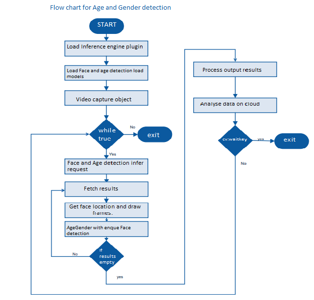

# Age and Gender Detection using the Intel® Distribution of OpenVINO™ toolkit
### Lab Overview
We have done Face Detection in our previous module. Now, we identify Age and Gender for the identified faces.    
We  build upon our Face Detection code and add Age, Gender identification code in this module.


### Tasks TODO for Age and Gender Detection:
- Defining the command line arguments required for Age and gender detection.
-	Load pre-trained data model for Age and Gender detection.
- Initializing the parameters to process the output.
- Resetting the parameters for each frame.
-	Once Face Detection result is available, submit inference request for Age and Gender Detection.
-	Mark the identified faces inside rectangle and put text on it for Age and Gender.
-	Observe Age and Gender Detection in addition to face.




### 1. Parsing  command line arguments
Setting up command line arguments and providing description to each argument.
- Replace **#TODO Age_Gender command line arguments**, with the following lines of code

```python
parser.add_argument("-m_ag", "--ag_model", help="Path to an .xml file with a trained model.", default=None, type=str)
parser.add_argument("-d_ag", "--device_ag",
                    help="Target device for Age/Gender Recognition network (CPU, GPU, FPGA, or MYRIAD). The demo will look for a suitable plugin for a specified device. (CPU by default)", default="CPU",
                    type=str)
#TODO Head_Pose command line arguments
  ```  
### 2. Initializing Plugin for Age and Gender
Initialize plugin for Age and gender.
- Replace **#TODO Age_Gender_Detection 1** with the following code.

```python
#Make sure only one IEPlugin is created for one type of device
plugin,net = load_model("Face Detection",args.model,args.device,args.plugin_dir,1,1,args.cpu_extension)    

if args.model and args.ag_model:
    plugin_ag,ag_net = load_model("Age/Gender Recognition",args.ag_model,args.device_ag,args.plugin_dir,1,2,args.cpu_extension)
    if args.device == args.device_ag:
        plugin_ag = plugin
        #TODO Head_Pose_Detection 2
```

### 3. Load Pre-trained Optimized Model for Age and Gender Inferencing

In previous step, CPU is selected as plugin device. Now, load pre-trained optimized model for age and gender detection inferencing on CPU.
- Replace **#TODO Age_Gender_Detection 2** with the following lines of code

```python
# age and gender   
if args.model and args.ag_model:

   age_enabled =True
   age_input_blob=next(iter(ag_net.inputs))
   age_out_blob=next(iter(ag_net.outputs))
   age_exec_net = plugin.load(network=ag_net, num_requests=2)      
   ag_n, ag_c, ag_h, ag_w = ag_net.inputs[input_blob].shape
   del ag_net

#TODO Head_Pose_Detection 3
```

### 4. Initialize the parameters
Here initialize the parameters which are required to process the output.
- Replace **#TODO Age_Gender_Detection 3** with the following lines of code

```python
curFaceCount = 0
prevFaceCount = 0
index = 0
malecount = 0
femalecount = 0
attentivityindex = 0
```

### 5. Resetting the parameters for each frame
The initialized parameters which are required to process the output are reset to zero.

- Replace **#TODO Age_Gender_Detection 4** with the following lines of code

```python
curFaceCount = 0
malecount=0
femalecount = 0
attentivityindex=0
```

### 6. Process Face detection Inference Results
Clip the identified Faces and send inference request for identifying Age and Gender.

- Replace **#TODO Age_Gender_Detection 5** with the following lines of code

```python
#Age and Gender
age_inf_time=0
if age_enabled:
    age_inf_start = time.time()
    clipped_face = cv2.resize(clippedRect, (ag_w, ag_h))
    clipped_face = clipped_face.transpose((2, 0, 1))  # Change data layout from HWC to CHW
    clipped_face = clipped_face.reshape((ag_n, ag_c, ag_h, ag_w))
    ag_res = age_exec_net.start_async(request_id=0,inputs={'data': clipped_face})
    # Face count
    curFaceCount+=1
    if age_exec_net.requests[cur_request_id].wait(-1) == 0:
        age_inf_end = time.time()
        age_inf_time=age_inf_end - age_inf_start
#TODO Head_Pose_Detection 4         

```

### 7. Process Age and Gender detection Results for display
At this stage face detection Inference results will be available for further processing. Here, identified face will be clipped off and will be used for identifying age and gender in next request for inferencing.
- Replace **#TODO Age_Gender_Detection 6** with the following lines of code

```python
if age_enabled:
    age = int((age_exec_net.requests[cur_request_id].outputs['age_conv3'][0][0][0][0])*100)
    if(((age_exec_net.requests[cur_request_id].outputs['prob'][0][0][0][0])) > 0.5):
        gender = 'F'
        femalecount+=1

    else:
        gender = 'M'
        malecount+=1
    cv2.putText(frame, str(gender) + ','+str(age), (xmin, ymin - 7), cv2.FONT_HERSHEY_COMPLEX, 0.6, (10,10,200), 1)
    cv2.rectangle(frame, (xmin, ymin), (xmax, ymax), (255, 10, 10), 2)

```

### The Final Solution
Keep the TODOs as it is. We will re-use this program during Cloud Integration.     
For complete solution click on following link [age_gender_detection](./solutions/agegenderdetection.md)


- Open command prompt and type this command

```
> C:\"Program Files (x86)""\IntelSWTools\openvino\bin\setupvars.bat
> cd C:\Users\Intel\Desktop\Retail\OpenVINO
> python main.py -i cam -m "C:\\Program Files (x86)\\IntelSWTools\\openvino\\deployment_tools\\tools\\model_downloader\\Transportation\\object_detection\\face\\pruned_mobilenet_reduced_ssd_shared_weights\\dldt\\face-detection-adas-0001.xml" -m_ag "C:\Program Files (x86)\IntelSWTools\openvino\deployment_tools\tools\model_downloader\Retail\object_attributes\age_gender\dldt\age-gender-recognition-retail-0013.xml" -l "C:\Users\intel\Documents\Intel\OpenVINO\inference_engine_samples_build_2017\intel64\Release\cpu_extension.dll"

 ```
- On successful execution, Face, Age and Gender will get detected.

### Lesson Learnt
In addition to Face, Age and Gender Detection using the Intel® Distribution of OpenVINO™ toolkit.

## Next Lab
[HeadPose Detection using the Intel® Distribution of OpenVINO™ toolkit](./Head_Pose_Detection.md)
