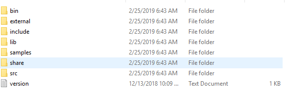

## Explore Intel® Distribution of OpenVINO™ toolkit Samples
### Introduction
The Intel® Distribution of OpenVINO™ toolkit is a comprehensive toolkit for quickly developing applications and Solutions that emulate human vision. Based on Convolutional Neural Networks (CNNs), the Toolkit extends computer vision workloads across Intel® hardware, maximizing performance.
### The Intel® Distribution of OpenVINO™ toolkit:
- Enables the CNN-based deep learning inference on the edge.
- Supports heterogeneous execution across Intel® computer vision accelerators, using a common API for the CPU, Intel® HD Graphics, Intel® Movidius™ Neural Compute Stick, and Intel® FPGA. However, we are not covering Intel® Movidius™ Neural Compute Stick and Intel® FPGA in this lab.
- Speeds time-to-market through an easy-to-use library of computer vision functions and pre-optimized kernels.
- Includes optimized calls for computer vision standards, including OpenCV, OpenCL™, and OpenVX™

### Pre-requisites
* **System Requirements**
  - Only the CPU, Intel® HD Graphics, and Intel® Movidius™ Neural Compute Stick options are supported for the Windows* installation. Linux* is required for using the FPGA or Intel® Movidius™. Myriad™ 2 VPU options.
* **Processors**
  - 6th – 8th Generation Intel® Core™ processor
  - Intel® Xeon® processor family v5 or v6
* **Operating System**
  - Ubuntu* 16.04.3 long-term support (LTS), 64-bit
  - CentOS* 7.4, 64-bit
  - Yocto Project* Poky Jethro* v2.0.3, 64-bit (for target only)

### Exploration
   This lab starts with exploring and understanding the Intel® Distribution of OpenVINO™ toolkit related packages installed in your device and running the prebuilt sample applications available with the Intel® Distribution of OpenVINO™ toolkit. Next lab session is to build a customized application using the Intel® Distribution of OpenVINO™ toolkit.

### Observation
Observe the folder structure available within the Intel® Distribution of OpenVINO™ toolkit and the performance difference between **CPU** and **GPU**.

### Learning Outcome
By the end of this module, the participant is expected to understand the Intel® Distribution of OpenVINO™ toolkit, installed folder structure and performance difference between **CPU** and **GPU**.
### To View the Packages installed on your Device
* **OIntel® Distribution of OpenVINO™ toolkit installer**                                                 
 Intel® Distribution of OpenVINO™ toolkit by default installs at C:\Program Files (x86)\IntelSWTools\openvino\
* **Intel® Distribution of OpenVINO™ toolkit sample applications showing various capabilities**
Intel® Distribution of OpenVINO™ toolkit samples are made available in C:\Program Files (x86)\IntelSWTools\openvino\inference_engine\samples\python_samples
* **Intel® Distribution of OpenVINO™ toolkit Documentation directory**
C:\Program Files (x86)\IntelSWTools\openvino\documentation
* **Intel® Distribution of OpenVINO™ toolkit pre-trained models**
C:\Program Files (x86)\IntelSWTools\openvino\deployment_tools\intel_models

### Understanding the Packages
Go to C:\Program Files (x86)\IntelSWTools\openvino\deployment_tools\ to understand the package contents.


- **bin** folder has 64-bit runtime libraries for OpenVINO™ toolkit samples
For example, cLDNN64.dll, cLDNNPlugin.dll and so on.
- **Samples** folder has  Intel® Distribution of OpenVINO™ toolkit samples like classification, object detection, interactive_face_detection and so on.
- **include** folder has several header files required for developing application using the Intel® Distribution of OpenVINO™ toolkit.
- **lib** folder has 64-bit plugin library like inference engine and libiomp5md are useful for video applications.
-  Inferenceengine.dll is the software library for loading inference engine plugins for CPU, GPU and so on.
- libiomp5md.dll is a runtime library used for developing application using OpenMP.

### Running the Sample Programs
* **Object Detection Demo**                            
**Description**                           
This demonstrates how to run the Object Detection demo application, which does inference using object detection networks like Faster R-CNN on Intel® Processors and Intel® HD Graphics.
Upon the start-up, the demo application reads command line parameters and loads a network and an image to the Inference Engine plugin. When inference is done, the application creates an output image and outputs data to the standard output stream.

* **Set Environment variables using below commands**
```
cd C:\Program Files (x86)\IntelSWTools\openvino\bin
setupvars.bat
```


- Navigate to: C:\Program Files (x86)\IntelSWTools\openvino\inference_engine\samples\python_samples\object_detection_demo_ssd_async


- **Case 1:** To run the sample application on **CPU**, execute the following commands:

```
python object_detection_demo_ssd_async.py -i cam -m "C:\Program Files (x86)\IntelSWTools\openvino\\deployment_tools\tools\model_downloader\Transportation\object_detection\face\pruned_mobilenet_reduced_ssd_shared_weights\dldt\face-detection-adas-0001.xml" -l "C:\Users\Intel\Documents\Intel\OpenVINO\inference_engine_samples_build_2017\intel64\Release\cpu_extension.dll" -d CPU
```


Next, we repeat the exercise with **GPU** and observe the performance.

- **case2:** To run the sample application on **GPU**, execute the following commands;

```
python object_detection_demo_ssd_async.py -i cam -m "C:\Program Files (x86)\IntelSWTools\openvino\\deployment_tools\tools\model_downloader\Transportation\object_detection\face\pruned_mobilenet_reduced_ssd_shared_weights\dldt\face-detection-adas-0001.xml" -l "C:\Users\Intel\Documents\Intel\OpenVINO\inference_engine_samples_build_2017\intel64\Release\cpu_extension.dll" -d GPU
```
- **Output and Performance**
The output uses OpenCV* to display the resulting frame with detections rendered as bounding boxes and labels, if provided. In default mode, the demo reports: Detection time, OpenCV* time.

- Press escape button to terminate

### Lessons Learned
- Intel® Distribution of OpenVINO™ toolkit, libraries, header and sample code files and available models
- Performance difference in detection time with CPU and GPU

## Next Lab
[Face Detection using the Intel® Distribution of OpenVINO™ toolkit](./Face_detection.md)
