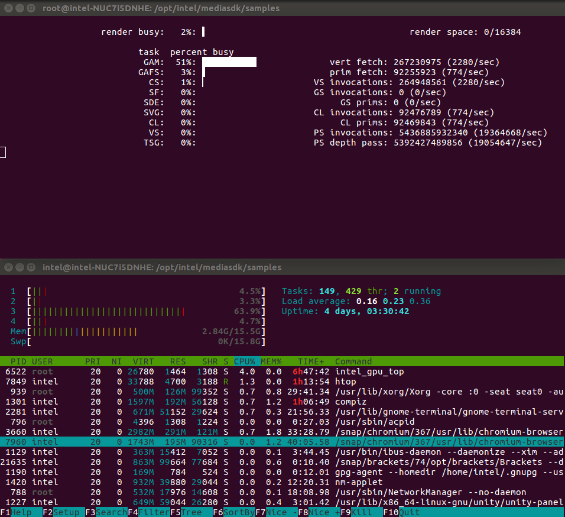

# Decoding a video stream using Intel® Media SDK
In this tutorial you will learn the basic principles behind decoding a video stream using the Intel(R) Media SDK. You will understand how to configure and optimise the Intel(R) Media SDK pipeline to decode a 4K 30fps AVC stream using hardware. We will also look at decoding a 4K 10-bit HEVC stream.

## Getting Started


You will need 3 terminal windows to complete the tutorial. One for compiling and running the code, one for monitoring CPU usage and system processes and another to monitor GPU usage.

Terminal 1:
``` bash
htop
```
Terminal 2:
``` bash
sudo intel_gpu_top
```
Terminal 3:
``` bash
export LD_LIBRARY_PATH="/usr/local/lib:/usr/lib64"
export LIBVA_DRIVERS_PATH=/opt/intel/mediasdk/lib64/
export LIBVA_DRIVER_NAME=iHD
export MFX_HOME=/opt/intel/mediasdk/
 cd ~/Desktop/Retail/MediaSDK/msdk_decode
```


Open the **msdk_decode.cpp** source file in your preferred code editor.
The file is located at the following path: **~/Desktop/Retail/MediaSDK/msdk_decode/src/**

## Understanding The Code
Take a look through the existing code using the comments as a guide. This example shows the minimum API usage to decode a H.264 stream.

The basic flow is outlined below:

 1. Specify input file to decode
 2. Initialise a new Media SDK session and decoder
 3. Configure basic video parameters (e.g. codec)
 4. Create buffers and query parameters
    - Allocate a bit stream buffer to store encoded data before processing
    - Read the header from the input file and use this to populate the rest of the video parameters
    - Run a query to check for the validity and SDK support of these parameters
 5. Allocate the surfaces (video frame working memory) required by the decoder
 6. Initialise the decoder
 7. Start the decoding process:
    - The first loop runs until the entire stream has been decoded
    - The second loop drains the decoding pipeline once the end of the stream is reached
8. Clean-up resources (e.g. buffers, file handles) and end the session.

## Hardware Decoding
The current code is configured to use software based decoding. The open-source Media SDK doesn't include software decoders so we need to update the code to use hardware based decoding which will also give improved efficiency and speed.

If software based decoders are available the Intel(R) Media SDK is able to select the best decode implementation based on the platform capabilities, first checking to see if hardware can be used and falling back to software if not by using the **'MFX_IMPL_AUTO_ANY'** implementation. In our case software decoders are not available so we will use the **'MFX_IMPL_HARDWARE'** implementation to force hardware based decoding.

> **Intel® Media Server Studio Professional Edition** is required to get optimised software fallback on Linux.

 - Change the Media SDK implementation from **'MFX_IMPL_SOFTWARE'** to **'MFX_IMPL_HARDWARE**:

``` cpp
    mfxIMPL impl = MFX_IMPL_HARDWARE;
```

## Build & Run The Code

 - To build the code run the **make** command in the **msdk_decode** directory:
``` bash
 make
```
> Make sure no errors are reported when running the **make** command
 - To run the application use the following command:
``` bash
cd ../build
./msdk_decode
```
 - While the decode process is running take a look at the CPU and GPU usage in the terminal windows you setup previously. You will notice some CPU usage as we are using system memory for our working surfaces but the decode process is taking place on the GPU which will be reflected in the GPU utilisation (use the **GAM** task as a reference).



 - Wait for the application to finish decoding the video stream and then take note of the **execution time** printed in the console window. You can then **press 'enter' to stop the application**.
```
Frame number: 1800
Execution time: 19.49 s (92.34 fps)
Press ENTER to exit...
```

## Further Optimisation
The current code uses **system memory** for the working surfaces as this is the implementation provided by the default allocator when creating an Intel(R) Media SDK session. Allocating surfaces in video memory is highly desirable since this eliminates copying them from the system memory to the video memory when decoding leading to improved performance. To achieve this we have to provide an external allocator which is able to manage video memory using the VA-API.

 - First we need to create a variable for the external allocator and pass this into our existing **Initialize** function.
``` cpp
    mfxFrameAllocator mfxAllocator;
    sts = Initialize(impl, ver, &session, &mfxAllocator);
```
 - Next we update the IO pattern specified in the video parameters to tell the decoder we are using video memory instead of system memory.
```
    mfxVideoParams.IOPattern = MFX_IOPATTERN_OUT_VIDEO_MEMORY;
```
 - We now need to use our new allocator when allocating surface memory for our decoder. Replace **Section 5** with the code below.
```
    //5. Allocate surfaces for decoder
    mfxFrameAllocResponse mfxResponse;
    sts = mfxAllocator.Alloc(mfxAllocator.pthis, &Request, &mfxResponse);
    MSDK_CHECK_RESULT(sts, MFX_ERR_NONE, sts);

    // Allocate surface headers (mfxFrameSurface1) for decoder
    mfxFrameSurface1** pmfxSurfaces = new mfxFrameSurface1 *[numSurfaces];
    MSDK_CHECK_POINTER(pmfxSurfaces, MFX_ERR_MEMORY_ALLOC);
    for (int i = 0; i < numSurfaces; i++) {
        pmfxSurfaces[i] = new mfxFrameSurface1;
        memset(pmfxSurfaces[i], 0, sizeof(mfxFrameSurface1));
        memcpy(&(pmfxSurfaces[i]->Info), &(mfxVideoParams.mfx.FrameInfo), sizeof(mfxFrameInfo));
        pmfxSurfaces[i]->Data.MemId = mfxResponse.mids[i];      // MID (memory id) represents one video NV12 surface
    }
```
 - Finally we need to make sure our allocator is destroyed once decoding is finished. Add the following line of code after the surface deletion *for loop* in **section 8**:
```
    mfxAllocator.Free(mfxAllocator.pthis, &mfxResponse);
```
 - We can also **remove** the following line from our cleanup code as it is no longer required:
```
    MSDK_SAFE_DELETE_ARRAY(surfaceBuffers);
```
 - **Build** the code using the **make** command as you did previously and again run the application. Take a look at the CPU and GPU utilisation whilst the application is running. You will see the **CPU usage** is now minimal (assuming nothing else is happening on the system) as we are no longer using shared memory for our working surfaces. Also notice the **GPU** is now **better utilised** as it is no longer having to wait for frames to be copied from system memory.

- Note the **execution time**, which should now be significantly improved,  before continuing.

## HEVC 4K 10-bit
"What about the latest 4K 10-bit HEVC video streams" I hear you ask? Support for both decode and encode of such streams was introduced with 7th Gen Intel(R) Core(TM) Processors and the Intel(R) Media SDK has full support for both. We will now make the small code modifications necessary to decode a sample 4K 10-bit HEVC stream.

 - Firstly we need to update our input source to the 4K 10-bit HEVC sample. This sample has an average bitrate of over 40Mbps, similar to that of a 4K Ultra HD Blu-ray.
 - NOTE : if the below h265 file is not available in Retail folder, download a .h265 file and use here.
``` cpp
    char path[] = "../jellyfish-60-mbps-4k-uhd-hevc-10bit.h265";
```
 - Next we update the codec in our decode video parameters from **MFX_CODEC_AVC** to **MFX_CODEC_HEVC**.
``` cpp
    mfxVideoParams.mfx.CodecId = MFX_CODEC_HEVC;
```
 - HEVC support is provided as a plugin to the Intel(R) Media SDK which needs to be manually loaded at runtime. Add the following code to **section 3** to load the HEVC plugin.
```
    // Load the HEVC plugin
    mfxPluginUID codecUID;
    bool success = true;
    codecUID = msdkGetPluginUID(impl, MSDK_VDECODE, mfxVideoParams.mfx.CodecId);

    if (AreGuidsEqual(codecUID, MSDK_PLUGINGUID_NULL)) {
        printf("Failed to get plugin UID for HEVC.\n");
        success = false;
    }

    printf("Loading HEVC plugin: %s\n", ConvertGuidToString(codecUID));

    // If we successfully got the UID, load the plugin
    if (success) {
        sts = MFXVideoUSER_Load(session, &codecUID, ver.Major);
        if (sts < MFX_ERR_NONE) {
            printf("Loading HEVC plugin failed!\n");
            success = false;
        }
    }
```
 - Before we proceed to test the code let's try playing the sample using the **ffplay** utility using only the CPU. To do so run the following command:
 - NOTE : if the below h265 file is not available in Retail folder, download a .h265 file and use here.
```
ffplay ../jellyfish-60-mbps-4k-uhd-hevc-10bit.h265
```
> Use the **Esc** key to stop playback at any time.

 - You will notice the CPU alone is struggling to decode the high bitrate stream fast enough to render at a smooth 30fps.

 - **Build** the code and **run the application** once again. Note the **execution time** before continuing. As you can see the GPU decoding performance comfortably fulfills the 30fps requirement for smooth playback.

> If you missed some steps or didn't have time to finish the tutorial the completed code is available in the **msdk_decode_final** directory.

## Conclusion
In this tutorial we looked at the Intel(R) Media SDK decoding pipeline and ways to optimise decoding performance on Intel platforms. We explored the performance and power advantages decoding using the GPU rather than the CPU particularly with complex codecs such as HEVC. We also looked at the advantages of using video memory for our working surfaces instead of system memory to avoid unnecessary memory transfers.
