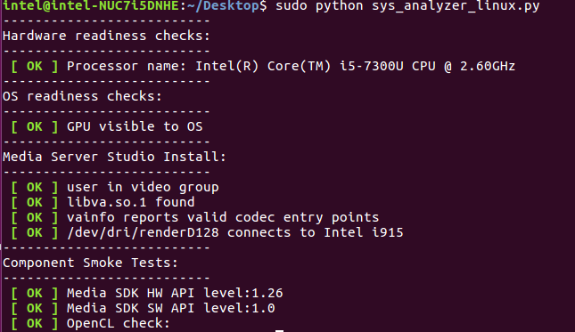
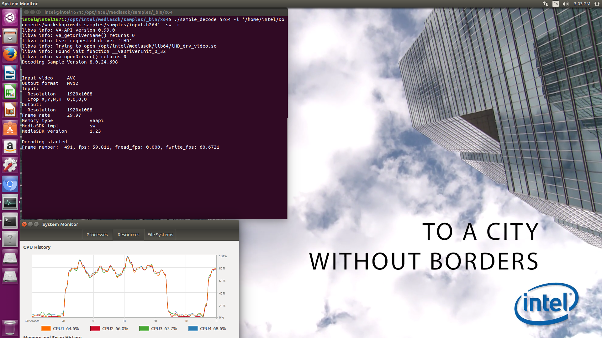
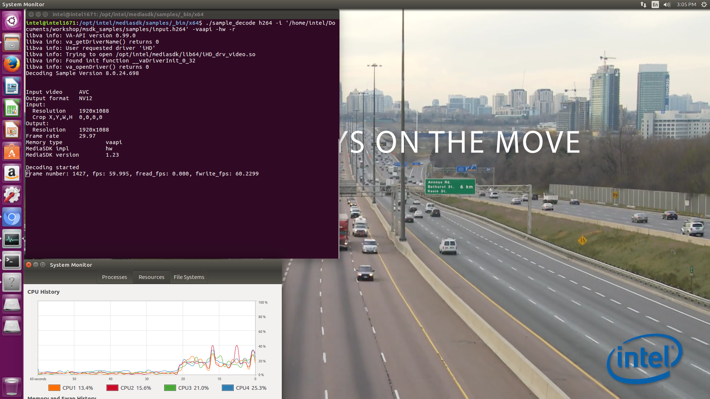

# Explore Intel® Media Server Studio Samples


## Introduction

Intel® Media Server Studio (Intel MSS) is a set of libraries, tools, header and sample code files that define cross-platform API for developing consumer and professional grade media applications on Intel platforms. Providing an access to Intel® Quick Sync Video, hardware accelerated codecs in Intel® Processor Graphics, Intel® Media Server Studio allows application developer to speed up video playback, encoding, processing and media conversion. Intel® Media Server Studio for Windows helps to deliver desktop applications, such as video players, editors and video conferencing clients, while Intel® Media Server Studio for Embedded Linux enables digital security and surveillance and connected car manufacturers to deliver smart cameras and infotainment or cluster display solutions. Hardware acceleration in Linux* is supported by VA-API.

Video Acceleration API (VA API) is a royalty-free API as well as its implementation as free and open-source library (libVA) distributed under the MIT License. The VA API interface is to be implemented by device drivers to offer end-user software, such as VLC media player or GStreamer, access to available video acceleration hardware, such as PureVideo (through the libva-vdpau driver, which implements VA API in terms of VDPAU) or Unified Video Decoder. The API enables and provides access to hardware-accelerated video processing, using hardware such as graphics processing units (GPU) to accelerate video encoding and decoding by offloading processing from the central processing unit (CPU). The VA API specification was originally designed by Intel for its GMA (Graphics Media Accelerator) series of GPU hardware with the specific purpose of eventually replacing the XvMC standard as the default Unix multi-platform equivalent of Microsoft Windows DirectX* Video Acceleration (DxVA) API, but today the API is no longer limited to Intel® hardware or GPUs. Other hardware and manufacturers can freely use this open standard API for hardware accelerated video processing with their own hardware without paying a royalty fee.

## Exploration

*   This lab starts with exploring and understanding the Intel® Media Server Studio related packages installed in your Intel® NUC. Then understand the customized applications such as sample decoder and video wall bundled with installation.
*   Understand the performance differences between hardware and software based encoding/decoding

## Observation

Performance monitoring using system performance monitoring tool.

Observe the utilization of GPU and CPU in software and hardware acceleration modes.

## Learning Outcome

By the end of this module, the participant would get basic understanding of Intel® Media Server Studio, installation structure, hardware acceleration and performance enhancement of selected applications.

## View the packages installed on your NUC

*   Media Server Studio installer:

    Intel® Media Server Studio by default installs at /opt/intel/mediasdk/

*   Media Sample applications:

    Pre built Intel® Media Server Studio samples will be available in /opt/intel/mediasdk/samples/ for 64-bit architecture

*   Media Server Studio Documentation directory: /opt/intel/mediasdk/doc/

## Commands:
```
$ls /opt/intel/mediasdk/  
$ls /opt/intel/mediasdk/share/mfx/samples/  
$ls /opt/intel/mediasdk/doc/
```
## System Analyzer

System Analyzer tool reports back following information about CPU, GPU and Intel® Media Server studio components.



*   Platform readiness: check if processor has necessary GPU components
*   OS readiness: check if OS can see GPU, and if it has required glibc/gcc level
*   Install checks for Intel® Media Server Studio/Intel® SDK for OpenCL™ applications components
*   Results from runs of small smoke test programs for Intel® Media Server Studio and OpenCL™

**Run** System Analyzer tool with below commands:
```
export LD_LIBRARY_PATH="/usr/local/lib:/usr/lib64"
export LIBVA_DRIVERS_PATH=/opt/intel/mediasdk/lib64/
export LIBVA_DRIVER_NAME=iHD
export MFX_HOME=/opt/intel/mediasdk/

cd ~/Desktop/Retail/MediaSDK
python sys_analyzer_linux.py
```
## Performance Monitoring

We would need few performance monitoring tools before we proceed with Intel® Media Server Studio sample programs.


Open the System Monitor, performance monitoring tool as shown in the picture

This tool is used to compare the CPU performance of the below two cases.

Note: If you are running any other programs, their process would be added to the CPU, GPU & memory utilization. So try closing all other programs. Then observe the Sample\_decode process performance from system monitor tool.

## Decode a raw video

Intel® Media Server Studio ships with few basic samples to try various functinalities. Here we are using a console application which performs decoding of elementary compressed video stream to raw frames.

Make sure to review the performance parameters while running these samples. Above said tools can help to understand the difference between software and hardware acceleration modes.

Open new terminal and change the directory

```
$ cd /opt/intel/mediasdk/share/mfx/samples/_bin/
```
<!--
Case 1: Execute the below command for software implementation:

In this example -sw stands for Software Acceleration, -r is for rendering the output.
```
$./sample\_decode h264 -i '/home/intel\[workshop id\]/Documents/workshop/msdk\_samples/samples/input.h264' -sw -r
```


Case 2: Execute the below command for hardware acceleration:
-->
Execute the below command for hardware acceleration:

In this example, we are instructing the application to use vaapi memory type. If you dont specify, then it will take system memory by default. -hw stands for hardware Acceleration.
```
$ ./sample_decode h264 -i ~/Desktop/Retail/MediaSDK/input.h264 -nv12 -o ~/Desktop/Retail/MediaSDK/input.yuv -vaapi -hw
```


If you wish to see all the available options for decode, then type ./sample\_decode. This will show the help output with variuos decode options:

For example:  
\-o : output to file in RAW formats  
\-f : change rendering frame rate  
\-w and –h : changing the resolution

## Encode raw video frames

sample\_encode is another console application which performs encoding of raw video frames into elementary compressed stream
- Export the environment variables before running commands.
```bash
export LD_LIBRARY_PATH="/usr/local/lib:/usr/lib64"
export LIBVA_DRIVERS_PATH=/opt/intel/mediasdk/lib64/
export LIBVA_DRIVER_NAME=iHD
export MFX_HOME=/opt/intel/mediasdk/
```

<!--
Execute the below command for software implementation:

We are passing an input raw video stream and converting it to h264 formatted elementary stream.

We specify width, height and framerate for this conversion. You can review all the available switches by typing ./sample\_encode at the terminal
```
$./sample\_decode h264 -i '/home/intel\[machine id\]/Documents/workshop/msdk\_samples/samples/input.h264' -nv12 -o '/home/intel\[machine id\]/Documents/workshop/msdk\_samples/samples/input.yuv' -vaapi -hw

```
Observe the CPU utilization from System Monitor as described before

Case 2: Execute the below command for hardware acceleration:
-->
Execute the below command for hardware acceleration:

```
./sample_encode h264 -nv12 -i /opt/intel/mediasdk/share/mfx/samples/_bin/content/test_stream_176x96.yuv -o ~/Desktop/Retail/MediaSDK/_out.h264 -w 720 -h 480 -b 10000 -f 30 -u quality
```
To view the converted h264 file, run the decoding sample as follows:
```
./sample_decode h264 -i ~/Desktop/Retail/MediaSDK/_out.h264 -nv12 -o ~/Desktop/Retail/MediaSDK/input.yuv -vaapi -hw
```
## Lessons learnt

*   Intel® Media Server Studio libraries, tools and sample code files.
*   Speed up in video decoding and encoding.
*   Performance monitoring
