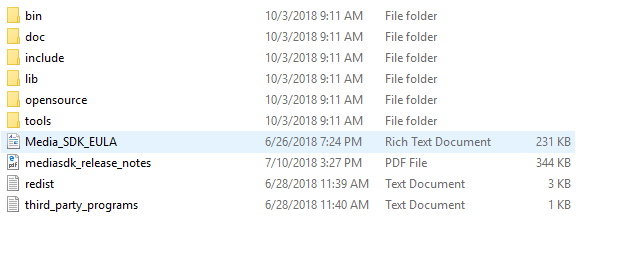
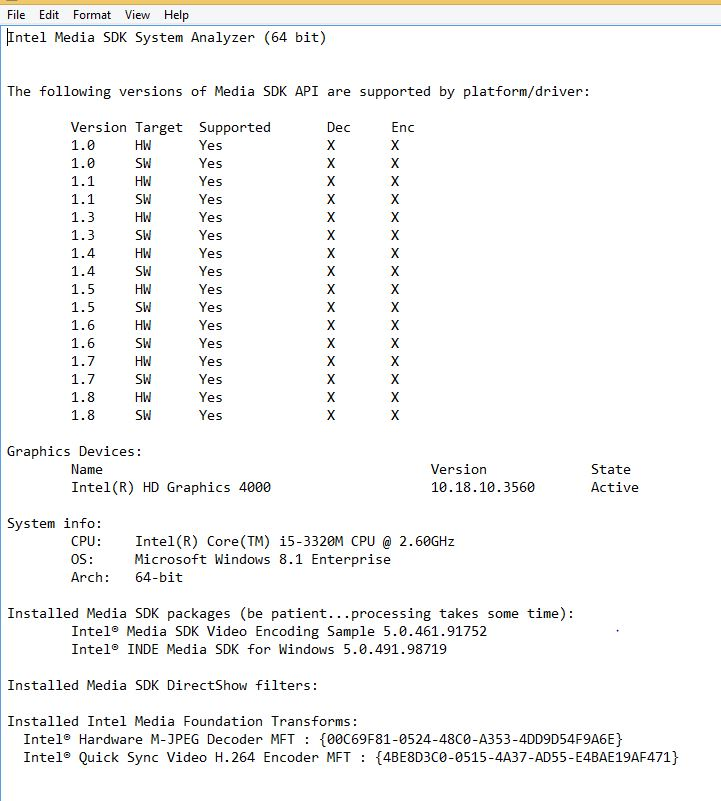
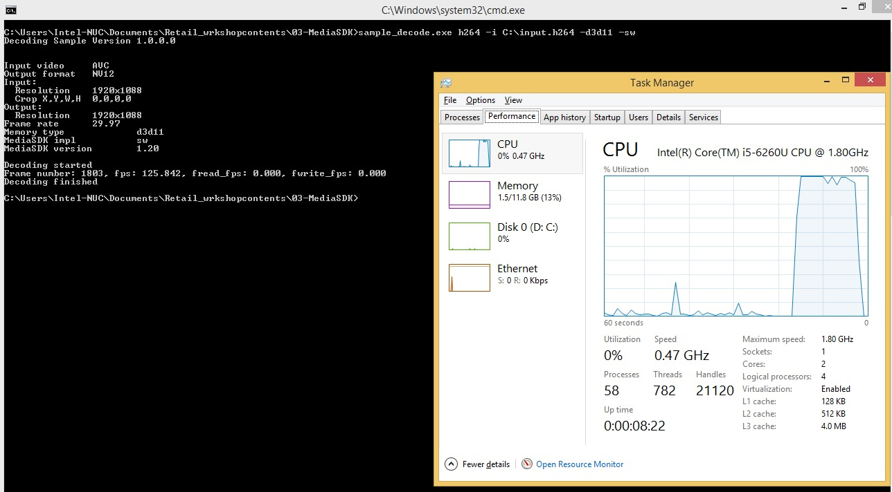

# Explore Intel® Media SDK Samples
## Introduction

Intel® Media SDK is a set of libraries, tools, header and sample code files that define cross-platform API for developing consumer and professional grade media applications on Intel platforms. Providing an access to Intel® Quick Sync Video, hardware accelerated codecs in Intel Graphics Processor, Media SDK allows application developer to speed up video playback, encoding, processing and media conversion. Media SDK for Windows helps to deliver desktop applications, such as video players, editors and video conferencing clients, while Media SDK for Embedded Linux enables digital security and surveillance and connected car manufacturers to deliver smart cameras and infotainment or cluster display solutions.

## Exploration

This lab starts with exploring and understanding the media sdk related packages installed in your Intel® NUC7i7DNHE (Dawson Canyon). Then understand the customized applications such as sample decoder and video wall bundled with installation.

## Observation

Performance monitoring using system performance monitoring tool; before and after hardware acceleration.

## Learning Outcome

By the end of this module, the participant is expected to understand the Intel® Media SDK, installation structure, hardware acceleration and performance enhancement of selected applications.
## View the packages installed on your NUC7i7DNHE (Dawson Canyon)

-  **Media SDK installer**

    MSDK2018R2.exe by default installs at C:\Program Files (x86)\IntelSWTools\Intel(R) Media SDK 2018 R2

-  **Media Sample applications**

    Media SDK samples is made available in C:\Users\<user name>\Documents\Intel® Media SDK 2018 R2-Media Samples 8.4.27.378
NUC7i7DNHE (Dawson Canyon)
- **Media SDK Documentation directory**

    C:\Program Files (x86)\IntelSWTools\Intel(R) Media SDK 2018 R2\Software Develoment kit\doc

## Understand the packages

- Go to C:\Program Files (x86)\IntelSWTools\Intel(R) Media SDK 2018 R2\Software Develoment kit and understand the Package Contents



*   **bin** folder has 32-bit and 64-bit runtime libraries for audio and media function encode-decode software capabilities.

    E.g., _libmfxsw32.dll_ is the software library for IA-32 architecture

    _libmfxsw64.dll_ is the software library for Intel® 64 architecture

*   **doc** folder has documentation for raw, audio, image, video, etc., media types. It also provide media sdk user manual and developer reference manuals

*   **include** folder has several header files supporting Intel® media sdk program development

*   **lib** folder has 32-bit and 64-bit static library _libmfx.lib_ for media function encoding and decoding

    It also may have _libmfx\_vs2015.lib_ to link Intel® Media SDK with MS® Visual Studio 2015

*   **open source** folder has SDK dispatcher. The dispatcher is a layer that lies between applications and SDK implementations. Upon initialization, the dispatcher locates the appropriate platform-specific SDK implementation. If there is none, it will select the software SDK implementation. The dispatcher will redirect subsequent function calls to the same functions in the selected SDK implementation.

*   **tools** folder has MediaSDK Tracer and Mediasdk System Analyzer - 64-bit and 32-bit supported.

## 1. MediaSDK Tracer:

  This tool will capture the basic call information from Media SDK API functions. It will generate a full log of interaction between the application and the SDK library including per-frame processing.

  **Note:** We are not running this tool in the workshop. For more infromation please refer to the document (readme-mediasdk-tracer.rtf) to know the system requirements and limitations of the tool.

## 2. MediaSDK System Analyzer:

  This tool utility analyzes the system and reports all Media SDK related capabilities, driver and components status. This tool can also be used to determine setup environment issues. This tool reports back installed graphics adapter, basic system information, installed Media SDK versions, installed DirectShow filters, Media foundation Transforms (MFT) and also tips for solutions in case either software or hardware implementations did not work.

  - Navigate to the MediaSDK System Analyzer folder using the File Explorer:
  **C:\Program Files (x86)\IntelSWTools\Intel(R) Media SDK 2018 R2\Software Development Kit\tools\mediasdk_sys_analyzer**
  - Double click **mediasdk_system_analyzer_64.exe**

  Usage:

  This tool starts reporting system status immediately. The tool will show you informationa bout your system and what Media SDK packages are installed. When complete user can exit the tool by pressing any key.

  **Note:** For more information please refer to the document (readme-mediasdk-system-analyzer.rtf) to know the system requirements and limitations of the system analyzer.

  Example Output:

  
  ## 1. Sample Decoder
  
  - Open the command prompt. **tip**: Search for *command prompt* in the lower left windows search bar. 
  
  - Navigate to the **Desktop > Retail > 03-MediaSDK >** folder:
  
  ```
  cd C:\Users\intel\Desktop\Retail\03-MediaSDK
  ```
  
  -  Open the task manager to compare the CPU performance of the below two cases.

   **Note:** If you are running any other programs, their process will be added to the CPU & memory utilization. So try closing all other programs. Then observe the Sample_decode.exe process performance from task manager.

-  Case 1: Execute the below command for software implementation:  
```
sample_decode.exe h264 -i input.h264 -sw

 ```

  Output & Performance:

  


*   Case 2: Execute the below command for hardware acceleration:  
```
    sample_decode.exe h264 -i input.h264 -hw

  ```

    Output & Performance:

  


*   Just type sample_decode.exe and explore other command line switches:  
    \-o : output to file in RAW formats  
    \-r: Present  
    \-f : change rendering frame rate  
    \-w and –h : changing the resolution

*   From the **Desktop > Retail > 03-MediaSDK >** folder run the video wall sample with the following command: 


```
sample_video_wall.bat input.h264

```

*   Observe the video projected on the wall divided into channels as specified in the batch file

 **Note:**  Open the batch file from the Wordpad and observe the effect of changing the following parameters:

- No. of channels (i.e VerticalCells and HorizontalCells) can be edited in sample_video_wall.bat file.

- Change MediaSDKImplementation to sw and hw.
## Lessons learnt
*   Intel® Media SDK's libraries, tools, header and sample code files.
*   speed up in video playback, encoding, processing and media conversion.
*   Performance monitoring

## Next Step 

Return to https://github.com/SSG-DRD-IOT/intel_retail_workshop/tree/lab-retail-workshop-windows/Video_Performance and continue with the next lab
