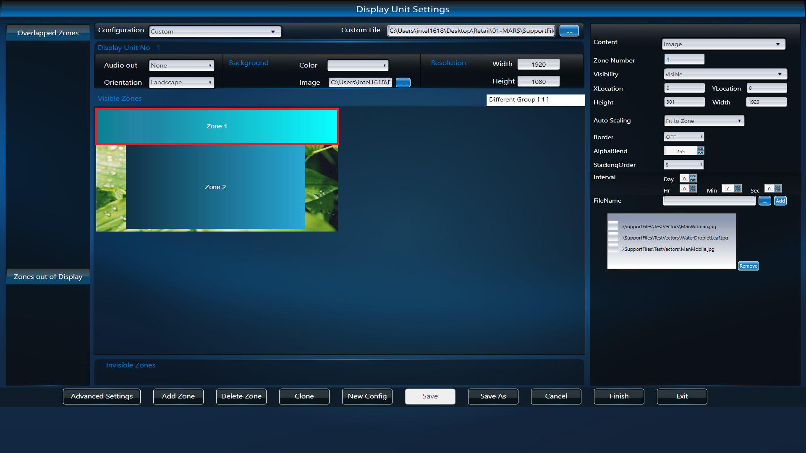
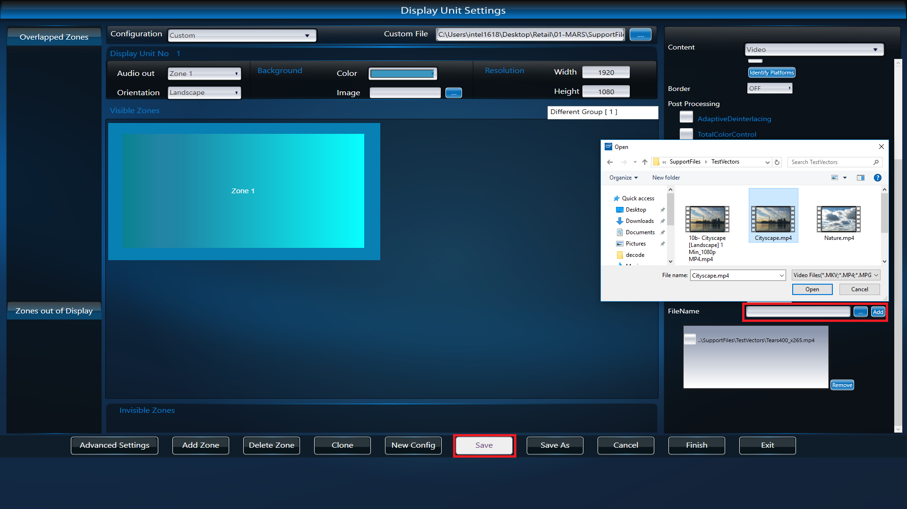
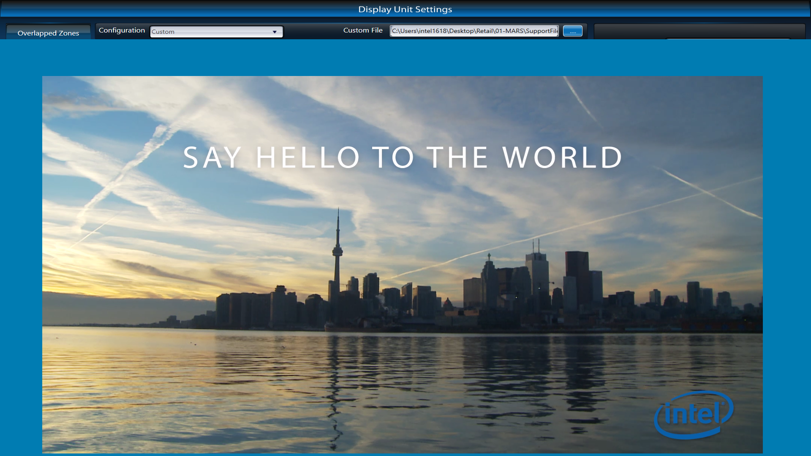

# Intel Media Acceleration Reference Software

## Introduction

Intel MARS: Media Acceleration Reference Software is licensed reference code for Digital Signage that uses the best practices for video decode, transcode, playback, compositing, blending, streaming and rendering by using a combination of Intel and other SDKs on Intel platforms

Target Platforms –Intel Sky Lake/KabyLake Core & Braswell, Apollo Lake Atom Platforms

*   OS supported –Windows 10
*   SDK -FFMPEG, Media Foundation, Media SDK 2016, DirectX 11 (DXVA2.0+)

**Exploration**

In this exercise let us explore the Media Acceleration Reference Software as follows:

*   Running the preset Media Acceleration Reference Software
*   Configure the GUI
*   Explore Image and Video zones
*   Customizing the Configuration files
*   Observing the output

## Observation

Observe the faciliy of different zones and corresponding settings provided                                     
Check the hardware acceleration performance
## Learning Outcome

By the end of this module, the participant is expected to understand briefly the working of Intel Media Acceleration Reference Software
## Running the Intel Media Acceleration Reference Software

*   Goto Start, type cmd, right click, run as administrator
*   Through elevated command prompt run **Desktop > Retail > 01-MARS > filterDlls > regdll.bat**, execute to register the dlls required for MARS
*   Change the path (cd) to Desktop/Retail/01-MARS/Bin

Execute the following command
*   MARS.exe ../SupportFiles/ConfigFiles/Windows/MARS\_Custom2\_Different\_1DU\_TH264.xml
*   This will show 3 zones viz. Background, Image & Video

## Configuration GUI

While MARS is running, press "s" key to invoke the configuration GUI. All the settings are available in the screen as shown here.

User can either select any of the preset files i.e.

*   Entry-Signage
*   Mainstream-Signage
*   Performance-Signage
*   Extreme-Signage
*   Entry-Medical
*   Mainstream-Medical
*   Entry-Security and
*   Mainstream-Security
*   Or they can select their own \[custom\] configuration file.

Custom configuration file: This lets the user to select any Configuration file, which was created earlier. Refer to the following screenshots to see how to load custom configuration file.
## Zone 1: Image Slideshow Settings

Click on Zone 1 to see Image slideshow settings on right side panel.

Change some of the settings like Visibility, XLocation, YLocation, Height, Width, Auto Scaling, Border, etc.,

Image can also be changed by File uploader provided.
## Zone 2: Video Settings

Click on Zone 2 to see Video settings on right side panel.

Change some of the settings like Visibility, XLocation, YLocation, Height, Width, Auto Scaling, Border, etc.,

Check the Hardware Acceleration option for performance gain

Video can also be changed by File uploader provided.
## Loading New Configuration file

Select Custom configuration from dropdown box at top.

Provide any other relevant configuration file from **Desktop > Retail > 01-MARS > SupportFiles > ConfigFiles > Windows** folder
## Loading new Video to new Configuration file

Select a zone, select custom video sample and click save button
## Finish editing new Configuration GUI

Once the required changes are done, the file can be saved or new config file can be created using Save As option

Hit Finish button after completion
## Sample MARS Output

## Lesson learnt

Working of Intel Media Acceleration Reference Software
