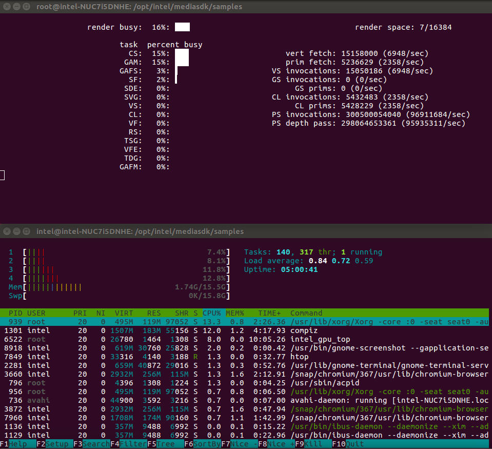
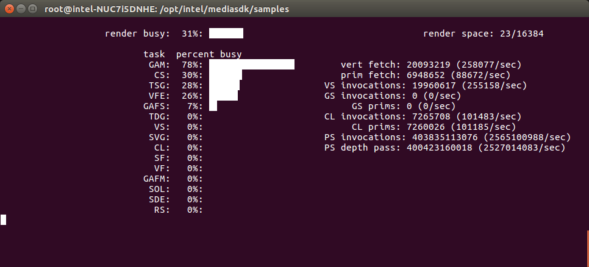

# Transcoding a video stream using Intel® Media SDK
In this tutorial we will look at a simple transcode (decode + encode) pipeline using the Intel® Media SDK. We will start with a basic example using system memory for working surfaces before exploring ways of improving the performance of the transcode process using features such as opaque memory and asynchronous operation. We will also look at adding a video frame processing (VPP) resize to the transcode process.

## Getting Started

You will need 3 terminal windows to complete the tutorial. One for compiling and running the code, one for monitoring CPU usage and system processes and another to monitor GPU usage.

Terminal 1:
``` bash
htop
```
Terminal 2:
``` bash
sudo intel_gpu_top
```
Terminal 3:
``` bash
export LD_LIBRARY_PATH="/usr/local/lib:/usr/lib64"
export LIBVA_DRIVERS_PATH=/opt/intel/mediasdk/lib64/
export LIBVA_DRIVER_NAME=iHD
export MFX_HOME=/opt/intel/mediasdk/
cd ~/Desktop/Retail/MediaSDK/msdk_transcode
```



Open the **msdk_transcode.cpp** source file in your preferred code editor.
The file is located at the following path: **$HOME/Retail_Workshop/msdk_transcode/src/**

## Understanding The Code
Take a look through the existing code using the comments as a guide. This example shows the minimum API usage to transcode (decode + encode) a H.264 stream to another H.264 stream.

The basic flow is outlined below:

 1. Specify input file to decode and file to write the encoded data to
 2. Create the Intel® Media SDK session, decoder and encoder
 3. Configure decoder video parameters (e.g. codec)
 4. Create buffers and query parameters
    - Allocate a bit stream buffer to store encoded data before processing
    - Read the header from the input file and use this to populate the rest of the video parameters
 5. Configure encoder video parameters (e.g. codec, bitrate, rate control)
 6. Allocate the surfaces (video frame working memory) required by the decoder and encoder
 7. Initialise the Intel® Media SDK decode and encode components
 8. Allocate a bit stream buffer to store the output from the encoder
 9. Start the transcoding process:
    -  The first loop is the main transcoding loop where the input stream is decoded and encoded until the end of the stream is reached
    - The second loop drains the decoding pipeline once the end of the stream is reached ensuring the full input stream is encoded
    - The third loop drains the encoding pipeline once the decoding pipeline is flushed and writes the last few encoded frames to disk
 10. Clean-up resources (e.g. buffers, file handles) and end the session.

## Build & Run The Code

 - To build the code run the **make** command in the **msdk_transcode** directory:
``` bash
 make
```
> Make sure no errors are reported when running the **make** command
 - To run the application use the following command:
``` bash
 cd ../build/
 ./msdk_transcode
```
 - While the transcode process is running take a look at the CPU and GPU usage in the terminal windows you setup previously. You will notice some CPU usage as we are using system memory for our working surfaces but the transcode process is taking place on the GPU which will be reflected in the GPU utilisation.  It's also clear from looking at the GPU utilisation that there is a bottleneck stopping the GPU from being fully utilised by our current code. In the next section we will begin optimising the code to rectify this.



 - Wait for the application to finish transcoding the video stream and then take note of the **execution time** printed in the console window. You can then **press 'enter' to stop the application**.
```
Frame number: 1800
Execution time: 45.17 s (39.85 fps)
Press ENTER to exit...
```

## Opaque Memory
In our current code we are using system memory for the working surfaces used by our decoder and encoder which means frames have to be passed between system memory and video memory multiple times during the transcode pipeline limiting performance. The Intel® Media SDK has a feature called **Opaque Memory** which hides surface allocation specifics and allows the SDK to select the best type for execution in hardware or software. This means that if the pipeline allows, surfaces will reside in video memory for best performance. It's worth mentioning that whilst opaque memory is an easy solution for optimised surface allocation in simple situations, if you need to integrate components outside of the Intel® Media SDK application-level video memory allocation is required.

 - We start by updating the IO pattern in our decoder video parameters from **MFX_IOPATTERN_OUT_SYSTEM_MEMORY** to **MFX_IOPATTERN_OUT_OPAQUE_MEMORY**.
``` cpp
    mfxDecParams.IOPattern = MFX_IOPATTERN_OUT_OPAQUE_MEMORY;
```
 - We make the same change to our encoder video parameters.
``` cpp
    mfxEncParams.IOPattern = MFX_IOPATTERN_IN_OPAQUE_MEMORY;
```
 - We need to update our surface allocation code to use opaque memory allocation. Replace the code in **section 6** with the code below.
     - Note that we don't allocate buffer memory anymore as for opaque memory this is handled internally by the SDK. We simply create **mfxExtOpaqueSurfaceAlloc** structures to hold a reference to the allocated surfaces and attach these to our decoder and encoder.
``` cpp
    //6. Initialize shared surfaces for decoder and encoder
    mfxFrameSurface1** pSurfaces = new mfxFrameSurface1 *[nSurfNum];
    MSDK_CHECK_POINTER(pSurfaces, MFX_ERR_MEMORY_ALLOC);
    for (int i = 0; i < nSurfNum; i++) {
        pSurfaces[i] = new mfxFrameSurface1;
        MSDK_CHECK_POINTER(pSurfaces[i], MFX_ERR_MEMORY_ALLOC);
        memset(pSurfaces[i], 0, sizeof(mfxFrameSurface1));
        memcpy(&(pSurfaces[i]->Info), &(DecRequest.Info), sizeof(mfxFrameInfo));
    }

    // Create the mfxExtOpaqueSurfaceAlloc structure for both encoder and decoder, the
    // allocated surfaces will be attached to these structures for the pipeline initialisations.
    mfxExtOpaqueSurfaceAlloc extOpaqueAllocDec;
    memset(&extOpaqueAllocDec, 0, sizeof(extOpaqueAllocDec));
    extOpaqueAllocDec.Header.BufferId = MFX_EXTBUFF_OPAQUE_SURFACE_ALLOCATION;
    extOpaqueAllocDec.Header.BufferSz = sizeof(mfxExtOpaqueSurfaceAlloc);
    mfxExtBuffer* pExtParamsDec = (mfxExtBuffer*) & extOpaqueAllocDec;

    mfxExtOpaqueSurfaceAlloc extOpaqueAllocEnc;
    memset(&extOpaqueAllocEnc, 0, sizeof(extOpaqueAllocEnc));
    extOpaqueAllocEnc.Header.BufferId = MFX_EXTBUFF_OPAQUE_SURFACE_ALLOCATION;
    extOpaqueAllocEnc.Header.BufferSz = sizeof(mfxExtOpaqueSurfaceAlloc);
    mfxExtBuffer* pExtParamsEnc = (mfxExtBuffer*) & extOpaqueAllocEnc;

    // Attach the surfaces to the decoder output and the encoder input
    extOpaqueAllocDec.Out.Surfaces = pSurfaces;
    extOpaqueAllocDec.Out.NumSurface = nSurfNum;
    extOpaqueAllocDec.Out.Type = DecRequest.Type;
    memcpy(&extOpaqueAllocEnc.In, &extOpaqueAllocDec.Out, sizeof(extOpaqueAllocDec.Out));

    mfxDecParams.ExtParam = &pExtParamsDec;
    mfxDecParams.NumExtParam = 1;
    mfxEncParams.ExtParam = &pExtParamsEnc;
    mfxEncParams.NumExtParam = 1;
   ```

 - Finally remove the following line from the cleanup code as we no longer manage surface buffers in the application code.
``` cpp
    MSDK_SAFE_DELETE_ARRAY(surfaceBuffers);
```

 - **Build** the code using the **make** command as you did previously and again run the application. Take a look at the CPU and GPU utilisation whilst the application is running. You will see the **CPU usage** is now minimal (assuming nothing else is happening on the system) as we are no longer using shared memory for our working surfaces. **GPU utilisation** will have increased since implementing opaque memory allocation as the shared memory bottleneck is eliminated, however, the GPU remains underutilised.

 - Take note of the **execution time** before continuing.

## Asynchronous Transcoding
To better utilise the GPU we can make our transcode pipeline asynchronous so more than one decode and encode operation can run at once. This means for each execution of our transcode loop we submit multiple "tasks" before synchronising the pipeline.

 - First we add a parameter to our decoder parameters to tell the decoder how many tasks we want to execute asynchronously in **section 3**. We set this parameter initially to **1** to mimic synchronous operation. We will later increase this to see the effect it has on performance and GPU utilisation.
``` cpp
    mfxDecParams.AsyncDepth = 1;
```
 - We also need to update our encode parameters in the same way. We use the same value as we used for the decode parameters to keep things aligned in **section 5**.
``` cpp
    mfxEncParams.AsyncDepth = mfxDecParams.AsyncDepth;
```
 - We now need to create a task pool for our encoding operations. Rather than having a single bit stream buffer for our encoder output each "task" has it's own so we need to replace the code in **section 8** with the following:
``` cpp
    //8. Create task pool to improve asynchronous performance
    mfxU16 taskPoolSize = mfxEncParams.AsyncDepth;
    Task* pTasks = new Task[taskPoolSize];
    memset(pTasks, 0, sizeof(Task) * taskPoolSize);
    for (int i = 0; i < taskPoolSize; i++) {
        // Prepare Media SDK bit stream buffer
        pTasks[i].mfxBS.MaxLength = par.mfx.BufferSizeInKB * 1000;
        pTasks[i].mfxBS.Data = new mfxU8[pTasks[i].mfxBS.MaxLength];
        MSDK_CHECK_POINTER(pTasks[i].mfxBS.Data, MFX_ERR_MEMORY_ALLOC);
    }
```
 - In **section 9** of the code we need to add two additional variables to keep track of tasks in our transcoding loops.
``` cpp
    int nFirstSyncTask = 0;
    int nTaskIdx = 0;
```
 - We now need to modify our transcoding loops to first execute multiple tasks asynchronously and once the task pool is full synchronise the pipeline. The main transcoding loop **(Stage 1)** should now look like this:
``` cpp
    while (MFX_ERR_NONE <= sts || MFX_ERR_MORE_DATA == sts || MFX_ERR_MORE_SURFACE == sts) {
        nTaskIdx = GetFreeTaskIndex(pTasks, taskPoolSize);  // Find free task
        if (MFX_ERR_NOT_FOUND == nTaskIdx) {
            // No more free tasks, need to sync
            sts = session.SyncOperation(pTasks[nFirstSyncTask].syncp, 60000);
            MSDK_CHECK_RESULT(sts, MFX_ERR_NONE, sts);

            sts = WriteBitStreamFrame(&pTasks[nFirstSyncTask].mfxBS, fSink);
            MSDK_BREAK_ON_ERROR(sts);

            pTasks[nFirstSyncTask].syncp = NULL;
            pTasks[nFirstSyncTask].mfxBS.DataLength = 0;
            pTasks[nFirstSyncTask].mfxBS.DataOffset = 0;
            nFirstSyncTask = (nFirstSyncTask + 1) % taskPoolSize;

            ++nFrame;
            if (nFrame % 100 == 0) {
                printf("Frame number: %d\r", nFrame);
                fflush(stdout);
            }
        } else {
            if (MFX_WRN_DEVICE_BUSY == sts)
                MSDK_SLEEP(1);  // Wait and then repeat the same call to DecodeFrameAsync

            if (MFX_ERR_MORE_DATA == sts) {
                sts = ReadBitStreamData(&mfxBS, fSource);  // Read more data to input bit stream
                MSDK_BREAK_ON_ERROR(sts);
            }

            if (MFX_ERR_MORE_SURFACE == sts || MFX_ERR_NONE == sts) {
                nIndex = GetFreeSurfaceIndex(pSurfaces, nSurfNum);  // Find free frame surface
                MSDK_CHECK_ERROR(MFX_ERR_NOT_FOUND, nIndex, MFX_ERR_MEMORY_ALLOC);
            }

            // Decode a frame asychronously (returns immediately)
            sts = mfxDEC.DecodeFrameAsync(&mfxBS, pSurfaces[nIndex], &pmfxOutSurface, &syncpD);

            // Ignore warnings if output is available,
            // if no output and no action required just repeat the DecodeFrameAsync call
            if (MFX_ERR_NONE < sts && syncpD)
                sts = MFX_ERR_NONE;

            if (MFX_ERR_NONE == sts) {
                for (;;) {
                    // Encode a frame asychronously (returns immediately)
                    sts = mfxENC.EncodeFrameAsync(NULL, pmfxOutSurface, &pTasks[nTaskIdx].mfxBS, &pTasks[nTaskIdx].syncp);

                    if (MFX_ERR_NONE < sts && !pTasks[nTaskIdx].syncp) { // Repeat the call if warning and no output
                        if (MFX_WRN_DEVICE_BUSY == sts)
                            MSDK_SLEEP(1);  // Wait if device is busy
                    } else if (MFX_ERR_NONE < sts && pTasks[nTaskIdx].syncp) {
                        sts = MFX_ERR_NONE; // Ignore warnings if output is available
                        break;
                    } else
                        break;
                }

                if (MFX_ERR_MORE_DATA == sts) {
                    // MFX_ERR_MORE_DATA indicates encoder need more input, request more surfaces from previous operation
                    sts = MFX_ERR_NONE;
                    continue;
                }
            }
        }
    }

    MSDK_IGNORE_MFX_STS(sts, MFX_ERR_MORE_DATA);
    MSDK_CHECK_RESULT(sts, MFX_ERR_NONE, sts);
```

 - **Stage 2** should be the same as **stage 1** with the exception that we pass **NULL** to the **DecodeFrameAsync** call in order to drain the decoding pipeline. Update **stage 2** with the code above and then make the required modification using the code below as a reference.
``` cpp
sts = mfxDEC.DecodeFrameAsync(NULL, pSurfaces[nIndex], &pmfxOutSurface, &syncpD);
```

 - **Stage 3** of the transcoding process should now look like this:
``` cpp
    //
    // Stage 3: Retrieve the buffered encoded frames
    //
    while (MFX_ERR_NONE <= sts) {
        nTaskIdx = GetFreeTaskIndex(pTasks, taskPoolSize);      // Find free task
        if (MFX_ERR_NOT_FOUND == nTaskIdx) {
            // No more free tasks, need to sync
            sts = session.SyncOperation(pTasks[nFirstSyncTask].syncp, 60000);
            MSDK_CHECK_RESULT(sts, MFX_ERR_NONE, sts);

            sts = WriteBitStreamFrame(&pTasks[nFirstSyncTask].mfxBS, fSink);
            MSDK_BREAK_ON_ERROR(sts);

            pTasks[nFirstSyncTask].syncp = NULL;
            pTasks[nFirstSyncTask].mfxBS.DataLength = 0;
            pTasks[nFirstSyncTask].mfxBS.DataOffset = 0;
            nFirstSyncTask = (nFirstSyncTask + 1) % taskPoolSize;

            ++nFrame;
            printf("Frame number: %d\r", nFrame);
            fflush(stdout);

        } else {
            for (;;) {
                // Encode a frame asychronously (returns immediately)
                sts = mfxENC.EncodeFrameAsync(NULL, NULL, &pTasks[nTaskIdx].mfxBS, &pTasks[nTaskIdx].syncp);

                if (MFX_ERR_NONE < sts && !pTasks[nTaskIdx].syncp) { // Repeat the call if warning and no output
                    if (MFX_WRN_DEVICE_BUSY == sts)
                        MSDK_SLEEP(1);  // Wait if device is busy
                } else if (MFX_ERR_NONE < sts && pTasks[nTaskIdx].syncp) {
                    sts = MFX_ERR_NONE; // Ignore warnings if output is available
                    break;
                } else
                    break;
            }
        }
    }
```
 - We also need to **add a 4th stage** to our transcode process in order to ensure all tasks in our task pool are synchronised and all output from the encoder gets written to disk.
``` cpp
    //
    // Stage 4: Sync all remaining tasks in task pool
    //
    while (pTasks[nFirstSyncTask].syncp) {
        sts = session.SyncOperation(pTasks[nFirstSyncTask].syncp, 60000);
        MSDK_CHECK_RESULT(sts, MFX_ERR_NONE, sts);

        sts = WriteBitStreamFrame(&pTasks[nFirstSyncTask].mfxBS, fSink);
        MSDK_BREAK_ON_ERROR(sts);

        pTasks[nFirstSyncTask].syncp = NULL;
        pTasks[nFirstSyncTask].mfxBS.DataLength = 0;
        pTasks[nFirstSyncTask].mfxBS.DataOffset = 0;
        nFirstSyncTask = (nFirstSyncTask + 1) % taskPoolSize;

        ++nFrame;
        printf("Frame number: %d\r", nFrame);
        fflush(stdout);
    }
```

 - Finally we need cleanup our task buffers and task pool. Replace the following line of code:
``` cpp
    MSDK_SAFE_DELETE_ARRAY(mfxEncBS.Data);
```
with this:
``` cpp
    for (int i = 0; i < taskPoolSize; i++)
        MSDK_SAFE_DELETE_ARRAY(pTasks[i].mfxBS.Data);
    MSDK_SAFE_DELETE_ARRAY(pTasks);
```

 - **Build** the code using the **make** command as you did previously and again **run the application** and take a look at the **GPU utilisation**. Remember we set the number of asynchronous tasks to 1 earlier so this is simply to get a benchmark before increasing the task pool size. Take a note of the **execution time** before continuing.

 - Now increase the number of asynchronous operations from **1** to **4**.
``` cpp
    mfxDecParams.AsyncDepth = 4;
```

 - Once again **Build** the code and run the application. Note the **execution time** and again take a look at the **GPU Utilisation**. You will notice that performance has increased and the GPU is better utilised now we are performing more asynchronous operations.

## Video Post Processing (VPP)
Often the reason for transcoding is because you want to change the input source in some way, be it codec, color space, resolution or filtering. The Intel® Media SDK offers several processing modules for this purpose which can be added to the pipeline. We will now look at adding a resize module to our transcode pipeline to lower the 4K input stream to 1080p before encoding. The transcode pipeline will then be as follows: **Decode -> VPP -> Encode**

 - We start by creating a VPP instance for our Intel® Media SDK session.
``` cpp
    MFXVideoVPP mfxVPP(session);
```
 - Next we need to set our VPP parameters to tell the SDK what the expected input and desired output of the VPP module should be. Add the following code to the top of **section 5**:
``` cpp
    mfxVideoParam VPPParams;
    memset(&VPPParams, 0, sizeof(VPPParams));
    // Input data
    VPPParams.vpp.In.FourCC = MFX_FOURCC_NV12;
    VPPParams.vpp.In.ChromaFormat = MFX_CHROMAFORMAT_YUV420;
    VPPParams.vpp.In.CropX = 0;
    VPPParams.vpp.In.CropY = 0;
    VPPParams.vpp.In.CropW = mfxDecParams.mfx.FrameInfo.CropW;
    VPPParams.vpp.In.CropH = mfxDecParams.mfx.FrameInfo.CropH;
    VPPParams.vpp.In.PicStruct = MFX_PICSTRUCT_PROGRESSIVE;
    VPPParams.vpp.In.FrameRateExtN = 30;
    VPPParams.vpp.In.FrameRateExtD = 1;
    VPPParams.vpp.In.Width = MSDK_ALIGN16(VPPParams.vpp.In.CropW);
    VPPParams.vpp.In.Height =
        (MFX_PICSTRUCT_PROGRESSIVE == VPPParams.vpp.In.PicStruct) ?
        MSDK_ALIGN16(VPPParams.vpp.In.CropH) :
        MSDK_ALIGN32(VPPParams.vpp.In.CropH);
    // Output data
    VPPParams.vpp.Out.FourCC = MFX_FOURCC_NV12;
    VPPParams.vpp.Out.ChromaFormat = MFX_CHROMAFORMAT_YUV420;
    VPPParams.vpp.Out.CropX = 0;
    VPPParams.vpp.Out.CropY = 0;
    VPPParams.vpp.Out.CropW = VPPParams.vpp.In.CropW / 2; // Scaling
    VPPParams.vpp.Out.CropH = VPPParams.vpp.In.CropH / 2; // Scaling
    VPPParams.vpp.Out.PicStruct = MFX_PICSTRUCT_PROGRESSIVE;
    VPPParams.vpp.Out.FrameRateExtN = 30;
    VPPParams.vpp.Out.FrameRateExtD = 1;
    VPPParams.vpp.Out.Width = MSDK_ALIGN16(VPPParams.vpp.Out.CropW);
    VPPParams.vpp.Out.Height =
        (MFX_PICSTRUCT_PROGRESSIVE == VPPParams.vpp.Out.PicStruct) ?
        MSDK_ALIGN16(VPPParams.vpp.Out.CropH) :
        MSDK_ALIGN32(VPPParams.vpp.Out.CropH);
    VPPParams.IOPattern = MFX_IOPATTERN_IN_OPAQUE_MEMORY | MFX_IOPATTERN_OUT_OPAQUE_MEMORY;
    VPPParams.AsyncDepth = mfxDecParams.AsyncDepth;
```
 - We need to update the **CropW** and **CropH** encoder parameters to match the output of the VPP module rather than the output of the decoder:
``` cpp
    mfxEncParams.mfx.FrameInfo.CropW = VPPParams.vpp.Out.CropW;
    mfxEncParams.mfx.FrameInfo.CropH = VPPParams.vpp.Out.CropH;
```
 - Next we add code to query the number of surfaces required for VPP. We have to take into account that VPP requires working surfaces for the input and output of the module.
``` cpp
    // Query number of required surfaces for VPP
    mfxFrameAllocRequest VPPRequest[2];     // [0] - in, [1] - out
    memset(&VPPRequest, 0, sizeof(mfxFrameAllocRequest) * 2);
    sts = mfxVPP.QueryIOSurf(&VPPParams, VPPRequest);
    MSDK_CHECK_RESULT(sts, MFX_ERR_NONE, sts);
```
 - Currently we use a single array of frame surfaces shared between the decoder and encoder. Now the decoded frames are a different size to those being fed to the encoder we require 2 surface arrays. One set of surfaces will be used by the decoder and VPP input, the other set will be used by the VPP output and encoder. First we need to determine the number of surfaces required in each instance by updating the **nSurfNum** variable and adding a **nSurfNum2** variable as follows:
``` cpp
    mfxU16 nSurfNum = DecRequest.NumFrameSuggested + VPPRequest[0].NumFrameSuggested + VPPParams.AsyncDepth;
    mfxU16 nSurfNum2 = EncRequest.NumFrameSuggested + VPPRequest[1].NumFrameSuggested + VPPParams.AsyncDepth;
````
 - Then we add the code to initialise our second surface array:
``` cpp
    mfxFrameSurface1** pSurfaces2 = new mfxFrameSurface1 *[nSurfNum2];
    MSDK_CHECK_POINTER(pSurfaces2, MFX_ERR_MEMORY_ALLOC);
    for (int i = 0; i < nSurfNum2; i++) {
        pSurfaces2[i] = new mfxFrameSurface1;
        MSDK_CHECK_POINTER(pSurfaces2[i], MFX_ERR_MEMORY_ALLOC);
        memset(pSurfaces2[i], 0, sizeof(mfxFrameSurface1));
        memcpy(&(pSurfaces2[i]->Info), &(EncRequest.Info), sizeof(mfxFrameInfo));
    }
```
 - We now create an opaque surface allocation structure for VPP as we did for the decoder and encoder.
``` cpp
    mfxExtOpaqueSurfaceAlloc extOpaqueAllocVPP;
    memset(&extOpaqueAllocVPP, 0, sizeof(extOpaqueAllocVPP));
    extOpaqueAllocVPP.Header.BufferId = MFX_EXTBUFF_OPAQUE_SURFACE_ALLOCATION;
    extOpaqueAllocVPP.Header.BufferSz = sizeof(mfxExtOpaqueSurfaceAlloc);
    mfxExtBuffer* pExtParamsVPP = (mfxExtBuffer*)& extOpaqueAllocVPP;
```
 - Next we need to attach the surface structures we have created to the relevant parts of our transcode pipeline. That means **pSurfaces** needs to be attached to the **decoder** and **VPP In** and **pSurfaces2** needs to be attached to **VPP Out** and the **encoder**. Replace the current surface attachment code with the following:
``` cpp
    //Attached the surfaces to the decoder output and the VPP input
    extOpaqueAllocDec.Out.Surfaces = pSurfaces;
    extOpaqueAllocDec.Out.NumSurface = nSurfNum;
    extOpaqueAllocDec.Out.Type = DecRequest.Type;
    memcpy(&extOpaqueAllocVPP.In, &extOpaqueAllocDec.Out, sizeof(extOpaqueAllocDec.Out));

    //Attached the surfaces to the VPP output and the encoder input
    extOpaqueAllocVPP.Out.Surfaces = pSurfaces2;
    extOpaqueAllocVPP.Out.NumSurface = nSurfNum2;
    extOpaqueAllocVPP.Out.Type = EncRequest.Type;
    memcpy(&extOpaqueAllocEnc.In, &extOpaqueAllocVPP.Out, sizeof(extOpaqueAllocVPP.Out));

    mfxDecParams.ExtParam = &pExtParamsDec;
    mfxDecParams.NumExtParam = 1;
    VPPParams.ExtParam = &pExtParamsVPP;
    VPPParams.NumExtParam = 1;
    mfxEncParams.ExtParam = &pExtParamsEnc;
    mfxEncParams.NumExtParam = 1;
```

 - Then we initialise our VPP module in the same way we initialise the decoder and encoder:
``` cpp
    // Initialize Media SDK VPP
    sts = mfxVPP.Init(&VPPParams);
    MSDK_IGNORE_MFX_STS(sts, MFX_WRN_PARTIAL_ACCELERATION);
    MSDK_CHECK_RESULT(sts, MFX_ERR_NONE, sts);
```

 - We are now ready to modify our main transcoding loops to incorporate VPP. Firstly we need to add another **mfxSyncPoint** for VPP:
``` cpp
    mfxSyncPoint syncpD, syncpE, syncpV;
```

 - We also need to add a second index to keep track of surfaces in the second surface array we added earlier **pSurfaces2**:
``` cpp
    int nIndex2 = 0;
```

 - We will now look at **stage 1** which is our main transcoding loop. The first section which fills our task pool remains unchanged. We only need to insert the VPP processing loop after decoding and modify the encoding process to ensure it is using surfaces from the correct surface pool and is encoding the output from VPP, not the decoder. Update the current code with the code below:
``` cpp
            if (MFX_ERR_NONE == sts) {
                nIndex2 = GetFreeSurfaceIndex(pSurfaces2, nSurfNum2);  // Find free frame surface
                MSDK_CHECK_ERROR(MFX_ERR_NOT_FOUND, nIndex2, MFX_ERR_MEMORY_ALLOC);

                for (;;) {
                    // Process a frame asychronously (returns immediately)
                    sts = mfxVPP.RunFrameVPPAsync(pmfxOutSurface, pSurfaces2[nIndex2], NULL, &syncpV);

                    if (MFX_ERR_NONE < sts && !syncpV) { // Repeat the call if warning and no output
                        if (MFX_WRN_DEVICE_BUSY == sts)
                            MSDK_SLEEP(1);  // Wait if device is busy
                    } else if (MFX_ERR_NONE < sts && syncpV) {
                        sts = MFX_ERR_NONE; // Ignore warnings if output is available
                        break;
                    } else
                        break;  // Not a warning
                }

				// VPP needs more data, let decoder decode another frame as input
				if (MFX_ERR_MORE_DATA == sts) {
					continue;
				} else if (MFX_ERR_MORE_SURFACE == sts) {
					break;
				} else
					MSDK_BREAK_ON_ERROR(sts);

                for (;;) {
                    // Encode a frame asychronously (returns immediately)
                    sts = mfxENC.EncodeFrameAsync(NULL, pSurfaces2[nIndex2], &pTasks[nTaskIdx].mfxBS, &pTasks[nTaskIdx].syncp);

                    if (MFX_ERR_NONE < sts && !pTasks[nTaskIdx].syncp) { // Repeat the call if warning and no output
                        if (MFX_WRN_DEVICE_BUSY == sts)
                            MSDK_SLEEP(1);  // Wait if device is busy
                    } else if (MFX_ERR_NONE < sts && pTasks[nTaskIdx].syncp) {
                        sts = MFX_ERR_NONE; // Ignore warnings if output is available
                        break;
                    } else
                        break;
                }

                if (MFX_ERR_MORE_DATA == sts) {
                    // MFX_ERR_MORE_DATA indicates encoder needs more input, request more surfaces from previous operation
                    sts = MFX_ERR_NONE;
                    continue;
                }
            }
```

 - In **stage 2** we are once again draining our decoder pipeline. The VPP and encode sections should once again be the same as **stage 1** so update the code here with the code above.

 - As we have added VPP to our pipeline we need to add a new stage to our transcoding process to drain the VPP pipeline in the same way we do for the decoder in **stage 2** and the encoder in **stage 3**.  Add the following code in between **stage 2** and **stage 3**:
``` cpp
    //
    // Stage 3: Retrieve buffered frames from VPP
    //
    while (MFX_ERR_NONE <= sts || MFX_ERR_MORE_DATA == sts || MFX_ERR_MORE_SURFACE == sts) {
        nTaskIdx = GetFreeTaskIndex(pTasks, taskPoolSize);      // Find free task
        if (MFX_ERR_NOT_FOUND == nTaskIdx) {
            // No more free tasks, need to sync
            sts = session.SyncOperation(pTasks[nFirstSyncTask].syncp, 60000);
            MSDK_CHECK_RESULT(sts, MFX_ERR_NONE, sts);

            sts = WriteBitStreamFrame(&pTasks[nFirstSyncTask].mfxBS, fSink);
            MSDK_BREAK_ON_ERROR(sts);

            pTasks[nFirstSyncTask].syncp = NULL;
            pTasks[nFirstSyncTask].mfxBS.DataLength = 0;
            pTasks[nFirstSyncTask].mfxBS.DataOffset = 0;
            nFirstSyncTask = (nFirstSyncTask + 1) % taskPoolSize;

            ++nFrame;
            printf("Frame number: %d\r", nFrame);
            fflush(stdout);
        } else {
            nIndex2 = GetFreeSurfaceIndex(pSurfaces2, nSurfNum2); // Find free frame surface
            MSDK_CHECK_ERROR(MFX_ERR_NOT_FOUND, nIndex2, MFX_ERR_MEMORY_ALLOC);

			for (;;) {
				// Process a frame asychronously (returns immediately)
				sts = mfxVPP.RunFrameVPPAsync(NULL, pSurfaces2[nIndex2], NULL, &syncpV);

				if (MFX_ERR_NONE < sts && !syncpV) { // Repeat the call if warning and no output
					if (MFX_WRN_DEVICE_BUSY == sts)
						MSDK_SLEEP(1);  // Wait if device is busy
				} else if (MFX_ERR_NONE < sts && syncpV) {
					sts = MFX_ERR_NONE; // Ignore warnings if output is available
					break;
				} else
					break; // Not a warning
			}

			if (MFX_ERR_MORE_SURFACE == sts) {
				break;
			} else
				MSDK_BREAK_ON_ERROR(sts);

            for (;;) {
                // Encode a frame asychronously (returns immediately)
                sts = mfxENC.EncodeFrameAsync(NULL, pSurfaces2[nIndex2], &pTasks[nTaskIdx].mfxBS, &pTasks[nTaskIdx].syncp);

                if (MFX_ERR_NONE < sts && !pTasks[nTaskIdx].syncp) { // Repeat the call if warning and no output
                    if (MFX_WRN_DEVICE_BUSY == sts)
                        MSDK_SLEEP(1);  // Wait if device is busy
                } else if (MFX_ERR_NONE < sts && pTasks[nTaskIdx].syncp) {
                    sts = MFX_ERR_NONE; // Ignore warnings if output is available
                    break;
                } else
                    break;
            }

            if (MFX_ERR_MORE_DATA == sts) {
                // MFX_ERR_MORE_DATA indicates encoder need more input, request more surfaces from previous operation
                sts = MFX_ERR_NONE;
                continue;
            }
        }
    }

    // MFX_ERR_MORE_DATA indicates that all VPP buffers has been fetched, exit in case of other errors
    MSDK_IGNORE_MFX_STS(sts, MFX_ERR_MORE_DATA);
    MSDK_CHECK_RESULT(sts, MFX_ERR_NONE, sts);
```

 - You may want to update the remaining stages to **stage 4** which drains our encoding pipeline and **stage 5** which synchronises remaining tasks in the pool. These require no code changes.

 - Finally we need to update our cleanup code. Firstly we need to make sure our VPP instance gets destroyed:
``` cpp
    mfxVPP.Close();
```
 - Then we make sure the surfaces in our second surface pool are deleted:
``` cpp
    for (int i = 0; i < nSurfNum2; i++)
        delete pSurfaces2[i];
    MSDK_SAFE_DELETE_ARRAY(pSurfaces2);
```

 - **Build** the code and **run the application** once again. You may notice slightly higher **GPU utilisation** due to the additional processing taking place to scale the video frames. You should also see that overall execution time is much faster as we are now encoding a 1080p stream instead of 4K.

 - Note the **execution time** before continuing.

 - To view the encoded output you can use the **ffplay** utility. To do so run the following command:
```
ffplay ../out.h264
```
> Use the **Esc** key to stop playback at any time.

## HEVC Encoding
So far we have been working with H.264 video streams but if we want to transcode our stream using a more efficient codec we can use the newer HEVC (H.265) codec which can produce the same perceived quality at lower bitrates which in turn leads to smaller file sizes. The trade-off is longer encoding time.

 - Start by updating the filename of the output file to **.h265** so we don't overwrite our existing H.264 encode.
``` cpp
    char oPath[] = "../out.h265";
```
 - We can also reduce the target encode bitrate for HEVC. Try setting the bitrate variable to half of what we used for H.264.
``` cpp
    // Bitrate for encoder
    mfxU16 bitrate = 4000;
```
 - Next we need to update our encoder parameters to use HEVC. As we are only working with 8-bit streams and not 10-bit (usually referred to as High Dynamic Range or HDR) we only need to update the **CodecId** parameter.
``` cpp
    mfxEncParams.mfx.CodecId = MFX_CODEC_HEVC;
```
 - HEVC support is provided as a plugin to the Intel® Media SDK which needs to be manually loaded at runtime. Add the following code to load the HEVC plugin after the code to populate the encoder parameters.
``` cpp
    // Load the HEVC plugin
    mfxPluginUID codecUID;
    bool success = true;
    codecUID = msdkGetPluginUID(MFX_IMPL_HARDWARE, MSDK_VENCODE, mfxEncParams.mfx.CodecId);
    if (AreGuidsEqual(codecUID, MSDK_PLUGINGUID_NULL)) {
        printf("Get Plugin UID for HEVC is failed.\n");
        success = false;
    }

    printf("Loading HEVC plugin: %s\n", ConvertGuidToString(codecUID));

    // If we got the UID, load the plugin
    if (success) {
        sts = MFXVideoUSER_Load(session, &codecUID, ver.Major);
        if (sts < MFX_ERR_NONE) {
            printf("Loading HEVC plugin failed\n");
            success = false;
        }
    }
```
 - **Build** the code and **run the application**. You will notice that the **execution time** is longer and **GPU utilisation** is significantly higher when encoding using the more complex HEVC codec.

 - Run the following command and note the size of the **out.h264** and **out.h265** files given in bytes:
``` bash
ls -l --block-size=MB ../out.*
```
- You will notice that the file encoded using HEVC is less than half the size of the H.264 encoded file.


 - You can use the **ffplay** utility as you did before to play both files and compare the output. Use the **Esc** key to stop playback at any time.
```
ffplay ../out.h264
ffplay ../out.h265
```
> If you missed some steps or didn't have time to finish the tutorial the completed code is available in the **msdk_transcode_final** directory.

## Conclusion
In this tutorial we looked at the Intel® Media SDK transcoding pipeline (Decode -> VPP -> Encode) and ways to optimally utilise the GPU for this task. We used opaque memory, a feature of the Intel® Media SDK to optimally manage surface memory allocation for best performance. We also looked at the advantages of implementing an asynchronous pipeline to better utilise the GPU and increase performance. Finally we explored using modern codecs supported by Intel platforms and the Intel® Media SDK such as HEVC to reduce the bitrate of video streams for situations where bandwidth or storage is constrained.
