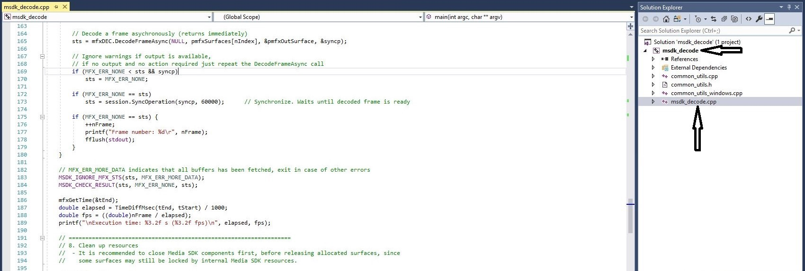
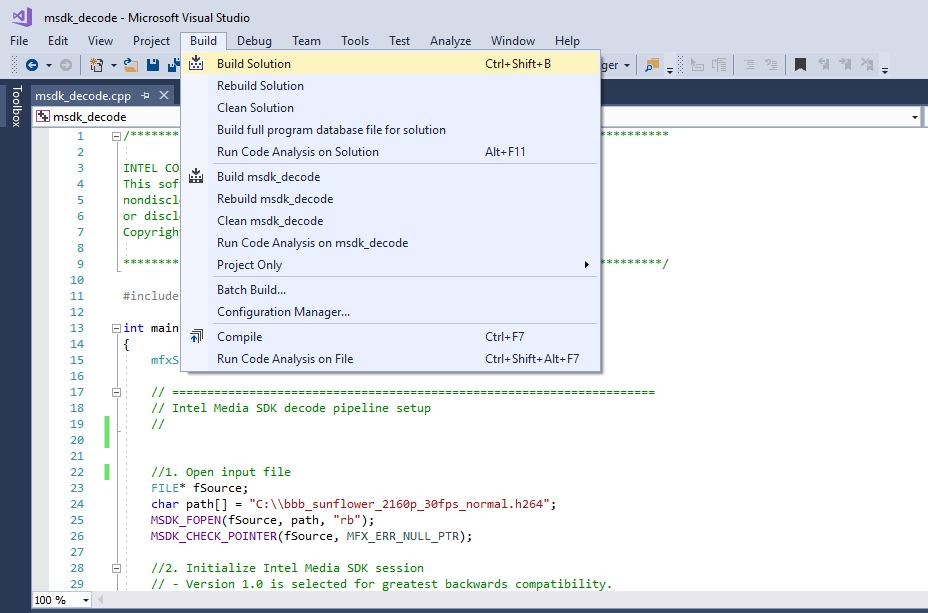
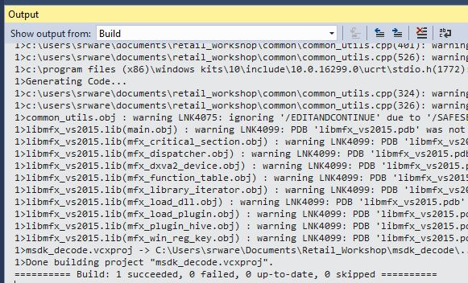
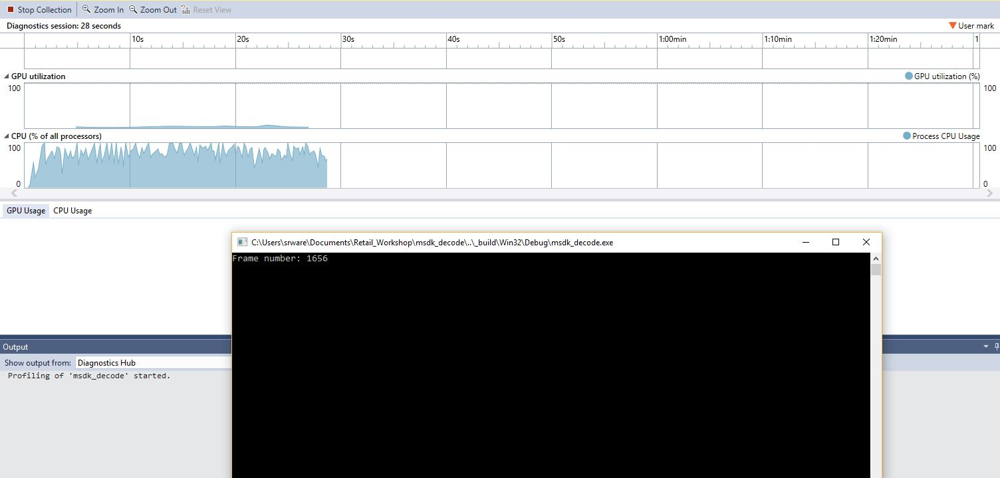
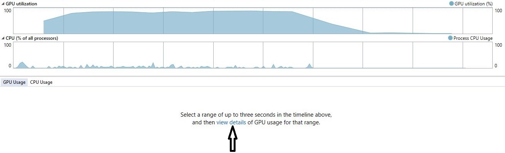
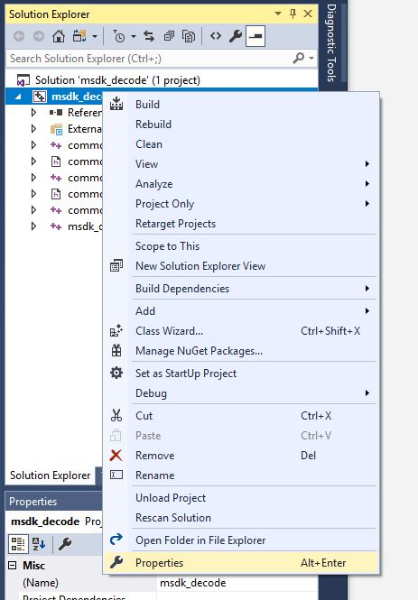
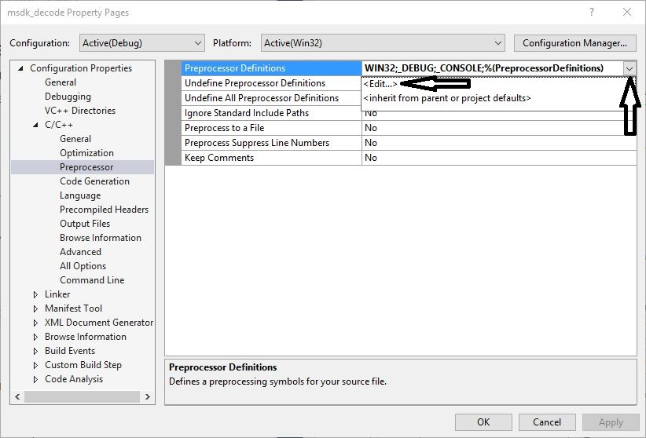
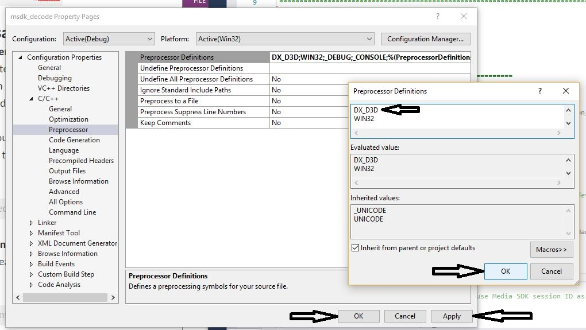
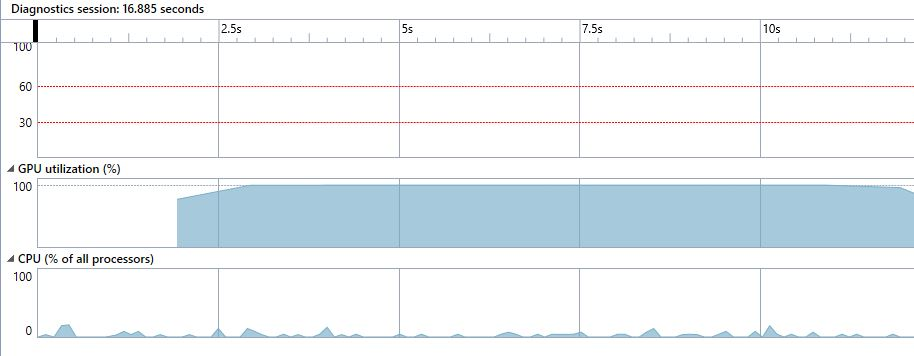
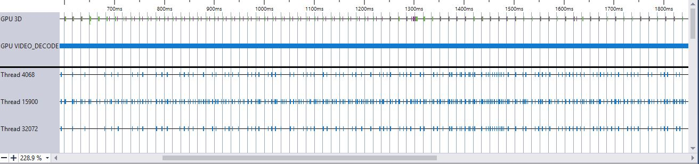

# Decoding a video stream using Intel(R) Media SDK (Windows)
In this tutorial you will learn the basic principles behind decoding a video stream using the Intel(R) Media SDK. You will understand how to configure the Intel(R) Media SDK pipeline to decode a 4K 30fps AVC stream initially using a software decode implementation and then optimising the code to utilise hardware based decoding. We will also look at decoding a 4K 10-bit HEVC stream.

## Getting Started

- Load the **'msdk_decode'** Visual Studio solution file > **"Retail_Workshop\msdk_decode\msdk_decode.sln"**

- Once Visual Studio has loaded expand the **msdk_decode** project in the **Solution Explorer** in the right-hand pane.

- Double-click on the **msdk_decode.cpp** file to load the main application code.



## Understanding The Code
Take a look through the existing code using the comments as a guide. This example shows the minimum API usage to decode a H.264 stream.

The basic flow is outlined below:

 1. Specify input file to decode
 2. Initialise a new Media SDK session and decoder
 3. Configure basic video parameters (e.g. codec)
 4. Create buffers and query parameters
    - Allocate a bit stream buffer to store encoded data before processing
    - Read the header from the input file and use this to populate the rest of the video parameters
    - Run a query to check for the validity and SDK support of these parameters
 5. Allocate the surfaces (video frame working memory) required by the decoder
 6. Initialise the decoder
 7. Start the decoding process:
    - The first loop runs until the entire stream has been decoded
    - The second loop drains the decoding pipeline once the end of the stream is reached
8. Clean-up resources (e.g. buffers, file handles) and end the session.

## Build & Run The Code

 - Build the solution: **Build->Build Solution**
 

 - Make sure the application built successfully by checking the **Output** log in the bottom left pane.
 

 - Run the application using the **Performance Profiler**:
     - Select **Debug->Performance Profiler...**
     - Make sure **CPU Usage** and **GPU Usage** are ticked and click **Start** to begin profiling.
     

 - A console window will load running the application whilst the profiling tool records usage data in the background.
 

 - Wait for the application to finish decoding the video stream and then take note of the **execution time** printed in the console window. You can then **press 'enter' to close the command window** and stop the profiling session.
 

 - Now go back to Visual Studio and take a look at the **GPU Utilization** and **CPU** graphs. Notice that CPU usage is high and GPU usage is low confirming that CPU based decoding is taking place.


## Hardware Decoding
Where possible we want to use hardware based decoding for improved efficiency and speed. The Intel(R) Media SDK is able to select the best decode implementation based on the platform capabilities, first checking to see if hardware can be used and falling back to software if not.

 - Change the Media SDK implementation from **'MFX_IMPL_SOFTWARE'** to **'MFX_IMPL_AUTO_ANY**:

``` cpp
    mfxIMPL impl = MFX_IMPL_AUTO_ANY;
```

 - Rebuild the project and once again run the **Performance Profiler** as before. Once again take note of the **execution time** before closing the console window. You will now see that **GPU** utilisation is high and **CPU** usage is low (depending on what else is happening on the system).
 - Click on **'View Details'** in the **GPU Usage** window below the graphs to get a better breakdown of GPU engine utilisation (3D and Video Decode).



 - Note the heavy utilisation of the **GPU VIDEO_DECODE** engine.


## Further Optimisation
The current code uses **system memory** for the working surfaces as this is the implementation provided by the default allocator when creating an Intel(R) Media SDK session. Allocating surfaces in video memory is highly desirable since this eliminates copying them from the system memory to the video memory when decoding leading to improved performance. To achieve this we have to provide an external allocator which is able to manage video memory using DirectX.

 - Firstly we need to modify our preprocessor definitions to tell the build system we will be using DirectX based memory allocation. **Right-click** on the **msdk_decode** project in the **Solution Explorer** window and select **Properties**




 - Navigate to **Configuration Properties -> C/C++ -> Preprocessor** and select **Preprocessor Definitions**. Once highlighted an arrow will appear at the end of the input box. Click on this and select **<Edit...>** from the options that appear.



 - Add **DX_D3D** to the list of definitions and click **OK** to close the window. Click **Apply** and finally **OK** to close the **Properties** window.



 - We now need to create a variable for the external allocator and pass this into our existing **Initialize** function.
``` cpp
    mfxFrameAllocator mfxAllocator;
    sts = Initialize(impl, ver, &session, &mfxAllocator);
```
 - Next we update the IO pattern specified in the video parameters to tell the decoder we are using video memory instead of system memory.
```
    mfxVideoParams.IOPattern = MFX_IOPATTERN_OUT_VIDEO_MEMORY;
```
 - We now need to use our new allocator when allocating surface memory for our decoder. Replace **Section 5** with the code below.
```
    //5. Allocate surfaces for decoder
    mfxFrameAllocResponse mfxResponse;
    sts = mfxAllocator.Alloc(mfxAllocator.pthis, &Request, &mfxResponse);
    MSDK_CHECK_RESULT(sts, MFX_ERR_NONE, sts);

    // Allocate surface headers (mfxFrameSurface1) for decoder
    mfxFrameSurface1** pmfxSurfaces = new mfxFrameSurface1 *[numSurfaces];
    MSDK_CHECK_POINTER(pmfxSurfaces, MFX_ERR_MEMORY_ALLOC);
    for (int i = 0; i < numSurfaces; i++) {
        pmfxSurfaces[i] = new mfxFrameSurface1;
        memset(pmfxSurfaces[i], 0, sizeof(mfxFrameSurface1));
        memcpy(&(pmfxSurfaces[i]->Info), &(mfxVideoParams.mfx.FrameInfo), sizeof(mfxFrameInfo));
        pmfxSurfaces[i]->Data.MemId = mfxResponse.mids[i];      // MID (memory id) represents one video NV12 surface
    }
```
 - Finally we need to make sure our allocator is destroyed once decoding is finished. Add the following line of code after the surface deletion *for loop* in **section 8**:
```
    mfxAllocator.Free(mfxAllocator.pthis, &mfxResponse);
```
 - We can also **remove** the following line from our cleanup code as it is no longer required:
```
    MSDK_SAFE_DELETE_ARRAY(surfaceBuffers);
```
 - Once again **build** the project and run the **Performance Profiler** as before. Note the **execution time** before closing the console window which should now be significantly improved. Also notice the **GPU** is now **fully utilised** whilst the application is running as it is no longer having to wait for frames to be copied from system memory.



 - Click on **View Details** in the **GPU Usage** window as you did previously. Note that the **GPU VIDEO_DECODE** engine graph is now a much more constant line indicating that we are getting maximum performance from the hardware.



## HEVC 4K 10-bit
"What about the latest 4K 10-bit HEVC video streams" I hear you ask? Support for both decode and encode of such streams was introduced with 7th Gen Intel(R) Core(TM) Processors and the Intel(R) Media SDK has full support for both. We will now make the small code modifications necessary to decode a sample 4K 10-bit HEVC stream.

 - Firstly we need to update our input source to the 4K 10-bit HEVC sample. This sample has an average bitrate of over 40Mbps, similar to that of a 4K Ultra HD Blu-ray.
``` cpp
    char path[] = "..\\jellyfish-60-mbps-4k-uhd-hevc-10bit.h265";
```
 - Next we update the codec in our decode video parameters from **MFX_CODEC_AVC** to **MFX_CODEC_HEVC**.
``` cpp
    mfxVideoParams.mfx.CodecId = MFX_CODEC_HEVC;
```
 - HEVC support is provided as a plugin to the Intel(R) Media SDK which needs to be manually loaded at runtime. Add the following code to **section 3** to load the HEVC plugin.
```
    // Load the HEVC plugin
    mfxPluginUID codecUID;
    bool success = true;
    codecUID = msdkGetPluginUID(impl, MSDK_VDECODE, mfxVideoParams.mfx.CodecId);

    if (AreGuidsEqual(codecUID, MSDK_PLUGINGUID_NULL)) {
        printf("Failed to get plugin UID for HEVC.\n");
        success = false;
    }

    printf("Loading HEVC plugin: %s\n", ConvertGuidToString(codecUID));

    // If we successfully got the UID, load the plugin
    if (success) {
        sts = MFXVideoUSER_Load(session, &codecUID, ver.Major);
        if (sts < MFX_ERR_NONE) {
            printf("Loading HEVC plugin failed!\n");
            success = false;
        }
    }
```
 - Before we proceed to test the code let's try playing the sample using the **ffplay** utility using only the CPU. To do so open a **Command Prompt** window and **'cd'** to the **Retail_Workshop** directory. From there run the following command:
```
ffplay.exe jellyfish-60-mbps-4k-uhd-hevc-10bit.h265
```
> Use the **Esc** key to stop playback at any time.

 - You will notice the CPU alone is struggling to decode the high bitrate stream fast enough to render at a smooth 30fps. Go back to your **Visual Studio** window and **Build** the solution ensuring there are no errors. Then once again use the **Performance Profiler** to run the code. Note the **execution time** before closing the console window and check that the GPU was indeed used to decode the stream by checking the **CPU** and **GPU** utilisation graphs. As you can see the GPU decoding performance comfortably fulfills the 30fps requirement for smooth playback.
 
> If you missed some steps or didn't have time to finish the tutorial the completed code is available in the **msdk_decode_final** directory.

## Conclusion
In this tutorial we looked at the Intel(R) Media SDK decoding pipeline and ways to optimise decoding performance on Intel platforms. We explored the performance and power advantages with decoding using the GPU rather than using a software based decoder running on the CPU. We also looked at the advantages of using video memory for our working surfaces instead of system memory to avoid unnecessary memory transfers.

## Next Tutorial
[Transcoding a video stream using Intel(R) Media SDK](media_sdk_transcode_windows.md)
