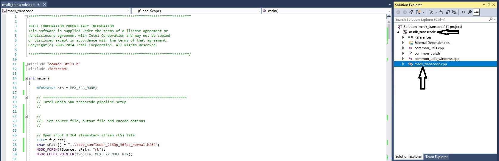
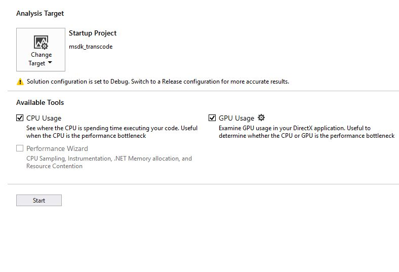
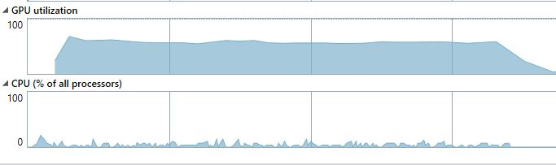
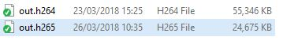

# Transcoding a video stream using Intel® Media SDK (Windows*)
In this tutorial we will look at a simple transcode (decode + encode) pipeline using the Intel® Media SDK. We will start with a basic example using system memory for working surfaces before exploring ways of improving the performance of the transcode process using features such as opaque memory and asynchronous operation. We will also look at adding a video frame processing (VPP) resize to the transcode process.

## Getting Started

Open the **'msdk_transcode'** Visual Studio* solution file with Visual Studio 2017

- Open the File Explorer and navigate to **"C:\users\intel\Desktop\Retail\03-MediaSDK\msdk_transcode\msdk_transcode.sln"**

- Double click the **mdk_decode.sln** file and select Visual Studio 2017 to open the file.

- Expand the **msdk_transcode** project in the **Solution Explorer** in the right-hand pane.

- Double-click on the **msdk_transcode.cpp** file to load the main application code.



## Understanding The Code
Take a look through the existing code using the comments as a guide. This example shows the minimum API usage to transcode (decode + encode) a H.264 stream to another H.264 stream.

The basic flow is outlined below:

 1. Specify input file to decode and file to write the encoded data to
 2. Create the Intel® Media SDK session, decoder and encoder
 3. Configure decoder video parameters (e.g. codec)
 4. Create buffers and query parameters
    - Allocate a bit stream buffer to store encoded data before processing
    - Read the header from the input file and use this to populate the rest of the video parameters
 5. Configure encoder video parameters (e.g. codec, bitrate, rate control)
 6. Allocate the surfaces (video frame working memory) required by the decoder and encoder
 7. Initialise the Intel® Media SDK decode and encode components
 8. Allocate a bit stream buffer to store the output from the encoder
 9. Start the transcoding process:
    -  The first loop is the main transcoding loop where the input stream is decoded and encoded until the end of the stream is reached
    - The second loop drains the decoding pipeline once the end of the stream is reached ensuring the full input stream is encoded
    - The third loop drains the encoding pipeline once the decoding pipeline is flushed and writes the last few encoded frames to disk
 10. Clean-up resources (e.g. buffers, file handles) and end the session.

## Build & Run The Code

 - Build the solution using the keyboard shortcut **CTRL+SHIFT+B** or **Build->Build Solution** in the menu bar.
 - Check the **Output** log in the bottom left pane to verify that the application was built successfully.
 ```
 Done building project "msdk_transcode.vcxproj".
========== Build: 1 succeeded, 0 failed, 0 up-to-date, 0 skipped ==========
```
 - Run the application using the **Performance Profiler**:
     - Select **Debug->Performance Profiler...**
     - Check the **CPU Usage** and **GPU Usage** checkboxes 
     - Click **Start** to begin profiling.



A console window will load running the application whilst the profiling tool records usage data in the background.


 - Take note of the **execution time** printed in the console window. 
 - Press the **'Enter'** to close the command window and stop the profiling session.
```
Frame number: 1800
Execution time: 32.84 s (54.81 fps)
Press ENTER to exit...
```
 - Review the **GPU Utilization** and **CPU** graphs in Visual Studio. 

The CPU usage is low (assuming no other program is consuming processor resources on your system) while the GPU utilization is higher indicating that the transcode process is taking place on the GPU as expected.



There is a bottleneck that stops the GPU from being fully utilized in the current implementation.<br/>
In the next section, we will optimize the code to rectify this.

## Opaque Memory
In the current implementation, system memory is used for the working surfaces by our decoder and encoder. This means frames have to be passed between system memory and video memory multiple times during the transcode pipeline limiting performance. The Intel® Media SDK has a feature called **Opaque Memory** which hides surface allocation specifics and allows the SDK to select the best type for execution in hardware or software. This means that if the pipeline allows, surfaces will reside in video memory for best performance. While opaque memory is an easy solution for optimized surface allocation in simple situations, if you need to integrate components outside of the Intel® Media SDK application-level video memory allocation is required.

 - Update the IO pattern in our decoder video parameters from **MFX_IOPATTERN_OUT_SYSTEM_MEMORY** to **MFX_IOPATTERN_OUT_OPAQUE_MEMORY**.
``` cpp
    mfxDecParams.IOPattern = MFX_IOPATTERN_OUT_OPAQUE_MEMORY;
```
 - Update the encoder video parameters
``` cpp
     mfxEncParams.IOPattern = MFX_IOPATTERN_IN_OPAQUE_MEMORY;
```
The surface allocation code needs to be updated to use opaque memory allocation.

- Replace the code in **Section 6** with the code below.

Buffer memory isn't necessary for allocation as opaque memory handles this internally via the SDK. <br/>
The creation of **mfxExtOpaqueSurfaceAlloc** structures are needed to hold a reference to the allocated surfaces and attach these to the decoder and encoder.
``` cpp
    //6. Initialize shared surfaces for decoder and encoder
    mfxFrameSurface1** pSurfaces = new mfxFrameSurface1 *[nSurfNum];
    MSDK_CHECK_POINTER(pSurfaces, MFX_ERR_MEMORY_ALLOC);
    for (int i = 0; i < nSurfNum; i++) {
        pSurfaces[i] = new mfxFrameSurface1;
        MSDK_CHECK_POINTER(pSurfaces[i], MFX_ERR_MEMORY_ALLOC);
        memset(pSurfaces[i], 0, sizeof(mfxFrameSurface1));
        memcpy(&(pSurfaces[i]->Info), &(DecRequest.Info), sizeof(mfxFrameInfo));
    }

    // Create the mfxExtOpaqueSurfaceAlloc structure for both encoder and decoder, the
    // allocated surfaces will be attached to these structures for the pipeline initialisations.
    mfxExtOpaqueSurfaceAlloc extOpaqueAllocDec;
    memset(&extOpaqueAllocDec, 0, sizeof(extOpaqueAllocDec));
    extOpaqueAllocDec.Header.BufferId = MFX_EXTBUFF_OPAQUE_SURFACE_ALLOCATION;
    extOpaqueAllocDec.Header.BufferSz = sizeof(mfxExtOpaqueSurfaceAlloc);
    mfxExtBuffer* pExtParamsDec = (mfxExtBuffer*) & extOpaqueAllocDec;

    mfxExtOpaqueSurfaceAlloc extOpaqueAllocEnc;
    memset(&extOpaqueAllocEnc, 0, sizeof(extOpaqueAllocEnc));
    extOpaqueAllocEnc.Header.BufferId = MFX_EXTBUFF_OPAQUE_SURFACE_ALLOCATION;
    extOpaqueAllocEnc.Header.BufferSz = sizeof(mfxExtOpaqueSurfaceAlloc);
    mfxExtBuffer* pExtParamsEnc = (mfxExtBuffer*) & extOpaqueAllocEnc;

    // Attach the surfaces to the decoder output and the encoder input
    extOpaqueAllocDec.Out.Surfaces = pSurfaces;
    extOpaqueAllocDec.Out.NumSurface = nSurfNum;
    extOpaqueAllocDec.Out.Type = DecRequest.Type;
    memcpy(&extOpaqueAllocEnc.In, &extOpaqueAllocDec.Out, sizeof(extOpaqueAllocDec.Out));

    mfxDecParams.ExtParam = &pExtParamsDec;
    mfxDecParams.NumExtParam = 1;
    mfxEncParams.ExtParam = &pExtParamsEnc;
    mfxEncParams.NumExtParam = 1;
   ```

 - Remove the following line from the cleanup code since the surface buffers no longer need to be managed in the application code.
``` cpp
    MSDK_SAFE_DELETE_ARRAY(surfaceBuffers);
```

 - **Build** the solution 
 - Run the **Performance Profiler** on the application. 
 - Take note of the **execution time** before closing the console window. 

Th execution time should be slightly improved since implementing opaque memory allocation. If you now look at the **GPU Utilization** graph in the performance profiler you will see the GPU remains underutilized.

## Asynchronous Transcoding
To better utilize the GPU we can make our transcode pipeline asynchronous so more than one decode and encode operation can run at once. This means for each execution of our transcode loop we submit multiple "tasks" before synchronizing the pipeline.

 - Add a parameter to the decoder parameters in **Section 3** to tell the decoder how many tasks we want to execute asynchronously. 
 - Set this parameter to **1** to mimic synchronous operation. We will increase this to see the effect it has on performance and GPU utilization in the future.
``` cpp
    mfxDecParams.AsyncDepth = 1;
```
 - Set the `AsyncDepth` for the encode parameters to the same value as the decode parameters in **Section 5**. 
 
 This is done to keep things aligned.
``` cpp
    mfxEncParams.AsyncDepth = mfxDecParams.AsyncDepth;
```
 - Create a task pool for the encoding operations. 
 Rather than having a single bit stream buffer for the encoder output, each "task" has it's own 
 - Replace the code in **Section 8** with the following:
``` cpp
    //8. Create task pool to improve asynchronous performance
    mfxU16 taskPoolSize = mfxEncParams.AsyncDepth;
    Task* pTasks = new Task[taskPoolSize];
    memset(pTasks, 0, sizeof(Task) * taskPoolSize);
    for (int i = 0; i < taskPoolSize; i++) {
        // Prepare Media SDK bit stream buffer
        pTasks[i].mfxBS.MaxLength = par.mfx.BufferSizeInKB * 1000;
        pTasks[i].mfxBS.Data = new mfxU8[pTasks[i].mfxBS.MaxLength];
        MSDK_CHECK_POINTER(pTasks[i].mfxBS.Data, MFX_ERR_MEMORY_ALLOC);
    }
```
 - Add two additional variables to keep track of tasks within the transcoding loops in **Section 9** of the code
``` cpp
    int nFirstSyncTask = 0;
    int nTaskIdx = 0;
```
 - Modify the transcoding loops to first execute multiple tasks asynchronously and once the task pool is full synchronise the pipeline. 

The main transcoding loop **(Stage 1)** should now look like this:
``` cpp
    while (MFX_ERR_NONE <= sts || MFX_ERR_MORE_DATA == sts || MFX_ERR_MORE_SURFACE == sts) {
        nTaskIdx = GetFreeTaskIndex(pTasks, taskPoolSize);  // Find free task
        if (MFX_ERR_NOT_FOUND == nTaskIdx) {
            // No more free tasks, need to sync
            sts = session.SyncOperation(pTasks[nFirstSyncTask].syncp, 60000);
            MSDK_CHECK_RESULT(sts, MFX_ERR_NONE, sts);

            sts = WriteBitStreamFrame(&pTasks[nFirstSyncTask].mfxBS, fSink);
            MSDK_BREAK_ON_ERROR(sts);

            pTasks[nFirstSyncTask].syncp = NULL;
            pTasks[nFirstSyncTask].mfxBS.DataLength = 0;
            pTasks[nFirstSyncTask].mfxBS.DataOffset = 0;
            nFirstSyncTask = (nFirstSyncTask + 1) % taskPoolSize;

            ++nFrame;
            if (nFrame % 100 == 0) {
                printf("Frame number: %d\r", nFrame);
                fflush(stdout);
            }
        } else {
            if (MFX_WRN_DEVICE_BUSY == sts)
                MSDK_SLEEP(1);  // Wait and then repeat the same call to DecodeFrameAsync

            if (MFX_ERR_MORE_DATA == sts) {
                sts = ReadBitStreamData(&mfxBS, fSource);  // Read more data to input bit stream
                MSDK_BREAK_ON_ERROR(sts);
            }

            if (MFX_ERR_MORE_SURFACE == sts || MFX_ERR_NONE == sts) {
                nIndex = GetFreeSurfaceIndex(pSurfaces, nSurfNum);  // Find free frame surface
                MSDK_CHECK_ERROR(MFX_ERR_NOT_FOUND, nIndex, MFX_ERR_MEMORY_ALLOC);
            }

            // Decode a frame asychronously (returns immediately)
            sts = mfxDEC.DecodeFrameAsync(&mfxBS, pSurfaces[nIndex], &pmfxOutSurface, &syncpD);

            // Ignore warnings if output is available,
            // if no output and no action required just repeat the DecodeFrameAsync call
            if (MFX_ERR_NONE < sts && syncpD)
                sts = MFX_ERR_NONE;

            if (MFX_ERR_NONE == sts) {
                for (;;) {
                    // Encode a frame asychronously (returns immediately)
                    sts = mfxENC.EncodeFrameAsync(NULL, pmfxOutSurface, &pTasks[nTaskIdx].mfxBS, &pTasks[nTaskIdx].syncp);

                    if (MFX_ERR_NONE < sts && !pTasks[nTaskIdx].syncp) { // Repeat the call if warning and no output
                        if (MFX_WRN_DEVICE_BUSY == sts)
                            MSDK_SLEEP(1);  // Wait if device is busy
                    } else if (MFX_ERR_NONE < sts && pTasks[nTaskIdx].syncp) {
                        sts = MFX_ERR_NONE; // Ignore warnings if output is available
                        break;
                    } else
                        break;
                }

                if (MFX_ERR_MORE_DATA == sts) {
                    // MFX_ERR_MORE_DATA indicates encoder need more input, request more surfaces from previous operation
                    sts = MFX_ERR_NONE;
                    continue;
                }
            }
        }
    }

    MSDK_IGNORE_MFX_STS(sts, MFX_ERR_MORE_DATA);
    MSDK_CHECK_RESULT(sts, MFX_ERR_NONE, sts);
```

**Stage 2** should be the same as **stage 1** with the exception that we pass **NULL** to the **DecodeFrameAsync** call in order to drain the decoding pipeline. 
 - Replace **stage 2** code with the code above 
 - Replace the variable initialization `sts = mfxDEC.DecodeFrameAsync(&mfxBS, pSurfaces[nIndex], &pmfxOutSurface, &syncpD);` with:
``` cpp
sts = mfxDEC.DecodeFrameAsync(NULL, pSurfaces[nIndex], &pmfxOutSurface, &syncpD);
```

 - **Stage 3** of the transcoding process (while loop **only**) should now look like this:
``` cpp
    //
    // Stage 3: Retrieve the buffered encoded frames
    //
    while (MFX_ERR_NONE <= sts) {
        nTaskIdx = GetFreeTaskIndex(pTasks, taskPoolSize);      // Find free task
        if (MFX_ERR_NOT_FOUND == nTaskIdx) {
            // No more free tasks, need to sync
            sts = session.SyncOperation(pTasks[nFirstSyncTask].syncp, 60000);
            MSDK_CHECK_RESULT(sts, MFX_ERR_NONE, sts);

            sts = WriteBitStreamFrame(&pTasks[nFirstSyncTask].mfxBS, fSink);
            MSDK_BREAK_ON_ERROR(sts);

            pTasks[nFirstSyncTask].syncp = NULL;
            pTasks[nFirstSyncTask].mfxBS.DataLength = 0;
            pTasks[nFirstSyncTask].mfxBS.DataOffset = 0;
            nFirstSyncTask = (nFirstSyncTask + 1) % taskPoolSize;

            ++nFrame;
            printf("Frame number: %d\r", nFrame);
            fflush(stdout);

        } else {
            for (;;) {
                // Encode a frame asychronously (returns immediately)
                sts = mfxENC.EncodeFrameAsync(NULL, NULL, &pTasks[nTaskIdx].mfxBS, &pTasks[nTaskIdx].syncp);

                if (MFX_ERR_NONE < sts && !pTasks[nTaskIdx].syncp) { // Repeat the call if warning and no output
                    if (MFX_WRN_DEVICE_BUSY == sts)
                        MSDK_SLEEP(1);  // Wait if device is busy
                } else if (MFX_ERR_NONE < sts && pTasks[nTaskIdx].syncp) {
                    sts = MFX_ERR_NONE; // Ignore warnings if output is available
                    break;
                } else
                    break;
            }
        }
    }
```
 - **Add a 4th stage** to the transcode process in order to ensure all tasks in our task pool are synchronized and all output from the encoder gets written to disk.
``` cpp
    //
    // Stage 4: Sync all remaining tasks in task pool
    //
    while (pTasks[nFirstSyncTask].syncp) {
        sts = session.SyncOperation(pTasks[nFirstSyncTask].syncp, 60000);
        MSDK_CHECK_RESULT(sts, MFX_ERR_NONE, sts);

        sts = WriteBitStreamFrame(&pTasks[nFirstSyncTask].mfxBS, fSink);
        MSDK_BREAK_ON_ERROR(sts);

        pTasks[nFirstSyncTask].syncp = NULL;
        pTasks[nFirstSyncTask].mfxBS.DataLength = 0;
        pTasks[nFirstSyncTask].mfxBS.DataOffset = 0;
        nFirstSyncTask = (nFirstSyncTask + 1) % taskPoolSize;

        ++nFrame;
        printf("Frame number: %d\r", nFrame);
        fflush(stdout);
    }
```

 - Replace the following line to cleanup the task buffers and task pool:
``` cpp
    MSDK_SAFE_DELETE_ARRAY(mfxEncBS.Data);
```
with this:
``` cpp
    for (int i = 0; i < taskPoolSize; i++)
        MSDK_SAFE_DELETE_ARRAY(pTasks[i].mfxBS.Data);
    MSDK_SAFE_DELETE_ARRAY(pTasks);
```

 - **Build** the solution and run the code using the **Performance Profiler** as before. 
 
 The number of asynchronous tasks were set to 1 initially as a benchmark before increasing the task pool size. 
 - Take note of the **execution time** before closing the console window
 - Review the **GPU Utilization** graph.

 - Increase the number of asynchronous operations from **1** to **4**.
``` cpp
    mfxDecParams.AsyncDepth = 4;
```

 - **Build** the solution and run the **Performance Profiler**. 
 - Take note of the **execution time** 
 - Review the **GPU Utilization** graph. 
 
 You will notice that the performance increased and the GPU is better utilised now we are performing more asynchronous operations.

## Video Post Processing (VPP)
Often the reason for transcoding is because you want to change the input source in some way such as its codec, color space, resolution or filtering. The Intel® Media SDK offers several processing modules for this purpose which can be added to the pipeline. We will now look at adding a resize module to our transcode pipeline to lower the 4K input stream to 1080p before encoding. The transcode pipeline will then be as follows: **Decode -> VPP -> Encode**

 - Create a VPP instance for our Intel® Media SDK session **in section 2**.
``` cpp
    MFXVideoVPP mfxVPP(session);
```
 - Set VPP parameters to tell the SDK what the expected input and desired output of the VPP module should be. 
 - Add the following code to the top of **section 5**:
``` cpp
    mfxVideoParam VPPParams;
    memset(&VPPParams, 0, sizeof(VPPParams));
    // Input data
    VPPParams.vpp.In.FourCC = MFX_FOURCC_NV12;
    VPPParams.vpp.In.ChromaFormat = MFX_CHROMAFORMAT_YUV420;
    VPPParams.vpp.In.CropX = 0;
    VPPParams.vpp.In.CropY = 0;
    VPPParams.vpp.In.CropW = mfxDecParams.mfx.FrameInfo.CropW;
    VPPParams.vpp.In.CropH = mfxDecParams.mfx.FrameInfo.CropH;
    VPPParams.vpp.In.PicStruct = MFX_PICSTRUCT_PROGRESSIVE;
    VPPParams.vpp.In.FrameRateExtN = 30;
    VPPParams.vpp.In.FrameRateExtD = 1;
    VPPParams.vpp.In.Width = MSDK_ALIGN16(VPPParams.vpp.In.CropW);
    VPPParams.vpp.In.Height =
        (MFX_PICSTRUCT_PROGRESSIVE == VPPParams.vpp.In.PicStruct) ?
        MSDK_ALIGN16(VPPParams.vpp.In.CropH) :
        MSDK_ALIGN32(VPPParams.vpp.In.CropH);
    // Output data
    VPPParams.vpp.Out.FourCC = MFX_FOURCC_NV12;
    VPPParams.vpp.Out.ChromaFormat = MFX_CHROMAFORMAT_YUV420;
    VPPParams.vpp.Out.CropX = 0;
    VPPParams.vpp.Out.CropY = 0;
    VPPParams.vpp.Out.CropW = VPPParams.vpp.In.CropW / 2; // Scaling
    VPPParams.vpp.Out.CropH = VPPParams.vpp.In.CropH / 2; // Scaling
    VPPParams.vpp.Out.PicStruct = MFX_PICSTRUCT_PROGRESSIVE;
    VPPParams.vpp.Out.FrameRateExtN = 30;
    VPPParams.vpp.Out.FrameRateExtD = 1;
    VPPParams.vpp.Out.Width = MSDK_ALIGN16(VPPParams.vpp.Out.CropW);
    VPPParams.vpp.Out.Height =
        (MFX_PICSTRUCT_PROGRESSIVE == VPPParams.vpp.Out.PicStruct) ?
        MSDK_ALIGN16(VPPParams.vpp.Out.CropH) :
        MSDK_ALIGN32(VPPParams.vpp.Out.CropH);
    VPPParams.IOPattern = MFX_IOPATTERN_IN_OPAQUE_MEMORY | MFX_IOPATTERN_OUT_OPAQUE_MEMORY;
    VPPParams.AsyncDepth = mfxDecParams.AsyncDepth;
```
 - Update the **CropW** and **CropH** encoder parameters to match the output of the VPP module rather than the output of the decoder:
``` cpp
    mfxEncParams.mfx.FrameInfo.CropW = VPPParams.vpp.Out.CropW;
    mfxEncParams.mfx.FrameInfo.CropH = VPPParams.vpp.Out.CropH;
```
 - Add code to query the number of surfaces required for VPP. We have to take into account that VPP requires working surfaces for the input and output of the module.
``` cpp
    // Query number of required surfaces for VPP
    mfxFrameAllocRequest VPPRequest[2];     // [0] - in, [1] - out
    memset(&VPPRequest, 0, sizeof(mfxFrameAllocRequest) * 2);
    sts = mfxVPP.QueryIOSurf(&VPPParams, VPPRequest);
    MSDK_CHECK_RESULT(sts, MFX_ERR_NONE, sts);
```
Currently we use a single array of frame surfaces shared between the decoder and encoder. Now the decoded frames are a different size to those being fed to the encoder we require 2 surface arrays. One set of surfaces will be used by the decoder and VPP input, the other set will be used by the VPP output and encoder. First we need to determine the number of surfaces required in each instance
 - Update the **nSurfNum** variable and adding a **nSurfNum2** variable as follows:
``` cpp
    mfxU16 nSurfNum = DecRequest.NumFrameSuggested + VPPRequest[0].NumFrameSuggested + VPPParams.AsyncDepth;
    mfxU16 nSurfNum2 = EncRequest.NumFrameSuggested + VPPRequest[1].NumFrameSuggested + VPPParams.AsyncDepth;
````
 - Add the following code to initialize our second surface array in **section 6** after the **nSurfNum** for loop:
``` cpp
    mfxFrameSurface1** pSurfaces2 = new mfxFrameSurface1 *[nSurfNum2];
    MSDK_CHECK_POINTER(pSurfaces2, MFX_ERR_MEMORY_ALLOC);
    for (int i = 0; i < nSurfNum2; i++) {
        pSurfaces2[i] = new mfxFrameSurface1;
        MSDK_CHECK_POINTER(pSurfaces2[i], MFX_ERR_MEMORY_ALLOC);
        memset(pSurfaces2[i], 0, sizeof(mfxFrameSurface1));
        memcpy(&(pSurfaces2[i]->Info), &(EncRequest.Info), sizeof(mfxFrameInfo));
    }
```
 - Create an opaque surface allocation structure for VPP as we did for the decoder and encoder.
``` cpp
    mfxExtOpaqueSurfaceAlloc extOpaqueAllocVPP;
    memset(&extOpaqueAllocVPP, 0, sizeof(extOpaqueAllocVPP));
    extOpaqueAllocVPP.Header.BufferId = MFX_EXTBUFF_OPAQUE_SURFACE_ALLOCATION;
    extOpaqueAllocVPP.Header.BufferSz = sizeof(mfxExtOpaqueSurfaceAlloc);
    mfxExtBuffer* pExtParamsVPP = (mfxExtBuffer*)& extOpaqueAllocVPP;
```
 - Attach the surface structures we have created to the relevant parts of our transcode pipeline. 
 
 That means **pSurfaces** needs to be attached to the **decoder** and **VPP In**
 **pSurfaces2** needs to be attached to **VPP Out** and the **encoder**. 
 - Replace the current surface attachment code with the following:
``` cpp
    //Attached the surfaces to the decoder output and the VPP input
    extOpaqueAllocDec.Out.Surfaces = pSurfaces;
    extOpaqueAllocDec.Out.NumSurface = nSurfNum;
    extOpaqueAllocDec.Out.Type = DecRequest.Type;
    memcpy(&extOpaqueAllocVPP.In, &extOpaqueAllocDec.Out, sizeof(extOpaqueAllocDec.Out));

    //Attached the surfaces to the VPP output and the encoder input
    extOpaqueAllocVPP.Out.Surfaces = pSurfaces2;
    extOpaqueAllocVPP.Out.NumSurface = nSurfNum2;
    extOpaqueAllocVPP.Out.Type = EncRequest.Type;
    memcpy(&extOpaqueAllocEnc.In, &extOpaqueAllocVPP.Out, sizeof(extOpaqueAllocVPP.Out));

    mfxDecParams.ExtParam = &pExtParamsDec;
    mfxDecParams.NumExtParam = 1;
    VPPParams.ExtParam = &pExtParamsVPP;
    VPPParams.NumExtParam = 1;
    mfxEncParams.ExtParam = &pExtParamsEnc;
    mfxEncParams.NumExtParam = 1;
```

 - Initialize a VPP module in the same way we initialized the decoder and encoder:
``` cpp
    // Initialize Media SDK VPP
    sts = mfxVPP.Init(&VPPParams);
    MSDK_IGNORE_MFX_STS(sts, MFX_WRN_PARTIAL_ACCELERATION);
    MSDK_CHECK_RESULT(sts, MFX_ERR_NONE, sts);
```

We are now ready to modify our main transcoding loops to incorporate VPP. 
- Add another **mfxSyncPoint** for VPP:
``` cpp
    mfxSyncPoint syncpD, syncpE, syncpV;
```

 - Add a second index to keep track of surfaces in **pSurfaces2**, the second surface array we added earlier:
``` cpp
    int nIndex2 = 0;
```

We will now look at **stage 1** which is our main transcoding loop. The first section which fills our task pool remains unchanged. We only need to insert the VPP processing loop after decoding and modify the encoding process to ensure it is using surfaces from the correct surface pool and is encoding the output from VPP, not the decoder. 
- Update the current implementation with the code below:
``` cpp
            if (MFX_ERR_NONE == sts) {
                nIndex2 = GetFreeSurfaceIndex(pSurfaces2, nSurfNum2);  // Find free frame surface
                MSDK_CHECK_ERROR(MFX_ERR_NOT_FOUND, nIndex2, MFX_ERR_MEMORY_ALLOC);

                for (;;) {
                    // Process a frame asychronously (returns immediately)
                    sts = mfxVPP.RunFrameVPPAsync(pmfxOutSurface, pSurfaces2[nIndex2], NULL, &syncpV);

                    if (MFX_ERR_NONE < sts && !syncpV) { // Repeat the call if warning and no output
                        if (MFX_WRN_DEVICE_BUSY == sts)
                            MSDK_SLEEP(1);  // Wait if device is busy
                    } else if (MFX_ERR_NONE < sts && syncpV) {
                        sts = MFX_ERR_NONE; // Ignore warnings if output is available
                        break;
                    } else
                        break;  // Not a warning
                }

				// VPP needs more data, let decoder decode another frame as input
				if (MFX_ERR_MORE_DATA == sts) {
					continue;
				} else if (MFX_ERR_MORE_SURFACE == sts) {
					break;
				} else
					MSDK_BREAK_ON_ERROR(sts);

                for (;;) {
                    // Encode a frame asychronously (returns immediately)
                    sts = mfxENC.EncodeFrameAsync(NULL, pSurfaces2[nIndex2], &pTasks[nTaskIdx].mfxBS, &pTasks[nTaskIdx].syncp);

                    if (MFX_ERR_NONE < sts && !pTasks[nTaskIdx].syncp) { // Repeat the call if warning and no output
                        if (MFX_WRN_DEVICE_BUSY == sts)
                            MSDK_SLEEP(1);  // Wait if device is busy
                    } else if (MFX_ERR_NONE < sts && pTasks[nTaskIdx].syncp) {
                        sts = MFX_ERR_NONE; // Ignore warnings if output is available
                        break;
                    } else
                        break;
                }

                if (MFX_ERR_MORE_DATA == sts) {
                    // MFX_ERR_MORE_DATA indicates encoder needs more input, request more surfaces from previous operation
                    sts = MFX_ERR_NONE;
                    continue;
                }
            }
```

In **stage 2**, the decoder pipeline is drained. 
- Update the code in **stage 2** with the code above so that the VPP and encode sections are the same as **stage 1**

As we have added VPP to our pipeline we need to add a new stage to our transcoding process to drain the VPP pipeline in the same way we do for the decoder in **stage 2** and the encoder in **stage 3**. 
 - Add the following code in between **stage 2** and **stage 3**:
``` cpp
    //
    // Stage 3: Retrieve buffered frames from VPP
    //
    while (MFX_ERR_NONE <= sts || MFX_ERR_MORE_DATA == sts || MFX_ERR_MORE_SURFACE == sts) {
        nTaskIdx = GetFreeTaskIndex(pTasks, taskPoolSize);      // Find free task
        if (MFX_ERR_NOT_FOUND == nTaskIdx) {
            // No more free tasks, need to sync
            sts = session.SyncOperation(pTasks[nFirstSyncTask].syncp, 60000);
            MSDK_CHECK_RESULT(sts, MFX_ERR_NONE, sts);

            sts = WriteBitStreamFrame(&pTasks[nFirstSyncTask].mfxBS, fSink);
            MSDK_BREAK_ON_ERROR(sts);

            pTasks[nFirstSyncTask].syncp = NULL;
            pTasks[nFirstSyncTask].mfxBS.DataLength = 0;
            pTasks[nFirstSyncTask].mfxBS.DataOffset = 0;
            nFirstSyncTask = (nFirstSyncTask + 1) % taskPoolSize;

            ++nFrame;
            printf("Frame number: %d\r", nFrame);
            fflush(stdout);
        } else {
            nIndex2 = GetFreeSurfaceIndex(pSurfaces2, nSurfNum2); // Find free frame surface
            MSDK_CHECK_ERROR(MFX_ERR_NOT_FOUND, nIndex2, MFX_ERR_MEMORY_ALLOC);

			for (;;) {
				// Process a frame asychronously (returns immediately)
				sts = mfxVPP.RunFrameVPPAsync(NULL, pSurfaces2[nIndex2], NULL, &syncpV);

				if (MFX_ERR_NONE < sts && !syncpV) { // Repeat the call if warning and no output
					if (MFX_WRN_DEVICE_BUSY == sts)
						MSDK_SLEEP(1);  // Wait if device is busy
				} else if (MFX_ERR_NONE < sts && syncpV) {
					sts = MFX_ERR_NONE; // Ignore warnings if output is available
					break;
				} else
					break; // Not a warning
			}

			if (MFX_ERR_MORE_SURFACE == sts) {
				break;
			} else
				MSDK_BREAK_ON_ERROR(sts);

            for (;;) {
                // Encode a frame asychronously (returns immediately)
                sts = mfxENC.EncodeFrameAsync(NULL, pSurfaces2[nIndex2], &pTasks[nTaskIdx].mfxBS, &pTasks[nTaskIdx].syncp);

                if (MFX_ERR_NONE < sts && !pTasks[nTaskIdx].syncp) { // Repeat the call if warning and no output
                    if (MFX_WRN_DEVICE_BUSY == sts)
                        MSDK_SLEEP(1);  // Wait if device is busy
                } else if (MFX_ERR_NONE < sts && pTasks[nTaskIdx].syncp) {
                    sts = MFX_ERR_NONE; // Ignore warnings if output is available
                    break;
                } else
                    break;
            }

            if (MFX_ERR_MORE_DATA == sts) {
                // MFX_ERR_MORE_DATA indicates encoder need more input, request more surfaces from previous operation
                sts = MFX_ERR_NONE;
                continue;
            }
        }
    }

    // MFX_ERR_MORE_DATA indicates that all VPP buffers has been fetched, exit in case of other errors
    MSDK_IGNORE_MFX_STS(sts, MFX_ERR_MORE_DATA);
    MSDK_CHECK_RESULT(sts, MFX_ERR_NONE, sts);
```

 - Update the remaining stages to **stage 4** which drains our encoding pipeline and **stage 5** which synchronizes remaining tasks in the pool. These require no code changes.

 - Update the cleanup code to destroy the VPP instance:
``` cpp
    mfxVPP.Close();
```
 - Add the following code to verfiy and delete the second surface pool:
``` cpp
    for (int i = 0; i < nSurfNum2; i++)
        delete pSurfaces2[i];
    MSDK_SAFE_DELETE_ARRAY(pSurfaces2);
```

 - **Build** the solution and use the **Performance Profiler** to run the application. 
 - Note the **execution time** before closing the console window. 
 - Review the **GPU Utilization** graph verifying that the GPU is slightly more utilized due to the additional processing taking place to scale the video frames. 
 
 You should also see that overall execution time is much faster as we are now encoding a 1080p stream instead of 4K.

To view the encoded output you can use the provided **ffplay** utility. 
- Open a **Command Prompt** window and **'cd'** to the **Retail_Workshop** directory. From there run the following command:
```
ffplay.exe out.h264
```
> Use the **Esc** key to stop playback at any time.

## HEVC Encoding
So far we have been working with H.264 video streams but if we want to transcode our stream using a more efficient codec we can use the newer HEVC (H.265) codec which can produce the same perceived quality at lower bitrates which in turn leads to smaller file sizes. The trade-off is longer encoding time.

 - Update the filename of the output file to **.h265** so we don't overwrite our existing H.264 encode.
``` cpp
    char oPath[] = "..\\out.h265";
```
We can also reduce the target encode bitrate for HEVC. 
 - Set the bitrate variable to half of what we used for H.264.
``` cpp
    // Bitrate for encoder
    mfxU16 bitrate = 4000;
```
Next we need to update our encoder parameters to use HEVC. We are only working with 8-bit streams and not 10-bit (usually referred to as High Dynamic Range or HDR) 
- Update the **CodecId** parameter.
``` cpp
    mfxEncParams.mfx.CodecId = MFX_CODEC_HEVC;
```
 HEVC support is provided as a plugin to the Intel® Media SDK which needs to be manually loaded at runtime. 
 - Add the following code to load the HEVC plugin after the code to populate the encoder parameters.
``` cpp
    // Load the HEVC plugin
    mfxPluginUID codecUID;
    bool success = true;
    codecUID = msdkGetPluginUID(MFX_IMPL_HARDWARE, MSDK_VENCODE, mfxEncParams.mfx.CodecId);
    if (AreGuidsEqual(codecUID, MSDK_PLUGINGUID_NULL)) {
        printf("Get Plugin UID for HEVC is failed.\n");
        success = false;
    }

    printf("Loading HEVC plugin: %s\n", ConvertGuidToString(codecUID));

    // If we got the UID, load the plugin
    if (success) {
        sts = MFXVideoUSER_Load(session, &codecUID, ver.Major);
        if (sts < MFX_ERR_NONE) {
            printf("Loading HEVC plugin failed\n");
            success = false;
        }
    }
```
 - **Build** the solution and use the **Performance Profiler** to run the code. 
 - Take note that the **execution time** is longer and **GPU Utilization** is higher when encoding with the more complex HEVC codec.
 - Open **File Explorer** and navigate to the **Retail_Workshop** directory. Note the size of the **out.h264** and **out.h265** files. You will notice that the file encoded using HEVC is less than half the size of the H.264 encoded file.



 - You can use the **ffplay** utility as you did before to play both files and compare the output. 

> Use the **Esc** key to stop playback at any time.
```
ffplay.exe out.h264
ffplay.exe out.h265
```
> If you missed some steps or didn't have time to finish the tutorial the completed code is available in the **msdk_transcode_final** directory.

## Conclusion
In this tutorial we looked at the Intel® Media SDK transcoding pipeline (Decode -> VPP -> Encode) and ways to optimally utilise the GPU for this task. We used opaque memory, a feature of the Intel® Media SDK to optimally manage surface memory allocation for best performance. We also looked at the advantages of implementing an asynchronous pipeline to better utilise the GPU and increase performance. Finally we explored using modern codecs supported by Intel® platforms and the Intel® Media SDK such as HEVC to reduce the bitrate of video streams for situations where bandwidth or storage is constrained.

<!--## Next Tutorial
[Intel® Media Accelerator Reference Software (M.A.R.S)](media_accelerator_reference_software_windows.md)-->
